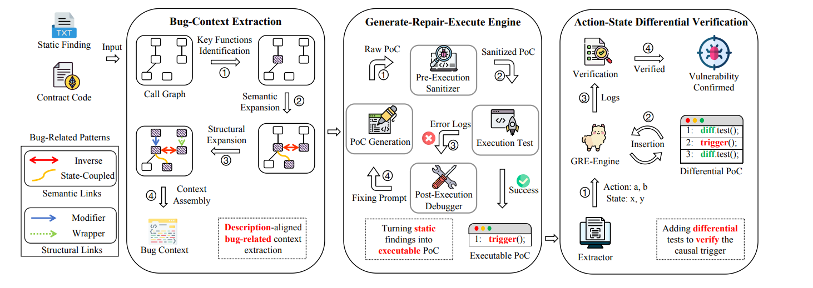

# SmartPoC Verification Pipeline

This project is an implementation of the approach described in the paper:

> **L. Chen, R. Yan, T. Wong, Y. Chen, J. Wang, and C. Zhang, "SmartPoC: Generating Executable and Validated PoCs for Smart Contract Bug Reports," _arXiv preprint arXiv:2511.12993_, 2025. [Online]. Available: https://arxiv.org/abs/2511.12993**

## High-Level Idea

SmartPoC eliminates the manual overhead of verifying static analysis reports by automatically synthesizing executable Proof-of-Concept (PoC) exploits.

The system first extracts a precise slice of the target contract to minimize context noise. It then employs an iterative *generate-repair-execute* loop where an LLM drafts a Foundry test script, runs it within an isolated Docker sandbox, and continuously refines the code using execution feedback until the vulnerability is successfully triggered and confirmed.



## 1. Prerequisites

1. **Docker Desktop**: Must be open and running. The pipeline spins up an isolated Foundry container to safely execute the AI-generated exploits.
2. **Foundry**: Must be installed on your host machine (specifically `forge`).
3. **Python**: Python 3 installed on your host machine.

## 2. Setup Environment

First, create and activate a Python virtual environment, then install the required dependencies:

```powershell
# Create virtual environment
python -m venv venv

# Activate it (Windows)
.\venv\Scripts\activate

# Install dependencies
pip install -r requirements.txt
```

Next, create a `.env` file in the root of the `harness` directory (if you haven't already) and add your Google AI Studio API key:

```env
GEMINI_API_KEY=AQ...
```

## 3. Managing Solidity Versions

The Bug-Context Extraction (BCE) module uses Slither, which needs to compile the project locally to map the AST. Slither relies on `solc-select` to find the right compiler.

Because Windows PowerShell isolates environment variables, **you must tell `solc-select` which version to use for your current terminal session** before running the pipeline on a new contract.

For example, if testing a contract that requires `0.8.28`:

```powershell
# Make sure your venv is activated
.\venv\Scripts\activate

# Install the required compiler version (only needed once)
solc-select install 0.8.28

# Tell the terminal to use this version for the current session
solc-select use 0.8.28
```

_Note: Change `0.8.28` to whichever version the target Foundry project requires._

## 4. Running the Pipeline

Once the environment is active and the `solc` version is set, simply run the entry point script:

```powershell
python .\scripts\run_smartpoc.py
```

## 5. Viewing the Output

Once the execution finishes (or hits the 30-retry limit), it will output a final verdict (`EXECUTION_FAILED` or `CONFIRMED_VULNERABLE`).

All telemetry—including every prompt sent to Gemini, every AI response, the generated code, and the raw Docker execution logs—is automatically saved to a timestamped file in the harness directory:

```text
trajectory_run_megapot_01_YYYYMMDD_HHMMSS.json
```

You can inspect this JSON file to see exactly how the AI reasoned through compiler errors and attempted to write the exploit.
