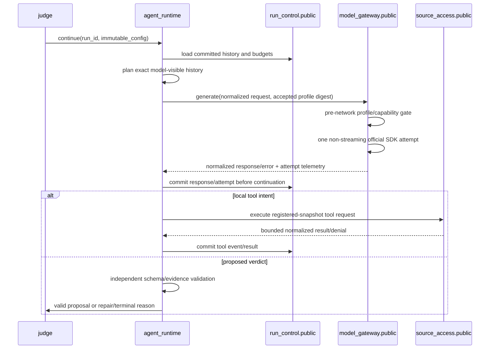

# Agent Runtime and Provider Boundaries

Normative: yes  
Version: `agent-runtime-boundaries-v1`  
Owners: TV2 agent runtime, TV1 model gateway; reviewers: TV3, TV5, TV6

## Capability responsibilities

| Capability | Owns | May call | Must not own/import |
|---|---|---|---|
| `judge` | Judge use-case coordination and terminal-result request | `agent_runtime.public`, `run_control.public`, `source_access.public` | provider SDK, tool implementation, scoring |
| `agent_runtime` | explicit committed history, step loop, context planning, stop rules, normalized tool intents, verdict proposal | `model_gateway.public`, `source_access.public`, `run_control.public` | provider SDK types/credentials, filesystem, ground truth, scorer |
| `model_gateway` | project provider port, profile gate, adapter mappings, provider attempt telemetry | its own public/domain/application/ports/adapters | agent loop, tool dispatch, verdict acceptance, ground truth |
| `source_access` | registered snapshot, workspace policy, local read/search/list tools | its own public contract | provider calls, agent policy, labels |
| `run_control` | lifecycle/CAS, immutable config, budgets, event/attempt persistence | its own public contract | provider/tool invocation or scoring |

Cross-capability imports use only `harness.modules.<capability>.public`. The OpenAI adapter is private to `model_gateway` and is composed only by an entrypoint.

## One logical step

History becomes model-visible only after its source event is durably committed. A crash reloads committed history; it never asks a provider-managed thread to reconstruct state.

## Adapter boundary

Project-owned port input contains normalized messages, local custom-function schemas, verdict response schema, limits, sampling and safe correlation IDs. Adapter output contains normalized assistant content/tool intents, usage, safe native identity, timing and normalized error. Mapping evidence lives in `contracts/provider-contract.md` and `providers/conformance-matrix.md`.

Forbidden edges:

- `agent_runtime`, `judge`, desktop or evaluator importing `openai` or any provider SDK;
- adapter invoking a local function, hosted tool or recursive agent loop;
- credential or raw provider object entering a trajectory;
- provider response becoming a verdict without independent project validation;
- label, contest answer, scorer record or raw host path reaching provider input.

## Deterministic substitution

Composition may replace the real adapter with `deterministic-scripted` or `deterministic-faults` behind the same port. Deterministic behavior keys on fixture/profile/request-step digests, not wall time or network. Architecture and contract tests must prove both substitutions require no change in `judge` or `agent_runtime`.

## Extension seams

A future provider adapter, streaming protocol or retry-enabled experiment is added behind `model_gateway.public` with a versioned profile and conformance evidence. Future Audit mode may reuse public result contracts but cannot broaden the Judge loop. A future `VerificationRunner` receives an approved verdict after Judge completion and owns any executable sandbox separately.

