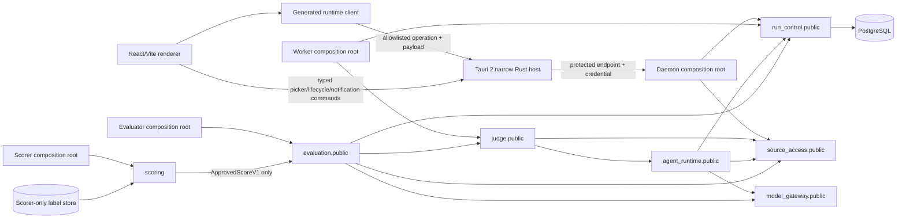

# Components, Ports, Dependencies, and Ownership

Normative: yes  
Version: `components-v4`  
Owner: TV1; collaborators: TV2–TV6  
Requirements: ORCH-05–ORCH-08, API-08–API-10, UI-06, EVAL-11

## Component map

Arrows between capabilities terminate only at `.public`. Composition roots may wire their declared module-owned adapters but contain no policy.

The Tauri host is not a runtime composition root. It transports generated-client operations to the discovered local daemon and owns only OS integration. It cannot interpret Judge policy, fabricate authoritative data, call providers/tools/scoring, or accept arbitrary renderer-supplied endpoints, processes, paths, environment names or update artifacts.

## Capability ownership

| Capability | Owner | Public contract | Adapter custody | Forbidden dependencies |
|---|---|---|---|---|
| `run_control` | TV1/TV6 | run commands/queries/events, claims and IDs | PostgreSQL run/outbox/job adapters; daemon API projection | SDK, source I/O, scoring |
| `model_gateway` | TV1 | one-attempt model port, profile and telemetry types | OpenAI plus deterministic adapters; credential resolver | continuation, desktop, ground truth |
| `source_access` | TV3/TV4 | registration/snapshot/tool/evidence types | filesystem/workspace/redaction/tool adapters | provider, scoring, repository-picker UI |
| `agent_runtime` | TV1/TV2 | turn/continuation/context/budget contracts | context estimator and committed-history adapters | Judge semantics, scoring |
| `judge` | TV1 | candidate/Judge/verdict workflow contracts | prompt/verdict/evidence validators | provider SDK, raw filesystem, labels |
| `evaluation` | TV5 | protocol/experiment/ApprovedScoreV1 acceptance/export contracts | schedule/reporting/manifest adapters | `scoring` import, label adapter/type/credential |
| `scoring` | TV5/TV4 | scorer-root-only application boundary | label store/normalizer/post-terminal join | daemon/worker/desktop/provider/tool paths |

## Outside-capability areas

| Area | Allowed contents | Forbidden contents |
|---|---|---|
| `shared_kernel` | IDs, time, money, `Result`, base errors | finding/run/provider/scoring business models or services |
| `platform` | configuration, DB engine, observability, secrets and process primitives | business repositories, queries, policies or cross-module orchestration |
| `entrypoints` | dependency construction, process startup/shutdown | branching business logic or direct foreign-table queries |
| `generated` | reproducible canonical-contract projections | manually maintained models or scorer types in daemon/desktop sets |

## Desktop ownership

| Area | Owns | Explicitly denied |
|---|---|---|
| `apps/desktop/ui` | React/Vite presentation, form state, safe cache/cursor, generated client and injected transport | raw local credential, direct DB/provider/tool/scorer access, generic native APIs |
| `apps/desktop/src-tauri/capabilities` | per-window allowlists and project command references | wildcard or permissive-default authority |
| `apps/desktop/src-tauri/permissions` | scopes for runtime bridge, picker, notification and update-preparation commands | generic filesystem/shell/process/env/URL/raw-secret/direct-updater grants |
| `apps/desktop/src-tauri/src/commands` | typed validation and dispatch into one native integration owner | business rules, arbitrary command or endpoint execution |
| runtime supervision | protected rendezvous, discover/start-or-attach/status | owning run state or terminating runtime on window/host exit |
| credential store | OS-protected installation credential access/rotation | returning persistent raw secret to renderer or plaintext fallback |
| update coordinator | signature/compatibility/active-work/quiesce/rollback orchestration | renderer-triggered direct install or signing-key access |

## Process composition

| Process | Runtime role | Persistent authority | Forbidden closure |
|---|---|---|---|
| daemon | local API, source registration, run/evaluation projections | PostgreSQL through capability ports | scoring, provider direct, ground truth |
| worker | claims work and executes Judge turns | PostgreSQL run/claim/event state | scoring, desktop, labels |
| evaluator | schedules frozen experiment cells and aggregates safe outputs | evaluation-owned records | scoring module, labels/credential |
| scorer | post-terminal canonical-ID label join and score computation | scorer role/schema plus `evaluation.public.AcceptApprovedScore` | provider/tools/agent workspace/run-event mutation |
| desktop renderer | display/control projection through generated client | none; renderer cache is non-authoritative | Python/DB/provider/tool/scorer imports and generic Tauri authority |
| Tauri host | window/OS integration and protected local transport | none; rendezvous/process signals are non-authoritative | Judge/scoring policy, DB/provider/tool access, runtime lifetime ownership |

## Integration rule

Contract tests target public ports and canonical schemas. Every model-visible or evaluation-visible contract change needs owner/consumer review, a new version/digest, updated flags when result-affecting, and updated traceability before implementation acceptance. Full file-placement, table ownership and architecture-test rules are in `physical-repository-layout.md`.
