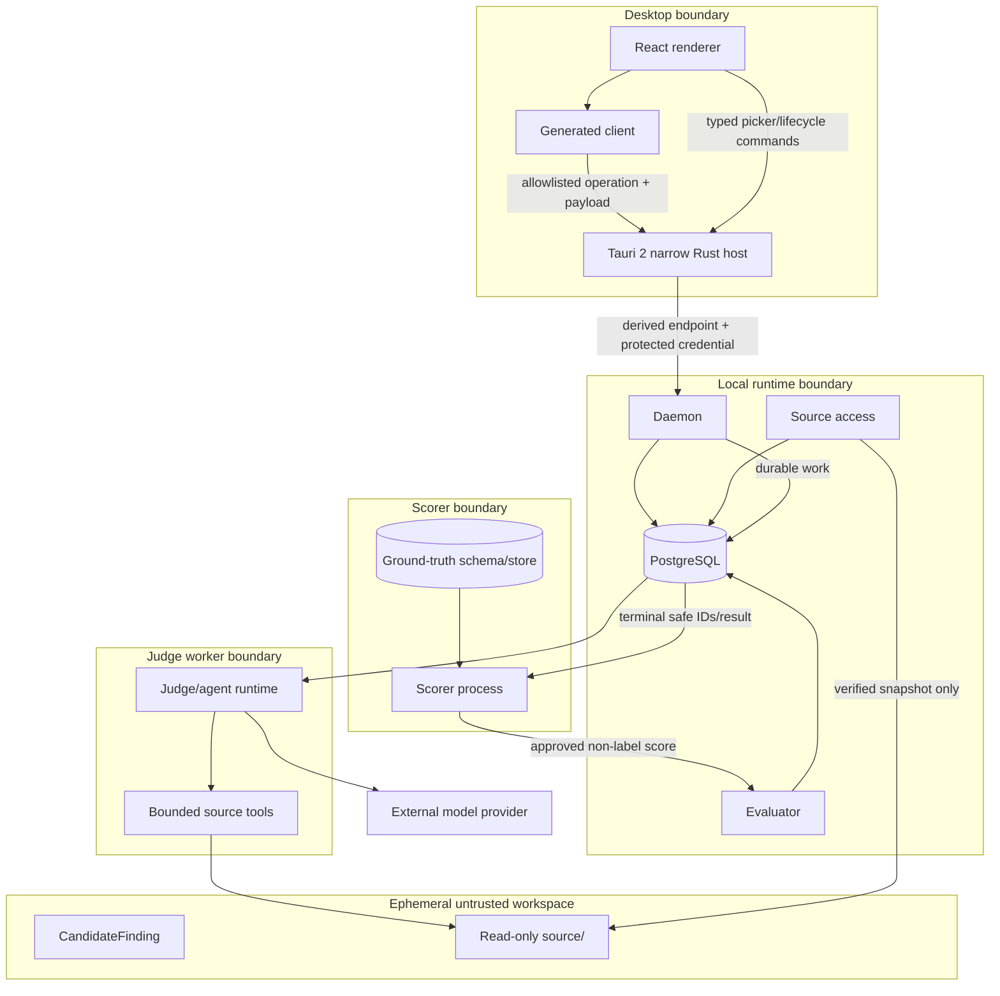

# Containers and Trust Boundaries

Normative: yes  
Version: `containers-v3`  
Owner: TV6; collaborators: TV1, TV4, TV5

## Container view

## Boundary invariants

| Boundary | Allowed crossing | Forbidden crossing |
|---|---|---|
| renderer → Tauri | generated-client operation/payload; typed runtime/picker/notification/update-preparation command | generic filesystem/shell/process/env/URL/credential/updater invocation |
| Tauri → daemon | protected allowlisted runtime operation; ephemeral selected path for registration; explicit lifecycle | arbitrary URL/command, tool authorization, provider/scorer call, run authority |
| renderer → daemon | only via generated-client contract and Tauri protected transport | direct endpoint credential, DB/provider/tool/scorer access or authoritative event creation |
| daemon → PostgreSQL | capability-owned records through ports | direct scorer-table query or credential |
| worker → provider | exact sanitized messages, local tool definitions, schema | ground truth, host path, provider credential in payload/trace |
| tools → workspace | bounded authorized relative read/search | shell/network/write/absolute/traversal/symlink escape |
| source registration → workspace | digest-verified source snapshot | whole contest, reports, labels, mutable host tree |
| ground truth → scorer | label/adjudication after terminal safe input | any path to desktop/daemon/worker/evaluator/provider/tools/trace |
| scorer → evaluation | approved non-ground-truth score contract | label/adjudication/raw scorer rationale |

## Explicitly forbidden edges

No edge exists from ground truth or `scoring` to desktop, daemon, worker, evaluator imports, request construction, context, provider, source workspace, tools, ordinary logs, trajectory or run export. No edge exists from the desktop to PostgreSQL, provider SDK, tool dispatcher or scorer. No renderer edge exists to generic Tauri filesystem, shell, process, environment, arbitrary URL, raw credential or direct updater authority. Local access control does not authorize public exposure.
