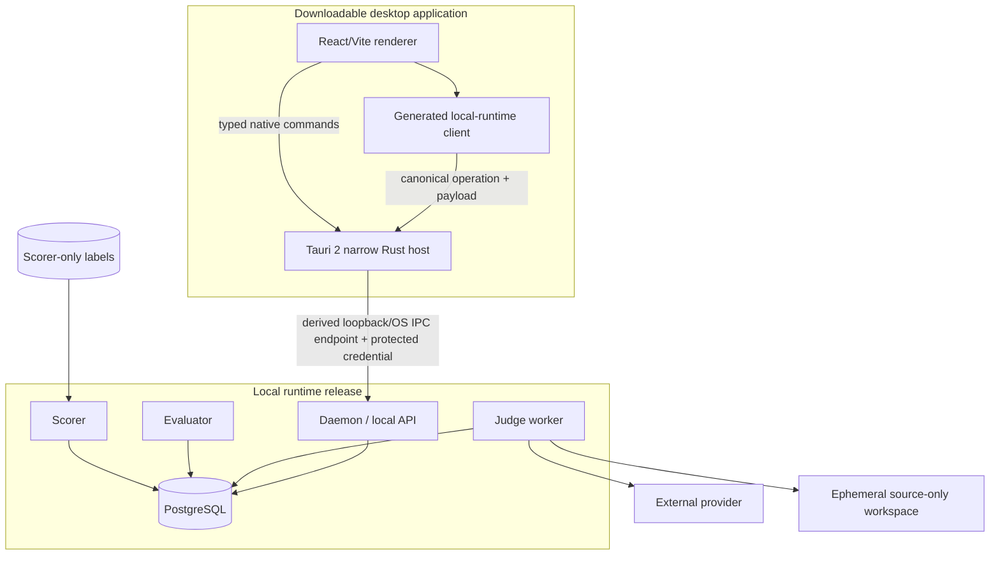

# Desktop and Local Runtime Topology

Normative: yes  
Version: `desktop-runtime-topology-v3`  
Owner: TV6; collaborators: TV1, TV4, TV5  
Decision: ADR-006 (`Accepted`), ADR-007 (`Accepted`)

## Deployment view



There is no desktop-to-DB/provider/tool/scorer edge and no ground-truth edge to daemon, worker, evaluator or desktop.

## Process authority

| Process | Owns | Does not own |
|---|---|---|
| Tauri host | windows, allowlisted generated-client transport, endpoint discovery, protected credential, picker, notification/update integration | run state, Judge policy, tool/provider/scorer behavior, ordinary-child runtime ownership |
| renderer | presentation, generated-client calls, local form state, cursor/cache projection | authoritative events, credentials, source authorization, generic native authority |
| daemon | handshake, local API, source-registration/run/evaluation projections | agent continuation, labels |
| worker | work claim, Judge execution, provider/tool settlement | desktop lifecycle, labels |
| evaluator | frozen schedule and safe aggregation | label resolution, scoring module import |
| scorer | post-terminal ground-truth join and approved score | provider/tools/run-event mutation |
| PostgreSQL | durable run/work/outbox/claim/lease/event/evaluation/scorer records under roles/schemas | presentation state |

## Lifecycle sequence

```mermaid
sequenceDiagram
  participant S as Tauri host
  participant D as Desktop renderer/client
  participant R as Local daemon
  participant P as PostgreSQL
  participant W as Worker
  S->>R: discover/start-or-attach independently supervised runtime
  D->>S: generated health operation + payload
  S->>R: protected health + version/contract/capability handshake
  R-->>S: compatible identity
  S-->>D: validated generated response
  D->>S: explicit picker then generated registration operation
  S->>R: protected registration (ephemeral selected path)
  R->>P: persist safe managed-snapshot identity/digests; never raw path
  D->>S: generated submission with snapshot_id
  S->>R: protected submission
  R->>P: commit run + work item + outbox intent
  R-->>S: 202 + run_id
  S-->>D: validated generated response
  W->>P: acquire versioned lease; CAS state/events/progress
  Note over D: window may close; no cancellation
  D->>S: generated reconnect/poll from cursor
  S->>R: protected finite retrieval
  R-->>S: committed state/events only
  S-->>D: validated generated response
```

## Compatibility policy

Handshake fields are `runtime_instance_id`, `runtime_version`, `api_version`, `contract_digest`, `build_version`, `capabilities`, `health`, and optional safe recovery action. Major/API/contract incompatibility disables mutation. A compatible client may tolerate declared additive capability differences; exact compatibility rules are versioned and testable, never inferred from successful TCP connection.

## Local endpoint and credential

- Default: loopback endpoint; OS IPC is an equivalent implementation choice.
- Rendezvous metadata and credential are installation-scoped and OS-protected.
- Credential is never placed in a URL, renderer storage, ordinary logs, trace or export.
- Tauri derives the endpoint and credential; the renderer cannot provide an arbitrary endpoint or retrieve the raw secret.
- An unavailable approved secure-store backend yields `unauthorized_local` and no plaintext/anonymous fallback.
- Rotation preserves run IDs and committed state.
- Public bind, remote proxy and multi-tenancy require a later security ADR.

## Renderer-to-native permission matrix

| Command family | Renderer-visible purpose | Native owner | Scope/denial |
|---|---|---|---|
| runtime discover/start-or-attach/status | establish a compatible local runtime | `runtime_supervision` | no arbitrary executable, PID, signal or endpoint input |
| generated runtime transport | execute a canonical generated-client operation | `commands` + credential store | allowlisted operation IDs only; derived endpoint; no raw credential |
| repository picker | explicit operator selection before registration | `repository_picker` | short-lived result; no generic read/list/write authority |
| safe notification | show bounded local run projection | `notifications` | no untrusted HTML/URL/action execution |
| update check/prepare | expose availability, active-work and confirmation state | `update_coordinator` | no renderer direct install, artifact URL, signer or bypass |

Generic filesystem, shell, process, environment, opener/arbitrary URL, raw credential and direct updater plugins/commands are absent from the main-window capability. Effective merged Tauri capabilities and custom-command defaults require release review.

## Packaging and update boundaries

Desktop/runtime compatibility is coordinated, but window or Tauri-host close does not stop the independently supervised runtime. Tauri transports signed native artifacts while the project update coordinator verifies OS signing, artifact signature, compatibility manifest, active work, `reject_if_active|quiesce_then_stop`, PostgreSQL migration compatibility, post-update health and rollback. Ambiguous paid attempts remain recorded. These mechanics are selected by ADR-007 but remain unproven until WP-01/WP-10 readiness evidence exists.

PostgreSQL is the only MVP work/state authority. Renderer cache, daemon/worker memory, rendezvous files and process exit status are disposable projections/signals; SQLite and Redis are not substitute authorities.

## Failure-state matrix

| Condition | Desktop state | Runtime/run behavior |
|---|---|---|
| daemon starting | `runtime_starting` | no submission; committed runs unchanged |
| endpoint unavailable | `runtime_unavailable` | worker may continue; retry discovery |
| local credential rejected | `unauthorized_local` | no fallback/direct access; rotate/restart action |
| protected credential backend unavailable | `unauthorized_local` | fail closed; no plaintext or anonymous fallback |
| contract incompatible | `incompatible_version` | mutations disabled; coordinated update action |
| connection lost with open trace | `reconnecting` | run continues from PostgreSQL authority |
| compatible reconnect | `ready` | resume cursor; de-duplicate `(run_id, sequence)` |
