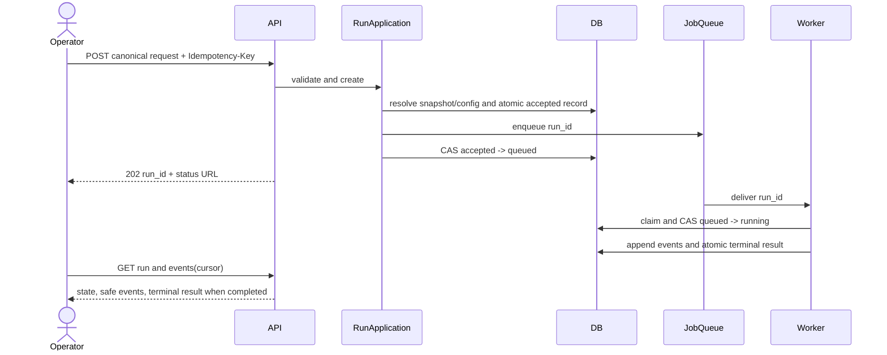
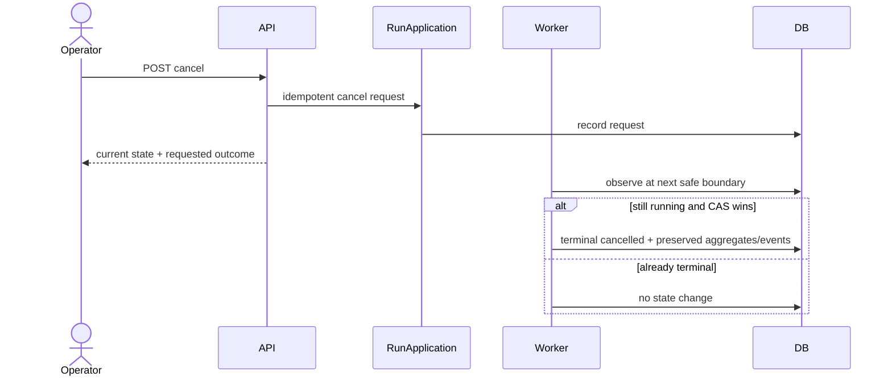

# End-to-End Sequences

Normative: yes  
Version: `judge-sequences-v3`  
Owner: TV1; collaborators: TV2, TV3, TV4, TV6

## Submission to terminal retrieval



Invariant: configuration is persisted before enqueue; queue payload contains only stable identifiers; a client disconnect does not stop work.

## Tauri discovery, protected transport, and host exit

```mermaid
sequenceDiagram
  actor U as Operator
  participant UI as React/generated client
  participant T as Tauri narrow host
  participant S as Runtime supervisor
  participant API as Local daemon
  participant DB as PostgreSQL
  U->>UI: open desktop
  UI->>T: runtime discover/start-or-attach
  T->>S: platform-scoped discover/start-or-attach
  S-->>T: protected rendezvous/runtime identity
  UI->>T: allowlisted runtime-info operation
  T->>API: derived endpoint + protected credential
  API-->>T: version/contract/capability/health
  T-->>UI: validated generated response
  Note over UI,T: every window/host may close or crash
  Note over S,DB: no implicit stop/cancel; committed work remains authoritative
  U->>UI: reopen desktop
  UI->>T: rediscover + full handshake + cursor resume
```

Invariant: renderer input cannot choose an arbitrary endpoint, credential, executable, process or URL. The Tauri host is protected transport/OS integration only and never owns Judge continuation or run state.

## Coordinated signed update

```mermaid
sequenceDiagram
  actor U as Operator
  participant UI as Desktop projection
  participant T as Tauri update coordinator
  participant API as Local daemon
  participant DB as PostgreSQL
  participant PKG as Approved signed release
  UI->>T: check/prepare approved channel
  T->>PKG: verify OS signing + artifact signature + compatibility manifest
  T->>API: prepare update(policy, target versions/digests)
  API->>DB: inspect active runs, claims and ambiguous attempts
  alt reject_if_active with work
    API-->>T: conflict + safe counts
    T-->>UI: no installation; explicit action required
  else confirmed quiesce_then_stop or no work
    API->>DB: quiesce at safe boundaries; preserve ambiguity
    API-->>T: quiesced + manifest digest
    T->>PKG: install coordinated signed artifacts
    T->>API: restart/rediscover and full compatibility handshake
    alt compatible and healthy
      T-->>UI: ready; mutations enabled
    else install/interruption/mismatch
      T->>PKG: execute documented rollback
      T-->>UI: incompatible/update-failed; mutations disabled
    end
  end
```

Invariant: Tauri's updater is artifact transport, not product authority. Renderer cannot supply artifact URLs/signing keys or invoke installation directly, and window close never substitutes for cancellation/quiesce.

## Provider and tool iteration

```mermaid
sequenceDiagram
  participant O as Orchestrator
  participant C as ContextPlanner
  participant P as model_gateway.public
  participant T as ToolRegistry
  participant W as WorkspacePolicy
  participant E as EventSink
  loop until valid verdict or stop
    O->>C: preflight exact planned messages + output reserve
    C-->>O: model input or context_budget
    O->>E: context.allocated/transformed
    O->>P: normalized request + accepted profile digest
    P->>P: pre-network gate; official async adapter; one non-streaming attempt
    P-->>O: normalized response/tool intent/usage/error
    O->>E: provider attempt + exact sanitized response
    alt tool request
      O->>T: bounded tool call
      T->>W: authorize canonical relative path
      W-->>T: allowed or safe denial
      T-->>O: bounded transformed result/error
      O->>E: tool/security/transformation events
    else proposed verdict
      O->>O: schema and evidence validation
    end
  end
```

Invariant: explicit history is reconstructed only from committed events. The adapter does not own conversation state, execute tools or accept a verdict; provider and tool errors are data in the trajectory and only the application transition authority commits terminal state.

## Tool failure and recovery

1. Persist `tool.requested` with bounded sanitized arguments.
2. Authorize before I/O; on operational failure, create normalized tool error.
3. Persist `tool.failed`; return a model-actionable bounded error inside untrusted-data delimiters.
4. Re-run context preflight before the next provider attempt.
5. Continue only if budgets and no-progress rules permit. A tool failure alone does not crash the worker.

## Structured repair and completion

1. A proposed verdict is validated independently of the provider.
2. Schema or evidence failure emits `verdict.validation_failed` with safe validation paths.
3. When repair is enabled and attempts remain, the failure is added to the next preflighted context.
4. A valid verdict and evidence are committed atomically with aggregates and `run.completed`.
5. Exhausted repair produces `failed/schema_repair_exhausted`; no partial verdict is terminal.

## Cancellation and budget exhaustion



Budget checks occur before and after each provider/tool boundary. A selected limit blocks any next action and commits `budget_exhausted` with observed-limit telemetry.

## Provider failure paths

| Path | Required sequence |
|---|---|
| Incomplete/unapproved profile | Reject before SDK client construction, credential access or network → commit safe configuration failure. |
| Transient under primary profile | Append the sole attempt/error → no SDK/project retry → commit the mapped terminal failure. |
| Permanent | Append attempt/error → no transient retry → commit `failed/provider_permanent`. |
| Retry-enabled non-primary research | Requires distinct flag/profile/experiment identity; append every attempt/backoff and enforce budgets. |
| Late result after cancellation | Sanitize and account where possible → never append model-visible continuation or rewrite terminal state. |

## Tool denial

Authorization rejects before content read, returns a safe tool error, and writes a separate `security.blocked` event with rule ID and normalized relative input. The event never stores the resolved prohibited path or content.

## Queue redelivery and worker interruption

```mermaid
sequenceDiagram
  participant Q as JobQueue
  participant W1 as Worker A
  participant W2 as Worker B
  participant DB
  Q->>W1: deliver run_id
  W1->>DB: claim token/version and append sequence N
  W1--xDB: interrupted
  Q->>W2: redeliver run_id
  W2->>DB: acquire new claim or observe active lease policy
  W2->>DB: reload next sequence and run state
  W2->>DB: append N+1; duplicates rejected
  W2->>DB: terminal CAS
```

Provider calls cannot be guaranteed exactly once across process failure. The reproduction record distinguishes attempts with unknown outcome, and idempotency prevents the system from pretending otherwise.

## Matched direct and harness calls

The scheduler resolves one accepted provider profile ID/version/digest for a matched pair. Both direct and harness arms use the same immutable model, SDK mapping, sampling, output reserve, timeout and one-attempt policy. Their prompt wrappers and allowed tools intentionally differ and are versioned by the experiment profile. Profile drift or retry asymmetry rejects the pair before either arm reaches the network.

## Post-terminal scoring

The evaluator passes canonical `experiment_cell_id` and terminal `run_id` to the separate scorer entrypoint without loading a label. Only scorer-composed `scoring` resolves `case_id`, writes scorer-only detail and submits `ApprovedScoreV1` through `evaluation.public`. The score is not a run event; no label or scorer detail returns to worker, evaluator internals, tools, provider, ordinary run API or desktop.
