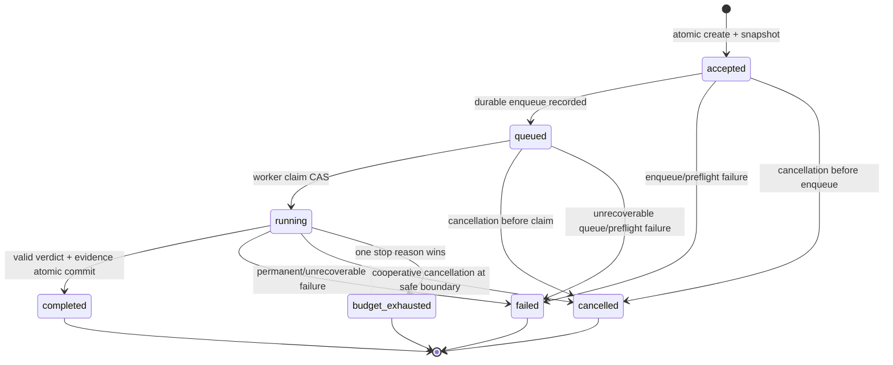

# Judge Run Lifecycle

Normative: yes  
Version: `judge-lifecycle-v2`  
Owner: TV1; collaborator: TV6  
Requirements: API-03, ORCH-01, ORCH-03

## State machine

## Transition table

| From | To | Authority | Preconditions | Atomic persistence | Duplicate/stale outcome |
|---|---|---|---|---|---|
| none | accepted | Run application | Valid canonical request, source/config resolvable, idempotency available | Run + immutable config + idempotency record | Same key/digest returns original; different digest conflicts |
| accepted | queued | Run application | Durable job reference created | State version CAS + `run.queued` | Existing queued state returned |
| accepted | failed | Run application | Snapshot/enqueue cannot complete safely | Failure event + terminal aggregate | Terminal state unchanged |
| accepted | cancelled | Run application | Cancel requested before durable enqueue | Cancel event + terminal aggregate | Terminal state unchanged |
| queued | running | Worker adapter | Claim token valid; cancellation not committed | Claim + state version CAS + start event | Stale claim rejected |
| queued | cancelled | Run application/worker | Cancel requested before successful start CAS | Cancel request/outcome + terminal aggregate | Claim loses CAS |
| queued | failed | Worker/application | Job is unrecoverable before model call | Failure event + terminal aggregate | Terminal state unchanged |
| running | completed | Run application via worker | Verdict schema/evidence valid; cancel absent; budgets available | Verdict/evidence/usage + completion event + terminal state in one transaction | Stale worker rejected |
| running | failed | Run application via worker | Permanent error or retries/repair exhausted | Failure reason/usage + terminal event/state | Stale worker rejected |
| running | cancelled | Run application via worker | Cancellation observed at model/tool boundary | Cancel outcome/usage + terminal event/state | Terminal state unchanged |
| running | budget_exhausted | Run application via worker | Stop condition selected | Budget evidence + terminal event/state | Terminal state unchanged |

All other transitions are invalid. Terminal states are immutable.

Before `accepted -> queued` for a real-provider run, the application resolves and validates accepted provider/experiment profile versions and digests. Before each model attempt, `model_gateway` repeats the pre-network gate before SDK client construction or credential access. A missing/unapproved/drifted profile is a configuration failure, not a provider attempt. Deterministic profiles bypass real credential/network approval while remaining schema/contract checked.

## Budget exhaustion

When checks observe multiple exhausted limits at one safe boundary, choose by fixed precedence: `wall_clock`, `cost_budget`, `total_tokens`, `max_steps`, `context_budget`, `no_progress`. Record all observed exhausted limits in telemetry but exactly one `terminal_reason`.

No provider or tool action starts after a terminal transition or after the chosen limit is known. In-flight provider calls may not be physically cancelled; their late result is recorded only as a safe orphan-attempt observation and cannot mutate the terminal run.

The primary RQ1 profile permits one project attempt and configures SDK retries to zero. A transient error therefore maps to a terminal primary outcome after the single recorded attempt. Retry-enabled execution is a different experiment identity and cannot reuse primary acceptance or paired results.

## Version and CAS

Each mutable run row has a monotonically increasing `state_version`. A transition supplies expected state and version. A zero-row update means the caller is stale and must reload; it never retries a terminal write blindly.
