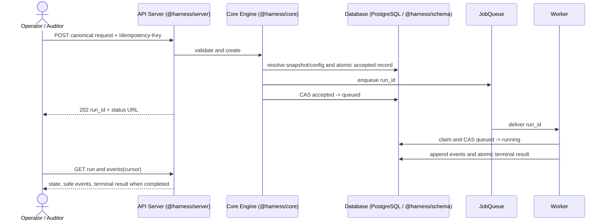
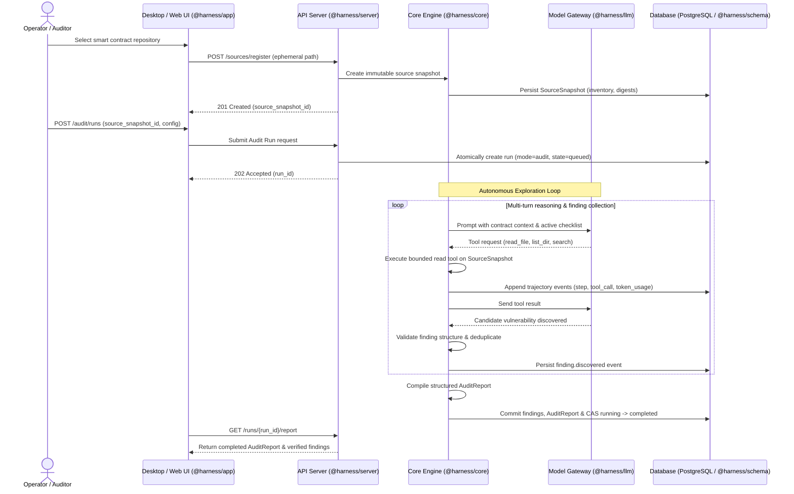
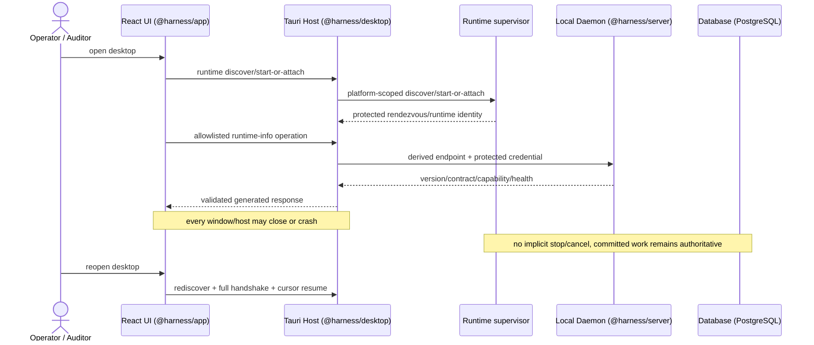
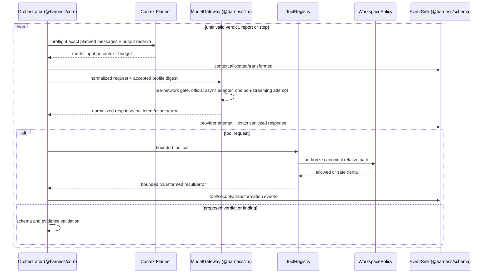
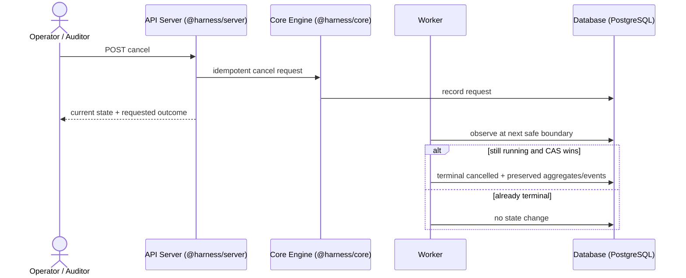
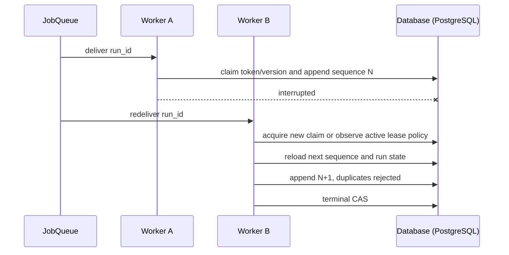
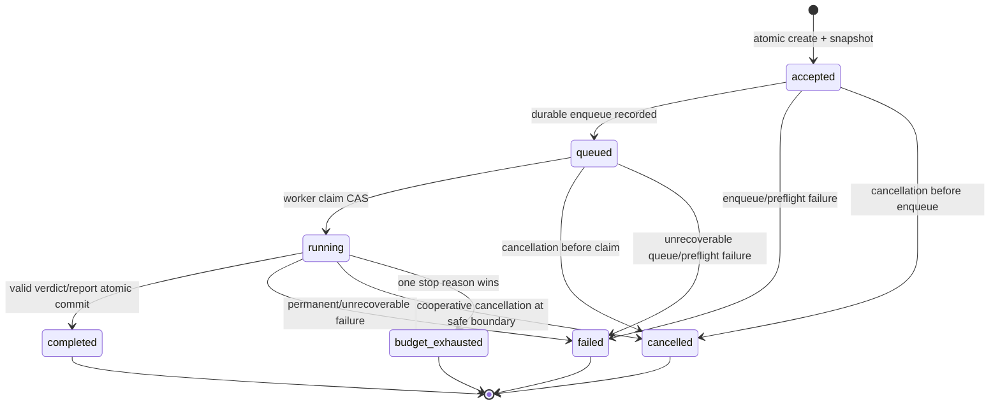

# System Sequences & Lifecycle

Normative: yes  
Version: `sequences-v4`  

## Submission to terminal retrieval (Judge Mode)

Invariant: configuration is persisted before enqueue; queue payload contains only stable identifiers; a client disconnect does not stop work.

## Autonomous Audit Mode flow

Invariant: Audit Mode operates purely on immutable snapshots through read-only tools; all intermediate reasoning, tool calls, and discovered findings are durably recorded in PostgreSQL.

## Tauri discovery, protected transport, and host exit

Invariant: renderer input cannot choose an arbitrary endpoint, credential, executable, process or URL. The Tauri host is protected transport/OS integration only and never owns Judge/Audit continuation or run state.

## Provider and tool iteration

Invariant: explicit history is reconstructed only from committed events. The adapter does not own conversation state, execute tools or accept a verdict; provider and tool errors are data in the trajectory and only the application transition authority commits terminal state.

## Tool failure and recovery

1. Persist `tool.requested` with bounded sanitized arguments.
2. Authorize before I/O; on operational failure, create normalized tool error.
3. Persist `tool.failed`; return a model-actionable bounded error inside untrusted-data delimiters.
4. Re-run context preflight before the next provider attempt.
5. Continue only if budgets and no-progress rules permit. A tool failure alone does not crash the worker.

## Structured repair and completion

1. A proposed verdict or finding is validated independently of the provider.
2. Schema or evidence failure emits validation failed event with safe validation paths.
3. When repair is enabled and attempts remain, the failure is added to the next preflighted context.
4. A valid verdict/finding and evidence are committed atomically with aggregates and `run.completed`.
5. Exhausted repair produces `failed/schema_repair_exhausted`; no partial verdict or unvalidated finding is terminal.

## Cancellation and budget exhaustion

Budget checks occur before and after each provider/tool boundary. A selected limit blocks any next action and commits `budget_exhausted` with observed-limit telemetry.

## Provider failure paths

| Path | Required sequence |
|---|---|
| Incomplete/unapproved profile | Reject before SDK client construction, credential access or network → commit safe configuration failure. |
| Transient under primary profile | Append the sole attempt/error → no SDK/project retry → commit the mapped terminal failure. |
| Permanent | Append attempt/error → no transient retry → commit `failed/provider_permanent`. |
| Configured retry profile | When explicit retry profile is enabled, append every attempt/backoff and enforce strict budget ceilings. |
| Late result after cancellation | Sanitize and account where possible → never append model-visible continuation or rewrite terminal state. |

## Tool denial

Authorization rejects before content read, returns a safe tool error, and writes a separate `security.blocked` event with rule ID and normalized relative input. The event never stores the resolved prohibited path or content.

## Queue redelivery and worker interruption

Provider calls cannot be guaranteed exactly once across process failure. The reproduction record distinguishes attempts with unknown outcome, and idempotency prevents the system from pretending otherwise.

## Run Lifecycle & State Machine

- **Normative**: yes  
- **Version**: `run-lifecycle-v3`  
- **Requirements**: API-03, ORCH-01, ORCH-03

## Transition table

| From | To | Authority | Preconditions | Atomic persistence | Duplicate/stale outcome |
|---|---|---|---|---|---|
| none | accepted | Run application | Valid canonical request, source/config resolvable, idempotency available | Run + immutable config + idempotency record | Same key/digest returns original; different digest conflicts |
| accepted | queued | Run application | Durable job reference created | State version CAS + `run.queued` | Existing queued state returned |
| accepted | failed | Run application | Snapshot/enqueue cannot complete safely | Failure event + terminal aggregate | Terminal state unchanged |
| accepted | cancelled | Run application | Cancel requested before durable enqueue | Cancel event + terminal aggregate | Terminal state unchanged |
| queued | running | Worker adapter | Claim token valid; cancellation not committed | Claim + state version CAS + start event | Stale claim rejected |
| queued | cancelled | Run application/worker | Cancel requested before successful start CAS | Cancel request/outcome + terminal aggregate | Claim loses CAS |
| queued | failed | Worker/application | Job is unrecoverable before model call | Failure event + terminal aggregate | Terminal state unchanged |
| running | completed | Run application via worker | Verdict/report schema and evidence valid; cancel absent; budgets available | Verdict/findings/usage + completion event + terminal state in one transaction | Stale worker rejected |
| running | failed | Run application via worker | Permanent error or retries/repair exhausted | Failure reason/usage + terminal event/state | Stale worker rejected |
| running | cancelled | Run application via worker | Cancellation observed at model/tool boundary | Cancel outcome/usage + terminal event/state | Terminal state unchanged |
| running | budget_exhausted | Run application via worker | Stop condition selected | Budget evidence + terminal event/state | Terminal state unchanged |

All other transitions are invalid. Terminal states are immutable.

Before `accepted -> queued` for a real-provider run, the application resolves and validates accepted provider profile versions and digests. Before each model attempt, `model_gateway` repeats the pre-network gate before SDK client construction or credential access. A missing/unapproved/drifted profile is a configuration failure, not a provider attempt. Deterministic profiles bypass real credential/network approval while remaining schema/contract checked.

## Budget exhaustion

When checks observe multiple exhausted limits at one safe boundary, choose by fixed precedence: `wall_clock`, `cost_budget`, `total_tokens`, `max_steps`, `context_budget`, `no_progress`. Record all observed exhausted limits in telemetry but exactly one `terminal_reason`.

No provider or tool action starts after a terminal transition or after the chosen limit is known. In-flight provider calls may not be physically cancelled; their late result is recorded only as a safe orphan-attempt observation and cannot mutate the terminal run.

The default profile permits one model attempt and configures SDK retries to zero. A transient error therefore maps to a terminal failure after the single recorded attempt, preventing silent provider retries from consuming unaccounted budget. Explicit retry-enabled runs require separate profile configuration with bounded retry budgets.

## Version and CAS

Each mutable run row has a monotonically increasing `state_version`. A transition supplies expected state and version. A zero-row update means the caller is stale and must reload; it never retries a terminal write blindly.
