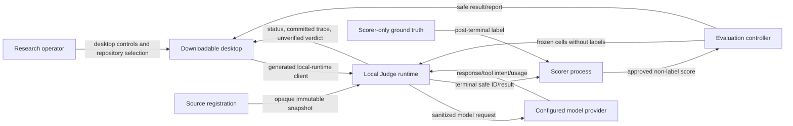

# System Context

Normative: yes  
Version: `system-context-v2`  
Owner: TV1; collaborators: TV4, TV5, TV6  
Requirements: API-04–API-09, EVAL-10–EVAL-11, TOOL-01

## Context diagram

## Responsibilities

| Element | Owns | Must not own or receive |
|---|---|---|
| research operator | repository choice, finding, approved config | implicit ground truth or public-service assumption |
| desktop | native OS integration and safe presentation | run authority, DB/provider/tool/scorer internals |
| local runtime | source registration, orchestration, persistence, safe API | agent-visible ground truth |
| model provider | sanitized one-attempt request/response | labels, host paths, credential in trajectory |
| evaluator | frozen schedule, safe aggregation/export | label resolution or scoring import |
| scorer | post-terminal label join | provider/tools/run-event mutation |

## Context invariants

| ID | Invariant |
|---|---|
| CTX-01 | Candidate/source content is untrusted agent-visible data, never a label. |
| CTX-02 | Run submission uses only opaque `source_snapshot_id`; raw path is registration-only ephemeral input. |
| CTX-03 | Ground truth reaches only the scorer after terminal execution. |
| CTX-04 | Desktop uses only generated local-runtime contracts and is not execution authority. |
| CTX-05 | Desktop disconnect/closure does not cancel or hide committed work. |
| CTX-06 | Local endpoint is access-controlled and non-public; this is not multi-tenant authorization. |
| CTX-07 | Evaluation results reference immutable runs; they never rewrite model-visible facts. |
