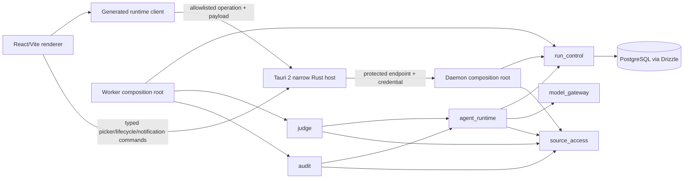
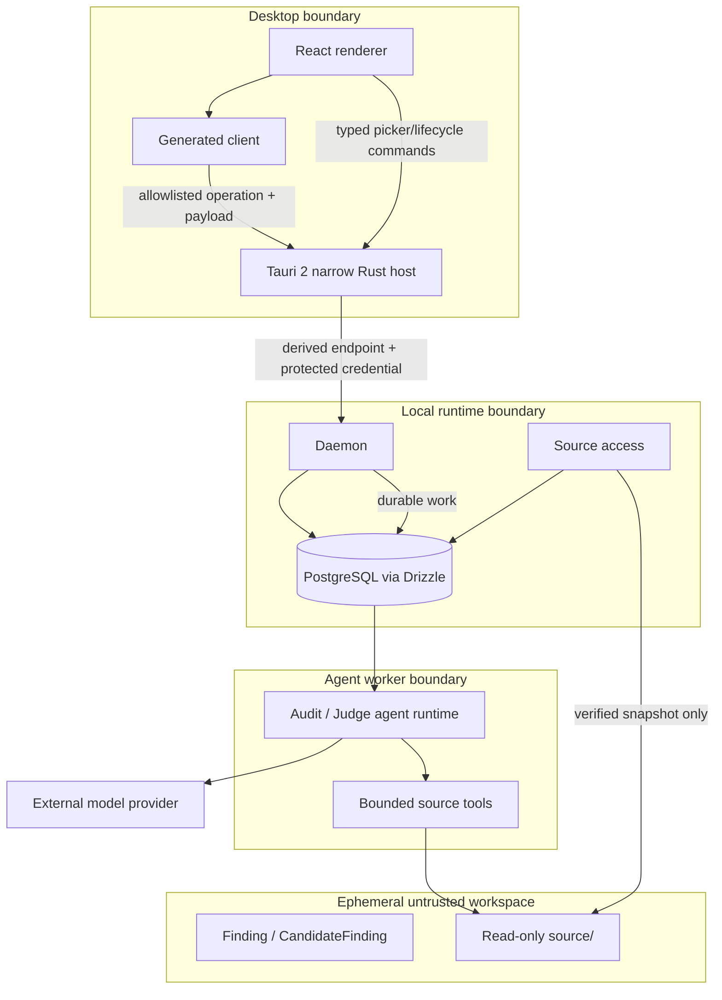
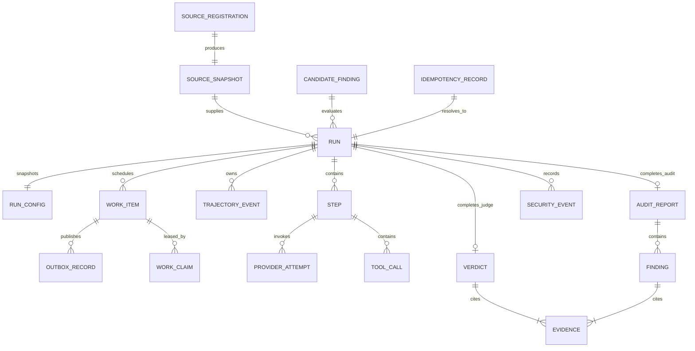

# System Overview & Persistence Model

## Operation Modes

Harness is a specialized Agent framework designed for smart contract security, operating in two main modes:

- **Audit Mode**: Autonomous exploration of a smart contract codebase to discover vulnerabilities (findings) from scratch.
- **Judge Mode**: Verifying, deduplicating, and filtering a provided set of candidate findings against the codebase.

## System Context

Normative: yes
Version: `system-context-v3`
Requirements: API-04–API-09, TOOL-01

### Context diagram

```mermaid
flowchart LR
    U[Operator / Auditor] -->|desktop controls and repository selection| D[Downloadable desktop (Tauri 2)]
    D -->|generated local-runtime client| H[Local Agent runtime]
    H -->|sanitized model request| P[Configured model provider]
    P -->|response/tool intent/usage| H
    SR[Source registration] -->|opaque immutable snapshot| H
    H -->|status, committed trace, verdicts / audit reports| D
```

### Responsibilities

| Element           | Owns                                                                 | Must not own or receive                            |
| ----------------- | -------------------------------------------------------------------- | -------------------------------------------------- |
| operator / auditor| repository choice, finding, candidate finding, approved config       | implicit ground truth or public-service assumption |
| desktop           | native OS integration and safe presentation                          | run authority, DB/provider/tool internals          |
| local runtime     | source registration, orchestration, persistence, safe API            | agent-visible ground truth                         |
| model provider    | sanitized one-attempt request/response                               | host paths, credential in trajectory               |

### Context invariants

| ID     | Invariant                                                                                             |
| ------ | ----------------------------------------------------------------------------------------------------- |
| CTX-01 | Candidate/source content is untrusted agent-visible data, never a label.                              |
| CTX-02 | Run submission uses only opaque `source_snapshot_id`; raw path is registration-only ephemeral input.  |
| CTX-04 | Desktop uses only generated local-runtime contracts and is not execution authority.                   |
| CTX-05 | Desktop disconnect/closure does not cancel or hide committed work.                                    |
| CTX-06 | Local endpoint is access-controlled and non-public; this is not multi-tenant authorization.           |

## Components, Ports, Dependencies, and Ownership

Normative: yes
Version: `components-v4`
Requirements: ORCH-05–ORCH-08, API-08–API-10, UI-06

### Component map



Arrows between capabilities terminate only at public boundaries. Composition roots wire declared module adapters but contain no business policy.

The Tauri host is not a runtime composition root. It transports generated-client operations to the discovered local daemon and owns only OS integration. It cannot interpret Judge or Audit policy, fabricate authoritative data, call providers/tools, or accept arbitrary renderer-supplied endpoints, processes, paths, environment names or update artifacts.

### Capability ownership

| Capability        | Public contract                                                 | Adapter custody                                           | Forbidden dependencies                            |
| ----------------- | --------------------------------------------------------------- | --------------------------------------------------------- | ------------------------------------------------- |
| `run_control`   | run commands/queries/events, claims and IDs                     | PostgreSQL run/outbox/job adapters; daemon API projection | SDK, source I/O                                   |
| `model_gateway` | one-attempt model port, profile and telemetry types             | OpenAI plus deterministic adapters; credential resolver   | continuation, desktop                             |
| `source_access` | registration/snapshot/tool/evidence types                       | filesystem/workspace/redaction/tool adapters              | provider, repository-picker UI                    |
| `agent_runtime` | turn/continuation/context/budget contracts                      | context estimator and committed-history adapters          | Judge/Audit domain semantics                      |
| `judge`         | candidate/Judge/verdict workflow contracts                      | prompt/verdict/evidence validators                        | provider SDK, raw filesystem                      |
| `audit`         | repository/audit/report workflow contracts                      | audit prompt/report validators                            | provider SDK, raw filesystem                      |

### Outside-capability areas

| Area              | Allowed contents                                                        | Forbidden contents                                                     |
| ----------------- | ----------------------------------------------------------------------- | ---------------------------------------------------------------------- |
| `shared_kernel` | IDs, time, money, `Result`, base errors                                 | finding/run/provider business models or services                       |
| `platform`      | configuration, DB engine, observability, secrets and process primitives | business repositories, queries, policies or cross-module orchestration |
| `entrypoints`   | dependency construction, process startup/shutdown                       | branching business logic or direct foreign-table queries               |
| `generated`     | reproducible canonical-contract projections                             | manually maintained models in daemon/desktop sets                      |

### Desktop ownership

| Area                                    | Owns                                                                                            | Explicitly denied                                                                |
| --------------------------------------- | ----------------------------------------------------------------------------------------------- | -------------------------------------------------------------------------------- |
| `packages/app`                          | React presentation, form state, safe cache/cursor, generated client                             | raw local credential, direct DB/provider/tool access, generic native APIs        |
| `packages/desktop/src-tauri/capabilities`| per-window allowlists and project command references                                           | wildcard or permissive-default authority                                         |
| `packages/desktop/src-tauri/permissions` | scopes for runtime bridge, picker, notification and update-preparation commands                 | generic filesystem/shell/process/env/URL/raw-secret/direct-updater grants        |
| `packages/desktop/src-tauri/src/commands`| typed validation and dispatch into one native integration owner                                | business rules, arbitrary command or endpoint execution                          |
| runtime supervision                     | protected rendezvous, discover/start-or-attach/status                                           | owning run state or terminating runtime on window/host exit                      |
| credential store                        | OS-protected installation credential access/rotation                                            | returning persistent raw secret to renderer or plaintext fallback                |

### Process composition

| Process          | Runtime role                                                  | Persistent authority                                             | Forbidden closure                                                         |
| ---------------- | ------------------------------------------------------------- | ---------------------------------------------------------------- | ------------------------------------------------------------------------- |
| daemon           | local API, source registration, run projections               | PostgreSQL through capability ports                              | provider direct                                                           |
| worker           | claims work and executes Judge and Audit turns                | PostgreSQL run/claim/event state                                 | desktop                                                                   |
| desktop renderer | display/control projection through generated client           | none; renderer cache is non-authoritative                        | Backend/DB/provider/tool imports and generic Tauri authority              |
| Tauri host       | window/OS integration and protected local transport           | none; rendezvous/process signals are non-authoritative           | Judge/Audit policy, DB/provider/tool access, runtime lifetime ownership  |

### Integration rule

Contract tests target public ports and canonical schemas. Every model-visible contract change needs owner/consumer review, a new version/digest, updated flags when result-affecting, and updated traceability before implementation acceptance. Full file-placement, table ownership and architecture-test rules are in `module-layout.md`.

## Containers and Trust Boundaries

Normative: yes
Version: `containers-v4`

### Container view



### Boundary invariants

| Boundary                         | Allowed crossing                                                                                      | Forbidden crossing                                                                         |
| -------------------------------- | ----------------------------------------------------------------------------------------------------- | ------------------------------------------------------------------------------------------ |
| renderer → Tauri                | generated-client operation/payload; typed runtime/picker/notification/update-preparation command      | generic filesystem/shell/process/env/URL/credential/updater invocation                     |
| Tauri → daemon                  | protected allowlisted runtime operation; ephemeral selected path for registration; explicit lifecycle | arbitrary URL/command, tool authorization, provider call, run authority                    |
| renderer → daemon               | only via generated-client contract and Tauri protected transport                                      | direct endpoint credential, DB/provider/tool access or authoritative event creation        |
| daemon → PostgreSQL             | capability-owned records through ports                                                                | direct unsupported query or credential                                                     |
| worker → provider               | exact sanitized messages, local tool definitions, schema                                              | host path, provider credential in payload/trace                                            |
| tools → workspace               | bounded authorized relative read/search                                                               | shell/network/write/absolute/traversal/symlink escape                                      |
| source registration → workspace | digest-verified source snapshot                                                                       | mutable host tree                                                                          |

### Explicitly forbidden edges

No edge exists from the desktop to PostgreSQL, provider SDK, or tool dispatcher. No renderer edge exists to generic Tauri filesystem, shell, process, environment, arbitrary URL, raw credential or direct updater authority. Local access control does not authorize public exposure.

## PostgreSQL Entity and Ownership Blueprint

Normative: yes
Version: `persistence-erd-v3`
Requirements: DATA-01–DATA-04

### Entity relationships



### Key fields

| Entity                                                              | Required identity/concurrency fields                                                                              | Sensitive/exposure rule                                            |
| ------------------------------------------------------------------- | ----------------------------------------------------------------------------------------------------------------- | ------------------------------------------------------------------ |
| `source_registration`                                             | registration ID, policy version, safe outcome, snapshot ID, timestamps                                            | no raw selected path/hash                                          |
| `source_snapshot`                                                 | snapshot ID, revision, inventory/tree/content digests, managed content reference                                  | safe projection exposes ID/revision/digests only                   |
| `run`                                                             | run ID, mode, state, state version, terminal reason/timestamps                                                    | no label/raw path/credential                                       |
| `run_config`                                                      | run ID, canonical config digest and immutable resolved values                                                     | profile/prompt/flag/budget/source versions/digests                 |
| `work_item`                                                       | work ID, run ID, kind, state, version, available time                                                             | PostgreSQL authority; queue payload ID only                        |
| `outbox_record`                                                   | outbox ID, aggregate/work ID, event kind, payload digest, publish state/version                                   | safe stable IDs only                                               |
| `work_claim`                                                      | claim ID/token digest, work ID, worker ID, claim version, lease expiry, heartbeat/release/outcome                 | token never API/export                                             |
| `trajectory_event`                                                | event ID, run ID, unique sequence, schema/type, safe payload/digest                                               | append-only safe projection                                        |
| `provider_attempt`                                                | attempt ID, step/logical-call/attempt indexes, profile/model, request/response digests, usage/timing/cost/outcome | no credential/raw native object                                    |
| `tool_call`                                                       | call ID/index, tool/version, safe args/result digests, timing/outcome                                             | relative authorized source paths only                              |
| `verdict/evidence`                                                | one verdict/run (Judge Mode); ordered relative-path evidence                                                      | no score/label                                                     |
| `audit_report/finding`                                            | one report/run (Audit Mode); structured findings with severity and evidence                                       | safe API/export                                                    |

### Capability table/migration ownership

| Capability        | Tables/migration namespace                                                                                                                                                            | Other capabilities use                                  |
| ----------------- | ------------------------------------------------------------------------------------------------------------------------------------------------------------------------------------- | ------------------------------------------------------- |
| `source_access` | `source_registration`, `source_snapshot`, managed-content metadata                                                                                                                | `source_access` public API only                         |
| `run_control`   | `candidate_finding`, `run`, `run_config`, `idempotency_record`, `work_item`, `outbox_record`, `work_claim`, `trajectory_event`, `security_event`, safe content refs                 | `run_control` public API only                           |
| `model_gateway` | `provider_profile_ref`, `provider_attempt`                                                                                                                                        | `model_gateway` public API only                         |
| `agent_runtime` | `step`, context allocation, `tool_call` projection/reference                                                                                                                      | `agent_runtime` public API only                         |
| `judge`         | `verdict`, `evidence`                                                                                                                                                             | `judge` public API only                                 |
| `audit`         | `audit_report`, `finding`                                                                                                                                                             | `audit` public API only                                 |

Foreign keys/references do not authorize cross-module SQL. Module migration metadata is composed by the migration registry; each table has exactly one owner.

## Required constraints and indexes

- unique source inventory/tree identity under policy version; no raw-path column;
- unique idempotency key digest with immutable canonical request digest;
- unique `(run_id, sequence)`, `(run_id, step_index)`, `(step_id, attempt_index)`, `(step_id, call_index)`;
- monotonic run/work/claim/outbox versions and terminal-state checks;
- at most one active non-expired claim/work item plus unique claim token digest;
- unique verdict/run and `(verdict_id, ordinal)` evidence;
- indexes for eligible work/lease expiry, unpublished outbox, run state/update, event run/sequence, attempt/tool failure, contest/source-family/split/cutoff.

## Isolation invariant

Daemon/worker/desktop roles have isolated access to their respective schemas. No raw fields enter daemon OpenAPI or desktop generation.

PostgreSQL is authoritative. SQLite, Redis, renderer cache, filesystem rendezvous data and process memory are not state authorities.

## Persistence Field Dictionary

Normative: yes
Version: `field-dictionary-v3`
Requirements: DATA-01, DATA-02, DATA-04, PROV-02

Legend: `P` public-safe local API projection, `I` trusted internal, `A` agent-visible exact sanitized, `X` secret/prohibited (never stored raw). Retention is `run` (life of research record), `registry`, or `ephemeral`.

## `source_registration` and `source_snapshot`

| Field                           | Type / null               | Constraint/index        | Class / retention | Source and digest semantics                                                     | API/export                  |
| ------------------------------- | ------------------------- | ----------------------- | ----------------- | ------------------------------------------------------------------------------- | --------------------------- |
| `registration_id`             | string / no               | PK, opaque              | I / registry      | Control-plane generated                                                         | Safe correlation only       |
| `registration_policy_version` | string / no               | index                   | I / registry      | Canonicalization/import policy                                                  | Reproduction evidence       |
| `registration_outcome`        | enum / no                 | index                   | I / registry      | accepted/rejected safe category                                                 | Safe operational projection |
| `registration_snapshot_id`    | string / yes              | FK unique when accepted | I / registry      | Produced managed snapshot                                                       | ID only                     |
| `registration_created_at`     | UTC timestamp / no        | index                   | I / registry      | Runtime clock                                                                   | Safe operational projection |
| `source_snapshot_id`          | string / no               | PK, opaque              | P / registry      | Control-plane generated                                                         | ID only                     |
| `contest_id`                  | string / yes              | index                   | I / registry      | External registry attaches separately; never needed for ordinary registration | Research export only        |
| `revision`                    | string / no               | immutable               | I / registry      | VCS/archive immutable revision                                                  | Config projection           |
| `source_tree_digest`          | digest / no               | unique                  | I / registry      | Exact authorized tree algorithm                                                 | Config/reproduction export  |
| `inventory_digest`            | digest / no               | index                   | I / registry      | Canonical allowlisted relative inventory                                        | Config/reproduction export  |
| `managed_content_ref`         | protected content ID / no | immutable               | I / registry      | Runtime-managed imported bytes; not original host location                      | Never API/export directly   |
| `created_at`                  | UTC timestamp / no        | index                   | I / registry      | Registry clock                                                                  | Reproduction export         |

There is deliberately no field for selected/raw/canonical host path or its hash. Registration request memory releases it after import/rejection.

## `candidate_finding`

| Field                    | Type / null        | Constraint/index | Class / retention | Source and digest semantics         | API/export                 |
| ------------------------ | ------------------ | ---------------- | ----------------- | ----------------------------------- | -------------------------- |
| `candidate_finding_id` | string / no        | PK               | P / run           | Content registry                    | Safe API/export            |
| `schema_version`       | string / no        | index            | P / run           | Canonical schema                    | Safe API/export            |
| `canonical_content`    | JSON / no          | immutable        | A / run           | Canonicalized agent-visible finding | Safe only under run access |
| `content_digest`       | digest / no        | unique           | P / run           | Canonical content bytes             | API/export                 |
| `source_platform_ref`  | string / yes       | index            | I / run           | Dataset provenance; never label     | Research export            |
| `created_at`           | UTC timestamp / no | index            | I / run           | Registry clock                      | Reproduction export        |

## `run`

| Field                          | Type / null         | Constraint/index           | Class / retention | Source and digest semantics                                    | API/export       |
| ------------------------------ | ------------------- | -------------------------- | ----------------- | -------------------------------------------------------------- | ---------------- |
| `run_id`                     | string / no         | PK                         | P / run           | Control-plane generated                                        | API/export       |
| `mode`                       | enum / no           | `'audit' \| 'judge'`       | P / run           | Submitted operational mode                                     | API/export       |
| `state`                      | enum / no           | state index                | P / run           | CAS transition                                                 | API/export       |
| `state_version`              | integer / no        | monotonic                  | I / run           | CAS counter                                                    | API safe summary |
| `candidate_finding_id`       | string / yes        | FK,index                   | P / run           | Registry ref (Judge Mode; null in Audit Mode)                  | API/export       |
| `source_snapshot_id`         | string / no         | FK,index                   | P / run           | Registry ref                                                   | API/export       |
| `config_digest`              | digest / no         | FK/unique-per-config       | P / run           | `run_config` canonical digest                                  | API/export       |
| `created_at`                 | UTC timestamp / no  | index                      | P / run           | Application clock                                              | API/export       |
| `updated_at`                 | UTC timestamp / no  | index                      | P / run           | Last committed transition                                      | API/export       |
| `started_at`                 | UTC timestamp / yes | index                      | P / run           | Running transition                                             | API/export       |
| `terminal_at`                | UTC timestamp / yes | index                      | P / run           | Terminal transition                                            | API/export       |
| `terminal_reason`            | enum / yes          | index                      | P / run           | Lifecycle vocabulary                                           | API/export       |
| `cancel_requested_at`        | UTC timestamp / yes | index                      | I / run           | Idempotent cancel request                                      | API safe state   |
| `logical_input_tokens_total` | integer / no        | non-negative               | P / run           | Sum full model-visible input including repeated/cached context | API/export       |
| `output_tokens_total`        | integer / no        | non-negative               | P / run           | Sum normalized attempts                                        | API/export       |
| `provider_latency_ms_total`  | integer / no        | non-negative               | P / run           | Sum recorded attempt latency                                   | API/export       |
| `tool_call_count`            | integer / no        | non-negative               | P / run           | Count committed tool calls                                     | API/export       |
| `cost_amount`                | decimal string / no | non-negative               | P / run           | Sum under stored pricing versions                              | API/export       |
| `cost_currency`              | ISO code / no       | one currency per aggregate | P / run           | Run config                                                     | API/export       |

## `run_config`

| Field                                    | Type / null         | Constraint/index | Class / retention | Source and digest semantics           | API/export                           |
| ---------------------------------------- | ------------------- | ---------------- | ----------------- | ------------------------------------- | ------------------------------------ |
| `run_id`                               | string / no         | PK/FK            | I / run           | Run identity                          | Internal join                        |
| `config_digest`                        | digest / no         | unique           | P / run           | Canonical resolved config             | API/export                           |
| `provider_profile_id`                  | string / no         | index            | P / run           | Resolved selection                    | API/export                           |
| `provider_profile_version`             | integer/string / no | index            | P / run           | Immutable profile version             | API/export                           |
| `provider_profile_digest`              | digest / no         | index            | P / run           | Exact accepted profile bytes          | API/export                           |
| `provider_name`                        | string / yes        | index            | P / run           | Adapter config                        | API/export                           |
| `provider_sdk_version`                 | string / no         | immutable        | I / run           | Accepted provider profile             | Reproduction export                  |
| `model_id_requested`                   | string / no         | index            | P / run           | Submitted approved model              | API/export                           |
| `model_capability_version`             | string / no         | index            | P / run           | Capability catalog                    | API/export                           |
| `context_limit`                        | integer / no        | positive         | P / run           | Model capability                      | API/export                           |
| `context_limit_source`                 | string / no         | immutable        | I / run           | Official/config evidence ref          | Reproduction export                  |
| `prompt_content`                       | text/ref / no       | immutable        | A / run           | Exact resolved system prompt          | Trusted trace/export                 |
| `prompt_versions`                      | JSON / no           | immutable        | P / run           | Ordered core/wrapper IDs and versions | API/export                           |
| `prompt_digest`                        | digest / no         | index            | P / run           | Exact prompt bytes                    | API/export                           |
| `tool_definitions_content`             | JSON/ref / no       | immutable        | A / run           | Exact tool descriptions/schemas       | Trusted trace/export                 |
| `tool_definitions_digest`              | digest / no         | index            | P / run           | Canonical definitions                 | API/export                           |
| `verdict_schema_content`               | JSON/ref / no       | immutable        | A / run           | Exact schema                          | Trusted trace/export                 |
| `verdict_schema_digest`                | digest / no         | index            | P / run           | Canonical schema                      | API/export                           |
| `resolved_flags`                       | JSON / no           | immutable        | P / run           | Flag catalog resolution               | API/export                           |
| `flags_digest`                         | digest / no         | index            | P / run           | Canonical flags                       | API/export                           |
| `budgets`                              | JSON / no           | immutable        | P / run           | Validated request/preset              | API/export                           |
| `sampling`                             | JSON / no           | immutable        | P / run           | Provider-neutral values/support       | API/export                           |
| `retry_policy`                         | JSON / no           | immutable        | P / run           | Versioned policy                      | API/export                           |
| `pricing_version`                      | string / no         | index            | P / run           | Frozen pricing catalog                | API/export                           |
| `harness_commit`                       | string / no         | index            | I / run           | Build provenance                      | Reproduction export                  |
| `build_id`                             | string / no         | index            | I / run           | Packaging provenance                  | Reproduction export                  |
| `runtime_id`                           | string / no         | immutable        | I / run           | Language/runtime version              | Reproduction export                  |
| `container_id`                         | string / yes        | immutable        | I / run           | Image digest when used                | Reproduction export                  |
| `dependency_lock_digest`               | digest / no         | immutable        | I / run           | Exact lock bytes                      | Reproduction export                  |
| `created_at`                           | UTC timestamp / no  | immutable        | I / run           | Before enqueue                        | Reproduction export                  |

## `trajectory_event`

| Field              | Type / null        | Constraint/index            | Class / retention | Source and digest semantics | API/export           |
| ------------------ | ------------------ | --------------------------- | ----------------- | --------------------------- | -------------------- |
| `event_id`       | string / no        | PK                          | P / run           | Event sink generated        | API/export           |
| `run_id`         | string / no        | FK + unique with sequence   | P / run           | Aggregate                   | API/export           |
| `sequence`       | integer / no       | unique`(run_id,sequence)` | P / run           | Atomic allocator            | API/export           |
| `schema_version` | string / no        | index                       | P / run           | Event contract              | API/export           |
| `type`           | enum / no          | index                       | P / run           | Event vocabulary            | API/export           |
| `safe_payload`   | JSON/ref / no      | append-only                 | A/I / run         | Pre-persistence sanitized   | Safe projection only |
| `payload_digest` | digest / no        | index                       | P / run           | Exact stored payload bytes  | API/export           |
| `occurred_at`    | UTC timestamp / no | index                       | P / run           | Producer clock              | API/export           |

## `step`

| Field                  | Type / null         | Constraint/index         | Class / retention | Source and digest semantics           | API/export           |
| ---------------------- | ------------------- | ------------------------ | ----------------- | ------------------------------------- | -------------------- |
| `step_id`            | string / no         | PK                       | I / run           | Worker generated                      | Event projection     |
| `run_id`             | string / no         | FK + unique step         | P / run           | Aggregate                             | API/export           |
| `step_index`         | integer / no        | unique`(run_id,index)` | P / run           | Orchestrator                          | API/export           |
| `request_content`    | text/ref / no       | immutable                | A / run           | Exact sanitized model-visible request | Trusted trace/export |
| `request_digest`     | digest / no         | index                    | P / run           | Exact stored request                  | API/export           |
| `response_content`   | text/ref / yes      | immutable                | A / run           | Exact sanitized response              | Trusted trace/export |
| `response_digest`    | digest / yes        | index                    | P / run           | Exact stored response                 | API/export           |
| `context_allocation` | JSON / no           | immutable                | P / run           | Context planner event                 | API/export           |
| `started_at`         | UTC timestamp / no  | index                    | P / run           | Worker clock                          | API/export           |
| `finished_at`        | UTC timestamp / yes | index                    | P / run           | Worker clock                          | API/export           |
| `duration_ms`        | integer / yes       | non-negative             | P / run           | Derived monotonic timing              | API/export           |
| `input_tokens`       | integer / no        | non-negative             | P / run           | Normalized usage                      | API/export           |
| `output_tokens`      | integer / no        | non-negative             | P / run           | Normalized usage                      | API/export           |
| `cost_amount`        | decimal string / no | non-negative             | P / run           | Attempt aggregation                   | API/export           |
| `error_category`     | enum / yes          | index                    | P / run           | Normalized error                      | API/export           |

## `provider_attempt`

| Field                        | Type / null         | Constraint/index          | Class / retention | Source and digest semantics                 | API/export          |
| ---------------------------- | ------------------- | ------------------------- | ----------------- | ------------------------------------------- | ------------------- |
| `provider_attempt_id`      | string / no         | PK                        | I / run           | Adapter boundary                            | Trace/export        |
| `step_id`                  | string / no         | FK + attempt unique       | I / run           | Step                                        | Trace/export        |
| `attempt_index`            | integer / no        | unique`(step_id,index)` | P / run           | Retry policy                                | API/export          |
| `provider_profile`         | string / no         | index                     | P / run           | Run config                                  | API/export          |
| `provider_profile_digest`  | digest / no         | index                     | P / run           | Exact accepted profile                      | API/export          |
| `provider_name`            | string / yes        | index                     | P / run           | Adapter                                     | API/export          |
| `model_id_requested`       | string / no         | index                     | P / run           | Request                                     | API/export          |
| `model_id_resolved`        | string / yes        | index                     | P / run           | Native response                             | API/export          |
| `native_request_id`        | string / yes        | index                     | I / run           | Native response, sanitized                  | Trusted export      |
| `endpoint_region`          | string / yes        | index                     | I / run           | Native/config metadata                      | Reproduction export |
| `request_digest`           | digest / no         | index                     | P / run           | Exact normalized request                    | API/export          |
| `seed_requested`           | integer / yes       | immutable                 | P / run           | Sampling config                             | API/export          |
| `seed_supported`           | boolean / no        | immutable                 | P / run           | Capability profile                          | API/export          |
| `started_at`               | UTC timestamp / no  | index                     | P / run           | Adapter monotonic boundary                  | API/export          |
| `finished_at`              | UTC timestamp / yes | index                     | P / run           | Adapter boundary                            | API/export          |
| `latency_ms`               | integer / yes       | non-negative              | P / run           | Monotonic derived                           | API/export          |
| `usage_native`             | JSON / yes          | immutable                 | I / run           | Lossless safe native fields                 | Research export     |
| `usage_normalized`         | JSON / yes          | immutable                 | P / run           | Contract mapping                            | API/export          |
| `logical_input_tokens`     | integer / no        | non-negative              | P / run           | Full sent input regardless of cache billing | API/export          |
| `pricing_version`          | string / no         | index                     | P / run           | Run config                                  | API/export          |
| `cost_amount`              | decimal string / no | non-negative              | P / run           | Pricing calculation                         | API/export          |
| `cost_currency`            | ISO code / no       | immutable                 | P / run           | Pricing catalog                             | API/export          |
| `finish_reason_native`     | string / yes        | immutable                 | I / run           | Native response, sanitized                  | Research export     |
| `finish_reason_normalized` | enum / yes          | index                     | P / run           | Contract mapping                            | API/export          |
| `error_native_safe`        | JSON / yes          | immutable                 | I / run           | Allowlisted/redacted native error           | Trusted export      |
| `error_normalized`         | enum / yes          | index                     | P / run           | Error taxonomy                              | API/export          |
| `retry_decision`           | enum / no           | index                     | P / run           | Versioned retry policy                      | API/export          |
| `backoff_ms`               | integer / no        | non-negative              | P / run           | Retry policy                                | API/export          |

## `tool_call`

| Field                               | Type / null         | Constraint/index          | Class / retention | Source and digest semantics         | API/export      |
| ----------------------------------- | ------------------- | ------------------------- | ----------------- | ----------------------------------- | --------------- |
| `tool_call_id`                    | string / no         | PK                        | P / run           | Orchestrator/native call mapping    | API/export      |
| `step_id`                         | string / no         | FK + call unique          | I / run           | Step                                | Trace/export    |
| `call_index`                      | integer / no        | unique`(step_id,index)` | P / run           | Response order                      | API/export      |
| `native_tool_call_id`             | string / yes        | index                     | I / run           | Native response                     | Trusted export  |
| `tool_name`                       | string / no         | index                     | P / run           | Registry                            | API/export      |
| `tool_version`                    | string / no         | index                     | P / run           | Registry                            | API/export      |
| `description_version`             | string / no         | index                     | P / run           | Registry                            | API/export      |
| `arguments_safe`                  | JSON / no           | immutable                 | A / run           | Bounded/redacted before persistence | Safe API/export |
| `arguments_digest`                | digest / no         | index                     | P / run           | Exact stored args                   | API/export      |
| `result_safe`                     | JSON/text/ref / yes | immutable                 | A / run           | Exact model-visible result/error    | Safe API/export |
| `sanitized_pre_truncation_digest` | digest / yes        | index                     | P / run           | After redaction, before truncation  | API/export      |
| `transformation_ids`              | string array / no   | immutable                 | P / run           | Rule versions                       | API/export      |
| `duration_ms`                     | integer / yes       | non-negative              | P / run           | Monotonic timing                    | API/export      |
| `result_tokens`                   | integer / yes       | non-negative              | P / run           | Estimator/version in event          | API/export      |
| `status`                          | enum / no           | index                     | P / run           | requested/completed/failed/blocked  | API/export      |
| `error_code`                      | enum / yes          | index                     | P / run           | Tool error catalog                  | API/export      |
| `created_at`                      | UTC timestamp / no  | index                     | P / run           | Event time                          | API/export      |

## `verdict` and `evidence`

| Entity.field                            | Type / null        | Constraint/index   | Class / retention | Source and digest semantics | API/export |
| --------------------------------------- | ------------------ | ------------------ | ----------------- | --------------------------- | ---------- |
| `verdict.verdict_id`                  | string / no        | PK                 | P / run           | Application generated       | API/export |
| `verdict.run_id`                      | string / no        | FK unique          | P / run           | Completed run               | API/export |
| `verdict.schema_version`              | string / no        | index              | P / run           | Validated schema            | API/export |
| `verdict.validity`                    | enum / no          | index              | P / run           | Model output validated      | API/export |
| `verdict.severity`                    | enum / no          | index              | P / run           | Cross-field validated       | API/export |
| `verdict.confidence`                  | decimal / no       | range`[0,1]`     | P / run           | Model output                | API/export |
| `verdict.rationale`                   | text / no          | bounded            | A / run           | Sanitized model output      | API/export |
| `verdict.verification_status`         | enum / no          | fixed unverified   | P / run           | MVP invariant               | API/export |
| `verdict.label_normalization_version` | string / no        | index              | P / run           | System config           | API/export |
| `verdict.created_at`                  | UTC timestamp / no | index              | P / run           | Terminal transaction        | API/export |
| `evidence.evidence_id`                | string / no        | PK                 | P / run           | Application generated       | API/export |
| `evidence.verdict_id`                 | string / no        | FK                 | P / run           | Verdict                     | API/export |
| `evidence.ordinal`                    | integer / no       | unique per verdict | P / run           | Model order                 | API/export |
| `evidence.relative_path`              | string / no        | index              | P / run           | Authorized normalized path  | API/export |
| `evidence.start_line`                 | integer / no       | >=1                | P / run           | Validated span              | API/export |
| `evidence.end_line`                   | integer / no       | >= start           | P / run           | Validated span              | API/export |
| `evidence.content_digest`             | digest / no        | index              | P / run           | Exact source span           | API/export |
| `evidence.note`                       | text / yes         | bounded            | A / run           | Model output sanitized      | API/export |

## `security_event`

| Field                   | Type / null        | Constraint/index | Class / retention | Source and digest semantics        | API/export            |
| ----------------------- | ------------------ | ---------------- | ----------------- | ---------------------------------- | --------------------- |
| `security_event_id`   | string / no        | PK               | I / run           | Security boundary                  | Safe trace projection |
| `run_id`              | string / no        | FK,index         | P / run           | Aggregate                          | API safe projection   |
| `trajectory_sequence` | integer / yes      | index            | I / run           | Related event                      | Safe trace projection |
| `event_type`          | enum / no          | index            | P / run           | block/redact/truncate/integrity    | API/export            |
| `rule_id`             | string / no        | index            | P / run           | Versioned policy                   | API/export            |
| `safe_details`        | JSON / no          | immutable        | I / run           | Never contains prohibited original | Safe projection only  |
| `created_at`          | UTC timestamp / no | index            | P / run           | Boundary clock                     | API/export            |

## `idempotency_record`, `work_item`, `outbox_record`, `work_claim`, and `content_blob`

| Entity.field                          | Type / null     | Constraint/index | Class / retention     | Source and digest semantics                | API/export             |
| ------------------------------------- | --------------- | ---------------- | --------------------- | ------------------------------------------ | ---------------------- |
| `idempotency_record.key_digest`     | digest / no     | PK               | I / run               | Hash of opaque key; raw key not retained   | Never API              |
| `idempotency_record.request_digest` | digest / no     | immutable        | I / run               | Canonical submission                       | Conflict logic only    |
| `idempotency_record.run_id`         | string / no     | FK unique        | I / run               | Accepted run                               | Internal               |
| `idempotency_record.created_at`     | timestamp / no  | index            | I / run               | Application clock                          | Internal               |
| `work_item.work_id`                 | string / no     | PK               | I / run               | Stable delivery identity                   | Internal               |
| `work_item.run_id`                  | string / no     | FK,index         | I / run               | Accepted run                               | Internal               |
| `work_item.kind`                    | enum / no       | index            | I / run               | Judge work kind                 | Internal               |
| `work_item.state`                   | enum / no       | eligible index   | I / run               | pending/claimed/completed/failed/cancelled | Internal               |
| `work_item.work_version`            | integer / no    | monotonic        | I / run               | Claim/completion CAS                       | Internal               |
| `work_item.available_at`            | timestamp / no  | eligible index   | I / run               | Versioned scheduling policy                | Internal               |
| `outbox_record.outbox_id`           | string / no     | PK               | I / run               | Transactional delivery intent              | Internal               |
| `outbox_record.work_id`             | string / no     | FK,index         | I / run               | Work reference                             | Internal               |
| `outbox_record.payload_digest`      | digest / no     | immutable        | I / run               | Stable IDs only                            | Internal               |
| `outbox_record.publish_state`       | enum / no       | publisher index  | I / run               | pending/published/failed                   | Internal               |
| `outbox_record.publish_version`     | integer / no    | monotonic        | I / run               | Publisher CAS                              | Internal               |
| `outbox_record.published_at`        | timestamp / yes | index            | I / run               | Delivery observation                       | Internal               |
| `work_claim.claim_id`               | string / no     | PK               | I / run               | Claim audit identity                       | Internal               |
| `work_claim.work_id`                | string / no     | FK,index         | I / run               | Work item                                  | Internal               |
| `work_claim.token_digest`           | digest / no     | unique           | X/I / ephemeral+audit | Raw token never stored                     | Never API/export       |
| `work_claim.worker_id`              | string / no     | index            | I / run               | Worker process identity                    | Internal observability |
| `work_claim.claim_version`          | integer / no    | monotonic        | I / run               | Lease/heartbeat CAS                        | Internal               |
| `work_claim.lease_expires_at`       | timestamp / no  | eligible index   | I / run               | Finite ownership lease                     | Internal               |
| `work_claim.heartbeat_at`           | timestamp / no  | index            | I / run               | Lease progress                             | Internal               |
| `work_claim.released_at`            | timestamp / yes | index            | I / run               | Completion/interruption                    | Internal               |
| `work_claim.outcome`                | enum / yes      | index            | I / run               | completed/released/expired/unknown_attempt | Internal               |
| `content_blob.content_digest`       | digest / no     | PK               | I/A / run             | Exact already-sanitized bytes              | Reference only         |
| `content_blob.media_type`           | string / no     | index            | I / run               | Contract                                   | Reference metadata     |
| `content_blob.byte_length`          | integer / no    | non-negative     | I / run               | Exact bytes                                | Reference metadata     |
| `content_blob.safe_content`         | bytes / no      | immutable        | A / run               | Redacted before insert                     | Trusted retrieval only |
| `content_blob.created_at`           | timestamp / no  | index            | I / run               | Store clock                                | Reproduction export    |


No raw `X` value has a persistence field; token digests are one-way high-entropy control material only. Provider credentials, raw secrets, prohibited ground-truth content in run records, and raw host paths/hashes are structurally absent. PostgreSQL records are authoritative; SQLite, Redis, renderer cache and process memory are not substitute authorities.

## PostgreSQL Consistency, Work Delivery, and Recovery

Normative: yes
Version: `persistence-consistency-v3`
Requirements: API-02, API-03, DATA-01–DATA-04

### Authority

PostgreSQL is the sole authoritative datastore for source-snapshot metadata, run/config/lifecycle, work items, outbox records, claims/leases, ordered events, attempts, tool calls, verdicts, audit findings and reports. All database tables, models, and migrations are managed type-safely via Drizzle ORM in `@harness/schema`. Desktop cache, daemon/worker memory, filesystem rendezvous metadata and process exit status are projections/signals only.

SQLite, Redis, and in-memory queues or state stores are not fallback authorities. They may not be silently introduced for packaging, polling, caching or scheduling.

### Transaction boundaries

1. **Register source:** after canonical import, insert immutable snapshot/inventory/digest metadata; original path is never persisted.
2. **Accept run:** resolve snapshot and profiles; insert candidate (if Judge Mode), run, immutable config and idempotency binding atomically.
3. **Publish work:** insert `work_item` and `outbox_record` in the same PostgreSQL transaction as `accepted -> queued`. An outbox publisher may repeat delivery; the database record is authority.
4. **Claim:** worker atomically acquires an eligible work item with claim token/version, owner and finite lease; stale owners cannot append or transition.
5. **Append:** allocate monotonic `(run_id, sequence)` and persist event plus associated step/attempt/tool fact atomically under active claim/version.
6. **Terminal:** compare expected run state/version/claim, persist verdict/evidence or audit findings/report, failure aggregate, usage/cost, terminal event, final state and completed work outcome atomically.

### Submission idempotency

The protected local API requires an opaque idempotency key and stores its SHA-256 digest. Canonical request digest covers candidate (if present), source snapshot and every configuration/profile/flag/budget reference. Equal key/digest returns the existing resource; equal key/different digest returns `idempotency_conflict`. Concurrent insert is resolved by a unique constraint and reload, never by duplicate enqueue.

Source registration and lifecycle commands use the same key/digest rule. A repeated registration may return the same snapshot only if canonical imported bytes and policy version match; it does not persist or compare raw host path.

### Work item, outbox, claim, and lease

`work_item` is a durable finite state record (`pending|claimed|completed|failed|cancelled`) with monotonic version. `outbox_record` represents delivery intent and publisher progress, not the run state. Queue messages contain only stable work/run IDs and delivery IDs.

A claim operation checks work state/version, run state/version, cancellation and `lease_expires_at`, then writes a unique claim token and increments claim/work versions. Heartbeat extends lease with compare-and-set. Expiry makes the item eligible for a new claim under versioned recovery policy, but does not prove an external provider attempt failed.

Every append/transition supplies run state/version and active claim token/version. A zero-row update means stale, expired, cancelled or terminal; the caller reloads. Tokens are never trusted from queue delivery alone.

### Ordered events and finite cursors

`(run_id, sequence)` is unique, begins at one and is never reused. The API returns finite bounded pages ordered by sequence. Cursor encodes/signs/binds run ID, last committed sequence, page policy and cursor version; it contains no DB offset, credential or content. Cross-run, malformed, expired-policy or gap-producing cursors fail safely. `next_cursor: null` means no later committed event at query time, not run terminality.

Desktop reconnect reloads runtime identity/compatibility, run state and events after its last committed sequence; it de-duplicates `(run_id, sequence)`. Desktop timestamps/cache never repair event order and never become lifecycle authority.

### Redelivery and ambiguous provider attempts

Duplicate delivery reloads PostgreSQL and cannot duplicate accepted/terminal transitions. A paid provider call cannot be exactly-once across a crash between external completion and local commit. The claim records `attempt_outcome_unknown`; primary one-attempt policy does not silently repeat it. Recovery either proves a committed response, terminates under frozen ambiguity policy, or schedules only under a separately accepted retry experiment identity.

### Cancellation and lifecycle

Cancellation request is idempotently durable. Accepted/queued work can cancel before claim; running work observes it at provider/tool boundaries. A terminal CAS wins permanently. Window close/disconnect never creates a cancel request.

Explicit runtime shutdown/update first records lifecycle operation and policy. `reject_if_active` conflicts when work is active; `quiesce_then_stop` prevents new claims and waits/terminates only under documented safe boundaries. Runtime update does not erase jobs/claims/events and compatibility migration/rollback is explicit.

### Desktop-independent recovery

Daemon, worker, and background runtime processes restart from PostgreSQL state without a desktop process. They recover outbox publication, eligible leases, next event sequence, remaining budgets and terminal immutability. Renderer cache may be deleted at any time without losing accepted work. Process memory is never the only copy of a state transition, queue intent, provider attempt, tool result, or cancellation.

### Reproduction snapshot

Before queueing, immutable configuration or content-addressed references retain canonical candidate/source digests; runtime/build/dependency lock; exact prompts/tool/schema digests; accepted provider/model/capability/cutoff/pricing profile; sampling; logical-token estimator/budgets; wall-clock; retry flag/attempt limits; all result-affecting flags and security/transformation versions. Every provider attempt records model/prompt/profile/flags, native/logical token categories, latency, cost and tool-call correlations.

Redaction/classification occurs before relational/blob/event/log/API/export persistence. Raw host paths, credentials, labels and prohibited originals are neither stored nor hashed into run-visible records.
