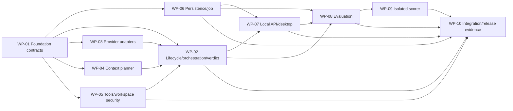

# Future Implementation Work Packages

Explanatory handoff: yes  
Version: `implementation-work-packages-v4`  
Owner: TV1; collaborators: TV2–TV6

These packages belong to one or more future implementation changes. They contain no source-level design, schedule, or evidence that code exists.

## Dependency graph

## Packages

| ID | Outcome | Contract inputs | Dependencies/gates | Future acceptance evidence |
|---|---|---|---|---|
| WP-01 | Scaffold accepted capability-first modular-monolith stack and canonical/generated contract pipeline, including the bounded Tauri host skeleton | ADR-001/005/006/007, physical layout, registry, vocabulary, domain/event/verdict/OpenAPI schemas | ADR-001/005/006/007 Accepted; Tauri toolchains pinned; readiness cases R01–R07 and R09 planned before native release work | Clean bootstrap on another machine; import/table-owner/generated-drift tests; minimal three-OS host evidence |
| WP-02 | State machine, agent loop, repair/recovery, structured terminal commit | Lifecycle/sequences, domain, verdict, context/provider/tool/event ports, flags | WP-01, WP-03–05 interfaces; ADR-002 for real adapter | Deterministic end-to-end runs; every terminal/budget/tool-error path; no crash |
| WP-03 | Official async OpenAI adapter plus two deterministic provider profiles behind `model_gateway.public` | ADR-002, provider profile schema/contract/conformance | WP-01; deterministic work allowed; real adapter call path requires Accepted `real-primary` and paid gate | PC-01–PC-12 suite; one-attempt/SDK-retry-zero; safe metadata/errors/usage; pre-network rejection |
| WP-04 | Per-call context allocation and stop/budget enforcement | Context/budget, capabilities, flag catalog | WP-01 | Fit/fail boundaries, reserve protection, transformation telemetry, enabled/disabled cases |
| WP-05 | Managed immutable source registration/workspace, safe tools, redaction, evidence validation | Tool contract, source registration flow, workspace policy, threat/adversarial catalog, data classification | WP-01; ADR-001/005/006 | Registration/raw-path exclusion plus all adversarial cases; no-network/write/shell/plugin proof; ground-truth absence |
| WP-06 | PostgreSQL event/work/outbox/claim/lease persistence and reproduction snapshot | ERD, field dictionary, consistency semantics | WP-01; ADR-001/005 Accepted | Migrations, CAS/lease/redelivery/restart/cross-run tests, exact safe retrieval, no SQLite/Redis authority, scorer schema separation |
| WP-07 | Protected local async API, generated client, least-authority Tauri bridge and trace-first desktop | canonical OpenAPI, registry, event schema, desktop wireframes/disclosure/connection, ADR-007 permission/lifecycle contract | WP-02, WP-05, WP-06; ADR-006/007; secure credential backend must fail closed | Handshake/access/source/run/event/cancel/lifecycle contract tests; finite cursor/reconnect races; generated-client drift; native permission/disclosure tests; desktop-independent recovery |
| WP-08 | Frozen evaluation scheduler, ApprovedScoreV1 acceptance, manifest/flags/profile/reporting | ADR-003, flags, baseline, SourceBundle, manifest/profile schemas, reporting | WP-02, WP-06, WP-07; ADR-003 Accepted and experiment profile Accepted before result-bearing run | Drift/resume/matched-pair/split/cluster/gate tests and JSON/CSV report projections; no label adapter/import |
| WP-09 | Separate scorer process/capability and scorer-only persistence/grants | scorer isolation boundary, ground-truth audit, registry, ApprovedScoreV1, ERD/dictionary | WP-06, WP-08 public acceptance contract | Import/composition/grant/schema-generation negative proofs; post-terminal join; no run mutation; label-free accepted output |
| WP-10 | Integrated Judge vertical slice, recovery/security/evaluation acceptance and reproducible local release evidence | all contracts plus traceability/validation plan | WP-02, WP-05–WP-09; Accepted concrete profiles for result-bearing/paid evidence; all ADR-007 readiness cases pass for each claimed release target | Deterministic e2e first; local runtime recovery, desktop polling, security/scorer proof, signed coordinated update/rollback and reproducible build; real RQ1 only after all gates |

## ADR-007 readiness acceptance matrix

This matrix schedules future evidence; every row is `Not implemented` in this documentation-only change. A target may be advertised only when all applicable rows pass for that exact OS/architecture/package channel. Failure is explicit and never causes an undeclared switch to Electron.

| ID | Readiness question | Owner/reviewer | Earliest package/window | Required future evidence | Blueprint status |
|---|---|---|---|---|---|
| R01 | Does the minimal Tauri package build on each claimed Windows/macOS/Linux target, with unsupported combinations recorded? | TV6/TV1 | WP-01, C02 | pinned-target CI/build logs and support matrix | Not implemented |
| R02 | Can it discover, start or attach to a dummy-compatible independently supervised runtime? | TV6/TV1 | WP-01/07, C02–C03 | process-tree/lifetime test showing no ordinary Tauri-child authority | Not implemented |
| R03 | Are compatible and incompatible runtime/API/contract-digest/capability handshakes fail-closed? | TV6/TV4 | WP-07, C03–C05 | generated-client contract tests covering every mismatch dimension | Not implemented |
| R04 | Is the local credential OS-protected, rotatable, absent from renderer persistence, and unavailable rather than plaintext when no approved backend exists? | TV6/TV4 | WP-07, C02–C05 | per-OS backend/rotation tests plus negative storage/log/trace scan | Not implemented |
| R05 | Is repository picking limited to registration with no later raw path retention? | TV6/TV3/TV4 | WP-05/07, C03–C05 | picker/registration tests plus request/state/log/trace scans | Not implemented |
| R06 | Does committed synthetic work survive native-host close/crash/reopen and remain rediscoverable? | TV6/TV1 | WP-07/10, C03–C08 | kill/reopen/reconnect tests against durable cursor/work state | Not implemented |
| R07 | Are undeclared native commands denied even when requested by untrusted rendered content? | TV4/TV6 | WP-07/10, C02–C08 | packaged effective-permission audit and adversarial NATIVE tests | Not implemented |
| R08 | Do signed update, active-work reject/quiesce, interruption, incompatible partial update, health and rollback states behave coherently? | TV6/TV4/TV1 | WP-10, C07–C08 | staged signed-artifact matrix without production signing keys | Not implemented |
| R09 | Is a clean-machine build reproducible with pinned Rust/Tauri/plugin/JavaScript toolchains? | TV6/TV1 | WP-01/10, C02 then C07–C08 | clean-host build records, lockfiles and artifact digests | Not implemented |
| R10 | Are startup, memory and bundle measurements recorded for every claimed target? | TV6/TV1 | WP-10, C07–C08 | repeatable measurement commands/raw reports and declared environment | Not implemented |

## Cross-package acceptance

Every optional result-affecting behavior ships flag + telemetry + immutable snapshot + enabled/disabled test together. Every package records build/runtime/dependency versions and reproducible commands. Ground-truth isolation, contest/source-family split, desktop trace, ablation readiness, later VerificationRunner seam and offline-demo seam are never removed to simplify implementation. No work package status is implied by this blueprint.
