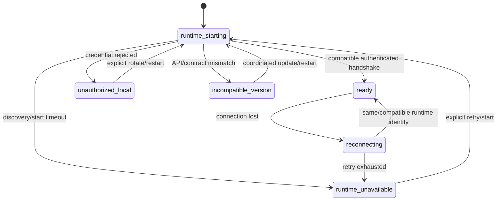

# Local Runtime Connection Contract

Normative: yes  
Version: `desktop-runtime-connection-v3`  
Owner: TV6; collaborators: TV1, TV4  
Requirements: API-04–API-10, UI-01, UI-04–UI-06

## State machine

Submission and mutation controls are enabled only in `ready`. Existing committed display data may remain visible as stale-safe during reconnect, but no final state is inferred.

## Rendezvous and credential custody

- Shell discovers an installation-scoped endpoint/runtime identity from an OS-protected rendezvous record.
- Transport is loopback HTTP or OS-equivalent IPC; public bind is invalid.
- Installation credential or equivalent OS access control remains in native-shell custody.
- Credential never appears in URLs, renderer persistence, console/ordinary logs, trajectories or exports.
- The Tauri host derives endpoint and credential from protected native state. Renderer input cannot choose an arbitrary endpoint, credential, method or URL.
- The generated client uses an injected shell-mediated transport or a least-lived non-persisted session representation; it never receives a long-lived installation secret.
- Failure to establish an approved Windows/macOS/Linux secure-store backend yields `unauthorized_local`; no plaintext, anonymous or renderer-storage fallback exists.
- Rotation changes access material, not `run_id`, event sequence or runtime identity history.

## Tauri command and permission boundary

The main window has explicit capabilities that reference only scoped project commands. No wildcard/native plugin default is accepted as review evidence.

| Allowed command family | Input constraint | Output constraint |
|---|---|---|
| runtime discover/start-or-attach/status | no renderer-supplied executable, PID, signal, endpoint or environment name | safe runtime/health state only |
| generated runtime transport | canonical allowlisted operation ID plus generated payload | validated generated response/error; never raw credential or internal transport details |
| repository picker | explicit user gesture and directory selection | short-lived path delivered only into registration flow |
| safe notification | bounded text/state from approved projection | no untrusted HTML, executable action or arbitrary URL |
| update check/prepare | approved channel and explicit lifecycle confirmation state | availability/active-work/result state; no direct artifact or signer access |

Generic filesystem, shell, process, environment, opener/arbitrary URL, raw credential and direct updater commands are not registered for renderer invocation. Effective merged capability and custom-command exposure is a required architecture/release review.

## Required handshake response

| Field | Rule |
|---|---|
| `runtime_instance_id` | Opaque installation/runtime instance identity; safe for diagnostics. |
| `runtime_version` | Coordinated runtime semantic version. |
| `api_version` | Must match generated-client supported major. |
| `contract_digest` | Digest of canonical local-runtime OpenAPI graph. |
| `build_version` | Immutable build identifier. |
| `capabilities` | Declared supported resource/capability IDs; no inferred feature probing. |
| `health` | `starting|ready|degraded|stopping`; `ready` required for mutation. |
| `recovery_action` | Optional safe `retry|restart|update|contact_owner`; never an executable shell command. |

## Compatibility decisions

| Condition | Outcome |
|---|---|
| exact compatible API major and accepted contract digest | `ready` |
| declared additive capability difference supported by client policy | `ready` with unavailable controls hidden/disabled |
| API major or contract digest incompatible | `incompatible_version`; fail closed |
| credential invalid | `unauthorized_local`; no anonymous fallback |
| approved credential backend unavailable | `unauthorized_local`; fail closed without writing plaintext |
| endpoint absent/unhealthy | `runtime_unavailable`; explicit retry/start |

No state permits direct database/provider/tool/scorer fallback.

## Reconnect and cursor recovery

For each open run, retain only `run_id`, last committed sequence/cursor and safe rendered projection. On reconnect, confirm compatible runtime identity, request PostgreSQL-authoritative status, resume finite event pagination, verify run/sequence continuity and de-duplicate `(run_id, sequence)`. A missing sequence triggers an integrity/full-refresh state; timestamp sorting never repairs order. Deleting renderer cache must never lose an accepted run.

## Lifecycle controls

| Control | Semantics |
|---|---|
| close window or exit Tauri host | presentation/native-integration only; never cancels run or stops runtime implicitly |
| cancel run | idempotent API request; worker observes at safe boundary |
| stop runtime | explicit shell/control-plane action; reports active work and safe stop outcome |
| update runtime/desktop | signed compatibility/active-work preflight; `reject_if_active` or confirmed `quiesce_then_stop`; post-update handshake and rollback; ambiguous paid attempts remain committed |
| rotate local credential | invalidates old access material without changing durable run state |

## Source registration

The native picker result is sent once as sensitive ephemeral registration input. The renderer does not store it. Success returns only `source_snapshot_id`, immutable revision, tree digest and safe status; every subsequent view/request uses these safe values.

## Runtime supervision invariant

The daemon/worker/evaluator/scorer/PostgreSQL process set is supervised or detached independently from Tauri. A bundled runtime binary is distribution payload only, not an ordinary child whose lifetime follows its parent handle. Discovery/start-or-attach uses a platform adapter plus protected rendezvous; a Tauri crash or last-window close emits no implicit stop signal. Reopen performs discovery and the full compatibility handshake before resuming cursor polling.
