# Desktop Submission and Asynchronous Status Wireframes

Normative: yes  
Version: `desktop-submission-status-v4`  
Owner: TV6; collaborators: TV4, TV5  
Requirements: API-01–API-10, UI-01, UI-04–UI-06

## Connection gate

```text
Runtime: READY · runtime 1.x · API v1 · contract sha256:…
[Reconnect] [Runtime details]
```

When state is `runtime_starting`, `runtime_unavailable`, `unauthorized_local`, `incompatible_version` or `reconnecting`, submission is disabled and the safe recovery action is shown. An unavailable approved OS credential backend is `unauthorized_local` and offers no plaintext/anonymous fallback. Direct DB/provider/native-authority fallback is never offered.

## Source registration

```text
Source snapshot
[Choose repository…]  (allowlisted Tauri picker)
Registering… → snapshot-alpha · revision abc… · tree sha256:…
```

The selected raw path is write-only ephemeral input to `POST /source-snapshots` over the protected local channel and disappears after registration. Runtime imports a managed immutable snapshot; failure shows a safe registration category. Renderer state, ordinary logs, access logs, run resources and event pages do not retain the path or its hash.

## Submission fields

| Field | Rule | Feedback |
|---|---|---|
| finding title/description | required bounded canonical text | labeled untrusted input |
| claimed locations | optional relative paths/lines; runtime validates | never accepts host root |
| source snapshot | registered opaque ID/revision/tree digest | no raw path/free text |
| provider/experiment profile | accepted immutable refs/digests; deterministic allowed | profile/ADR status and pre-network gate visible |
| flags preset/overrides | dependencies and safety invariants enforced | result-affecting value snapshotted |
| budgets | steps/tokens/wall-clock/cost/output within control limits | unit and maximum visible |
| manifest/protocol | approved version for experiment submission | drift/conflict rejected |
| idempotency key | retained per canonical draft | changed digest requires new key |

## Wireflow

```mermaid
flowchart LR
  H[Compatible runtime handshake] --> P[Allowlisted Tauri repository picker]
  P --> T[Generated client + protected native transport]
  T --> R[POST source registration]
  R -->|opaque snapshot| D[Edit canonical draft]
  D --> V[Client validation]
  V -->|valid| J[POST /judge-runs]
  J -->|202| RUN[Open run_id view]
  RUN --> POLL[Poll status + cursor events]
  POLL -->|disconnect| RE[Reconnecting; preserve committed view]
  RE --> POLL
  POLL -->|terminal| T[Render terminal state]
```



## Running skeleton

```text
Run 018f… [RUNNING] updated 01:00:05Z [Request cancellation]
Committed so far — no final verdict
Steps 2 · attempts 2 · tools 1 · tokens 2,560 · USD 0.02

Trace: 1 accepted · 2 context allocated · 3 provider attempt · 4 tool requested
```

Closing every window or exiting/crashing the Tauri host does nothing to this run. The independently supervised runtime continues or recovers from PostgreSQL; reopening rediscovers it, repeats the compatible handshake, polls committed state and de-duplicates sequence.

Explicit cancellation uses the generated cancel operation. Runtime shutdown and update preparation live under a separate lifecycle confirmation showing target desktop/runtime/API/contract/database compatibility, active-run and ambiguous-attempt counts, and `reject_if_active|quiesce_then_stop`. No renderer action supplies an artifact URL/key or executes an updater command. ADR-007 selects Tauri and the signed coordination boundary; packaged behavior remains future WP-01/WP-10 evidence.

## Errors

- invalid configuration: focus exact fields and safe paths;
- idempotency conflict: preserve draft and explain digest mismatch;
- source registration rejected: safe category/status, no retained raw path;
- secure credential backend unavailable: `unauthorized_local`, fail closed with setup/recovery guidance and no secret detail;
- run not found: dedicated state, not empty running view;
- connection lost: preserve last committed view and mark stale/reconnecting;
- incompatible version: disable mutation; show explicit update/restart action.
- active-work update conflict: show counts and require reject or explicit quiesce confirmation; never treat window close as cancellation.
