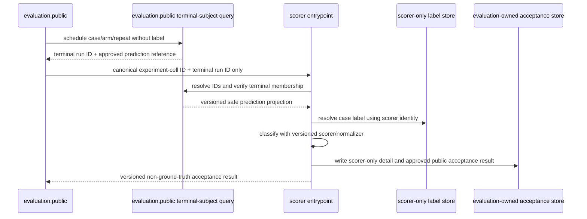

# Evaluation Methodology

## Source: baseline-protocol.md

# Direct-versus-Harness Baseline Protocol

Normative: yes  
Version: `judge-baseline-protocol-v2`  
Owner: TV5; collaborators: TV1, TV2, TV4, TV6  
Requirements: EVAL-01–EVAL-06

ADR-003 accepts this methodology. `rq1-confirmatory-v1.profile.yaml` is still Proposed, so no result-bearing or network run is authorized.

## Frozen experiment identity

The canonical experiment profile freezes its own version/digest plus: exact prompt bytes/digests, SourceBundle version/digest, verdict schema digest, flag catalog/preset digests, contest manifest and ordered case-list digests, repeat count, paired schedule/seed, accepted provider profile ID/version/digest, sampling/seed semantics, logical-token estimator/budget, output reserve, wall-clock ceiling, retry policy, scorer/label-normalization versions, contest-cluster method/confidence/seed/iterations, source-family sensitivity, pricing, execution window, thresholds, failure/metric semantics and approvers.

Any changed value creates a new experiment profile version and experiment identity. Human-readable names never override digest mismatch.

## Matched-pair fairness matrix

| Dimension | Direct | Harness | Rule |
|---|---|---|---|
| Case/repeat | same `case_id`, `repeat_index` | same | atomic matched-pair scheduling unit |
| Candidate | same canonical bytes/digest | same | required equality |
| Source snapshot | same ID/revision/tree digest | same | required equality |
| Provider profile/model | same Accepted ID/version/digest | same | no floating alias |
| Sampling/seed support | same | same | unsupported explicit |
| Logical-token budget | same total | same total | full repeated/cached model-visible input counts |
| Output reserve/accounting | same formula | same formula | every call preflighted |
| Wall-clock ceiling | same | same | latency components reported separately, no token credit |
| Verdict schema/Judge core | same exact bytes/digest | same | independent validation |
| Wrapper | direct wrapper | harness wrapper | intentional frozen treatment difference |
| Source access | deterministic SourceBundle | local safe source tools | intentional treatment difference |
| Loop/tool feedback/repair | disabled by direct primary preset | explicit harness primary flags | frozen treatment definition |
| Primary provider retry | SDK 0/project 1 | SDK 0/project 1 per logical call | asymmetry rejects pair |
| Memory/PoC/Audit | disabled | disabled | outside MVP |

## Arm construction

The direct call orders `judge-core` then `direct-wrapper`, canonical candidate, deterministic SourceBundle and verdict schema. It contains no tool definition, agent loop, memory, verification or schema-repair call.

The harness orders the same `judge-core` then `harness-wrapper`, canonical candidate, safe local tool definitions and verdict schema. `agent_runtime` may make bounded logical calls; every call resends explicit committed history and all model-visible tokens count again.

The direct SourceBundle and harness tool visibility derive from the same immutable snapshot and exclusion policy. Prompt differences are declared, not disguised as equality.

## Pre-network rejection

Resolve both cells before either real call. Reject the pair when provider/experiment profile status, digest, model, prompt, schema, source, flags, retry, sampling, budget, manifest, split, case/repeat, pricing, threshold or approval values are missing, drifted or asymmetric. Rejection occurs before provider client construction, credential access or DNS and is represented by `examples/pre-network-rejection.json`.

## Pair scheduling and repeats

The accepted profile declares repeat count and deterministic balanced order/seed before test execution. Both arms for a pair are reserved under the same immutable identity. Repeats measure stochastic within-case variability and are retained; they never multiply the inferential case/contest count.

Ambiguous provider outcomes are recorded and not silently replayed as primary cells. A retry-enabled study uses a new experiment identity and acceptance family.

## Split and adaptation discipline

Whole contests and source families are assigned to train, validation or frozen test. Development and prompt/threshold/flag selection use train/validation only. Test access requires the accepted/frozen profile; results cannot feed changes back into the same test identity. Post-cutoff is a predeclared subgroup, not a replacement split.

## Terminal accounting and RQ1 classification

Every declared cell is completed, failed, cancelled or budget exhausted. A ground-truth-valid cell without a completed valid prediction contributes a false negative under the declared rule, while completion and schema-failure remain separate metrics.

The report applies predeclared precision-gain, recall-loss and completion gates. RQ1 is `positive` only when all pass, `negative` when no material precision gain is established without a gate violation, and `mixed` whenever recall or completion fails even if precision improves. Exact decision rules are frozen before test.

## Cost and timing

Native usage remains evidence; logical accounting supplies fairness; immutable pricing supplies derived cost. Cost correction versions a report without mutating run facts. Queue, provider, tool and end-to-end latency are separate fields. See `paired-logical-token-examples.md`.

## Synthetic evidence only

Complete/incomplete profile examples prove schema behavior; the complete example uses a deterministic synthetic profile and placeholder artifact digests. It is not approval for a real provider, dataset, credential, budget or execution.


## Source: scoring-and-reporting.md

# Scoring, Resumption, Inference, and Reporting

Normative: yes  
Version: `scoring-reporting-v2`  
Owner: TV5; collaborators: TV4, TV6  
Requirements: EVAL-04–EVAL-06, DATA-01–DATA-03

## Scorer-only post-terminal join



The scorer runs only after an immutable terminal run. It cannot append run events, call a provider/tool, or return labels/adjudication to `judge`, worker, evaluator, daemon or desktop. The public acceptance result contains pass/fail/mixed aggregate-safe fields and IDs, never ground-truth content.

## Approved-score crossing contract

`ApprovedScoreV1` is the only scorer-to-evaluation crossing and is accepted through `evaluation.public.AcceptApprovedScore`. It contains contract/schema digest, score record ID, experiment cell ID, run ID, scorer and label-normalizer versions, completion/prediction class, gate-ready aggregate-safe values and timestamp. It contains no ground-truth label, adjudication, official report, raw scorer rationale, source/host path or provider/tool handle. The evaluator validates identity/version/idempotency but cannot resolve or reconstruct the label.

`examples/scoring-record.json` is scorer-only; `examples/approved-score.json` is the corresponding label-free crossing shape. Neither is a real score or test result.

## Identity and resumption

```text
experiment_id := digest(experiment_profile_digest, manifest_digest, provider_profile_digest)
experiment_cell_id := digest(experiment_id, case_id, arm, repeat_index)
pair_id := digest(experiment_id, case_id, repeat_index)
```

A uniqueness rule binds one accepted run to each cell identity. Reuse requires exact profile/manifest/provider/source/prompt/flag/schema/scorer digests. A matching name with different bytes is drift. An ambiguous primary provider attempt is preserved, not silently replayed. A retry-enabled run belongs to a distinct profile/experiment identity.

## Cell classification and denominators

Predicted `valid` is positive. For completed schema-valid verdicts: valid/valid is TP, invalid/valid FP, invalid/invalid TN and valid/invalid FN. A ground-truth-valid cell without a completed schema-valid prediction is also FN under the frozen rule and remains separately classified by terminal/completion/schema status. A failed ground-truth-invalid cell is not TN.

Every declared cell remains in completion denominators. Reports distinguish declared, scheduled, provider-attempted, completed-valid, failed, cancelled and budget-exhausted cells. Missingness is never dropped to improve quality metrics.

## Repeats and inferential unit

Repeat rows are retained to show stochastic agreement/dispersion within a case. They are not independent observations. Paired arm deltas are computed within `(case_id, repeat_index)`, summarized within case, and uncertainty is clustered/resampled at contest level so all cases/repeats/arms from a selected contest travel together.

The primary report states counts for contests, source families, cases, repeats and cells. It reports a contest-cluster confidence interval with method/version/seed/resample count. A source-family-clustered sensitivity interval is added when enough families exist; otherwise it is marked underpowered rather than fabricated. Naive cell-level intervals may appear only as explicitly non-inferential diagnostics.

## Metrics and subgroups

- Precision, recall, completion and schema-failure with defined/undefined indicators.
- Matched harness-minus-direct deltas and contest-cluster confidence intervals.
- Token accounting: native usage plus full logical input/output including repeated/cached context.
- Cost using immutable price version/currency; provider, tool, queue and end-to-end latency separately.
- Repeat validity/severity agreement and within-case dispersion.
- Overall plus `pre_cutoff`, `post_cutoff`, `unknown`, contest and source-family views.

Post-cutoff is a predeclared contamination subgroup, not the sole primary analysis. Unknown cutoff never enters post-cutoff. Small clusters and interval instability are disclosed.

## Predeclared RQ1 gates

The Accepted experiment profile must freeze:

1. minimum harness precision gain over direct;
2. maximum permitted harness recall loss;
3. minimum harness completion rate;
4. exact confidence/point-estimate decision rule and undefined-metric handling.

The test-access audit cites the profile digest created before frozen-test access. `positive` requires all gates. Recall-gate or completion-gate failure always yields `mixed`, even when precision passes. Lack of required precision gain with safety gates intact is `negative` or `inconclusive` according to the frozen rule. No post-hoc threshold can relabel the same experiment.

## Export fields

Per-cell research export: schema/version, experiment/profile/manifest/provider digests, pair/cell/case/contest/source-family/split/cutoff bucket, arm/repeat, run/state/reason, safe prediction, completion/schema class, native/logical usage, retry snapshot, cost/pricing, separated latency, scorer/normalizer versions and trajectory reference.

Aggregate export: grouping keys; unit counts; declared/completed/failure counts; TP/FP/TN/FN; precision/recall/completion/schema failure; paired deltas; cluster method/seed/count/interval; logical/native tokens; cost/latency summaries; repeat agreement; cutoff and family breakdown; each gate value/result and final RQ1 classification.

Agent-facing run/event/desktop exports omit labels, score detail and scorer-only schema. Research evaluation exports are access-controlled and never consumed as future Judge input.


## Source: validity-gates.md

# Evaluation Validity Gates

Normative: yes  
Version: `evaluation-validity-gates-v1`  
Owner: TV5; reviewers: TV1, TV4, TV6

These gates run in order. Failure prevents test scheduling or marks a report invalid; no gate can be waived silently.

## Pre-freeze gates

| ID | Check | Rejection evidence |
|---|---|---|
| EV-SPLIT-01 | Every case inherits one contest split; every contest belongs to one source family; family and member splits match. | `manifest-split-leaking.json` shape fail and `manifest-source-family-leaking.json` semantic fail. |
| EV-ADAPT-01 | Prompt/flag/stopping/budget/gate selection uses train/validation only. | Any frozen-test read before Accepted profile creates an invalid experiment audit event. |
| EV-THRESHOLD-01 | Precision gain, maximum recall loss, completion floor and classification rule are non-null and approved before frozen-test access. | Proposed `rq1-confirmatory-v1` is rejected because thresholds are null. |
| EV-PAIR-01 | Case/repeat lists, provider/profile, source, schema, sampling, logical budget and primary retry match across arms. | Direct/harness packets demonstrate equality; a field diff rejects both cells. |
| EV-RETRY-01 | Primary direct and harness both use SDK retry 0/project attempt 1/flag false. | Any asymmetry is `pre_network_experiment_rejected`; symmetric retry uses a different profile/digest. |

## Analysis gates

| ID | Check | Required treatment |
|---|---|---|
| EV-UNIT-01 | Repeat is variability within case, not an independent sample. | Retain per-repeat rows; estimate matched deltas and cluster uncertainty by contest. |
| EV-CLUSTER-01 | Contests, not findings/repeats, are the independent cluster. | Contest-cluster bootstrap/interval; report contest count and source-family sensitivity. |
| EV-CUTOFF-01 | Pre/post/unknown bucket follows immutable model cutoff evidence. | Report all plus post-cutoff subgroup; never reclassify unknown. |
| EV-MISSING-01 | All scheduled cells remain in completion and declared quality semantics. | Failed/cancelled/budget cells cannot disappear from denominators. |
| EV-GATE-01 | Apply thresholds frozen before test. | Precision pass + recall or completion fail yields `mixed`, never positive. |

## Pseudo-replication review

The report must display `N contests`, `N source families`, `N cases` and `N repeat cells` separately. A confidence interval computed by treating every repeat/finding as independent is invalid even if numerically narrow. Primary uncertainty resamples contests while retaining all cases/repeats/paired arms within a selected contest; a source-family clustered sensitivity analysis is also reported when family count permits.

## Threshold-before-test review

The frozen profile digest must include the three numeric thresholds and exact decision function. The test-access audit record cites that Accepted digest and timestamp. A profile accepted after reading test results is invalid. Corrections require a new untouched test set, not a renamed profile over the same observations.

## RQ1 decision table

| Precision gain gate | Recall-loss gate | Completion gate | Classification |
|---|---|---|---|
| pass | pass | pass | `positive` |
| fail | pass | pass | `negative` or `inconclusive` under predeclared precision rule |
| any | fail | any | `mixed` |
| any | any | fail | `mixed` |

`examples/retry-asymmetry-rejected.json` is the concrete pre-network retry failure packet. `examples/rq1-mixed-gate.json` proves that a precision improvement cannot override a recall failure.


## Source: flags-and-ablation.yaml

```yaml
schema_version: flags-and-ablation-v2
catalog_version: judge-flags-v2
canonicalization: lexical-key-canonical-json
digest_algorithm: sha256
presets:
  direct-primary-v1:
    agent_loop: false
    source_tools: false
    tool_result_truncation: false
    no_progress_detection: false
    verdict_schema_repair: false
    provider_retry: false
    tool_error_feedback: false
    structured_output_mode: native
    tool_description_profile: none
  harness-primary-v1:
    agent_loop: true
    source_tools: true
    tool_result_truncation: true
    no_progress_detection: true
    verdict_schema_repair: true
    provider_retry: false
    tool_error_feedback: true
    structured_output_mode: native
    tool_description_profile: source-tools-v1
  direct-retry-research-v1:
    inherits: direct-primary-v1
    provider_retry: true
    provider_retry_policy: paired-retry-v1
  harness-retry-research-v1:
    inherits: harness-primary-v1
    provider_retry: true
    provider_retry_policy: paired-retry-v1
features:
  - name: agent_loop
    type: boolean
    default: true
    version: agent-loop-v1
    result_effect: Enables multiple provider steps and tool-result feedback.
    dependencies: []
    arm_values: { direct-primary-v1: false, harness-primary-v1: true }
    telemetry: agent_loop_enabled
    run_snapshot: resolved_flags.agent_loop
    acceptance_enabled: [ABL-LOOP-ON-001]
    acceptance_disabled: [ABL-LOOP-OFF-001]
  - name: source_tools
    type: boolean
    default: true
    version: source-tools-v1
    result_effect: Exposes the versioned safe read-only source tool registry.
    dependencies: [agent_loop]
    arm_values: { direct-primary-v1: false, harness-primary-v1: true }
    telemetry: source_tools_enabled
    run_snapshot: resolved_flags.source_tools
    acceptance_enabled: [ABL-TOOLS-ON-001]
    acceptance_disabled: [ABL-TOOLS-OFF-001]
  - name: tool_result_truncation
    type: boolean
    default: true
    version: tool-truncation-v1
    result_effect: Applies deterministic byte/line truncation after redaction.
    dependencies: [source_tools]
    arm_values: { direct-primary-v1: false, harness-primary-v1: true }
    telemetry: tool_result_truncation_applied
    run_snapshot: resolved_flags.tool_result_truncation
    acceptance_enabled: [ABL-TRUNCATE-ON-001]
    acceptance_disabled: [ABL-TRUNCATE-OFF-001]
  - name: no_progress_detection
    type: boolean
    default: true
    version: no-progress-v1
    result_effect: Terminates repeated normalized intent/tool signatures.
    dependencies: [agent_loop]
    arm_values: { direct-primary-v1: false, harness-primary-v1: true }
    telemetry: no_progress_detection_enabled
    run_snapshot: resolved_flags.no_progress_detection
    acceptance_enabled: [ABL-NOPROGRESS-ON-001]
    acceptance_disabled: [ABL-NOPROGRESS-OFF-001]
  - name: verdict_schema_repair
    type: boolean
    default: true
    version: verdict-repair-v1
    result_effect: Allows bounded corrective model attempts after verdict validation failure.
    dependencies: [agent_loop]
    arm_values: { direct-primary-v1: false, harness-primary-v1: true }
    telemetry: verdict_schema_repair_enabled
    run_snapshot: resolved_flags.verdict_schema_repair
    acceptance_enabled: [ABL-REPAIR-ON-001]
    acceptance_disabled: [ABL-REPAIR-OFF-001]
  - name: provider_retry
    type: boolean
    default: false
    version: provider-retry-v2
    result_effect: Enables project-owned transient retries only in a separately identified, symmetric retry research profile; primary RQ1 is false in both arms.
    dependencies: []
    arm_values: { direct-primary-v1: false, harness-primary-v1: false, direct-retry-research-v1: true, harness-retry-research-v1: true }
    telemetry: provider_retry_enabled
    run_snapshot: resolved_flags.provider_retry
    immutable_identity_fields: [experiment_profile_digest, provider_retry_policy, sdk_max_retries, project_max_attempts]
    acceptance_enabled: [ABL-RETRY-ON-001]
    acceptance_disabled: [ABL-RETRY-OFF-001]
  - name: tool_error_feedback
    type: boolean
    default: true
    version: tool-error-feedback-v1
    result_effect: Returns bounded model-actionable tool errors in later context.
    dependencies: [agent_loop, source_tools]
    arm_values: { direct-primary-v1: false, harness-primary-v1: true }
    telemetry: tool_error_feedback_enabled
    run_snapshot: resolved_flags.tool_error_feedback
    acceptance_enabled: [ABL-TOOLERR-ON-001]
    acceptance_disabled: [ABL-TOOLERR-OFF-001]
  - name: structured_output_mode
    type: enum
    values: [native, prompted]
    default: native
    version: structured-output-mode-v1
    result_effect: Selects provider-native schema enforcement or prompted JSON followed by independent validation.
    dependencies: []
    arm_values: { direct-primary-v1: native, harness-primary-v1: native }
    telemetry: structured_output_mode
    run_snapshot: resolved_flags.structured_output_mode
    acceptance_enabled: [ABL-STRUCTURED-NATIVE-001]
    acceptance_disabled: [ABL-STRUCTURED-PROMPTED-001]
  - name: tool_description_profile
    type: enum
    values: [none, source-tools-v1]
    default: source-tools-v1
    version: tool-description-profile-v1
    result_effect: Selects exact tool descriptions made model-visible.
    dependencies: []
    arm_values: { direct-primary-v1: none, harness-primary-v1: source-tools-v1 }
    telemetry: tool_description_profile
    run_snapshot: resolved_flags.tool_description_profile
    acceptance_enabled: [ABL-TOOLDESC-SOURCE-001]
    acceptance_disabled: [ABL-TOOLDESC-NONE-001]
non_disableable_invariants:
  - name: ground_truth_isolation
    version: ground-truth-boundary-v1
    telemetry: ground_truth_preflight_passed
    run_snapshot: safety.ground_truth_isolation_version
    acceptance: [PATH-008, PATH-009, GT-FLOW-001]
    rationale: Disabling it invalidates evaluation rather than defining an ablation arm.
  - name: contest_level_split
    version: contest-split-v1
    telemetry: manifest_split_validation_passed
    run_snapshot: safety.manifest_digest
    acceptance: [MANIFEST-SPLIT-001]
    rationale: Finding-level splits are methodologically invalid.
  - name: source_snapshot_integrity
    version: source-tree-digest-v1
    telemetry: source_snapshot_preflight_passed
    run_snapshot: safety.source_tree_digest
    acceptance: [SNAP-001, SNAP-002, SNAP-003]
    rationale: A changed tree breaks identity and can expose prohibited files.
  - name: path_authorization
    version: workspace-policy-v1
    telemetry: workspace_policy_version
    run_snapshot: safety.workspace_policy_version
    acceptance: [PATH-001, PATH-002, PATH-003, PATH-004, PATH-005, PATH-006, PATH-007]
    rationale: Filesystem isolation is a security boundary.
  - name: secret_and_prohibited_redaction
    version: redaction-v1
    telemetry: redaction_rule_version
    run_snapshot: safety.redaction_rule_version
    acceptance: [CONTENT-003, CONTENT-004, CONTENT-005, DISC-001, DISC-002]
    rationale: Raw sensitive values must never enter provider traffic or persistence.
  - name: context_preflight_and_output_reserve
    version: context-budget-v1
    telemetry: context_preflight_outcome
    run_snapshot: safety.context_preflight_version
    acceptance: [CTX-PREFLIGHT-001]
    rationale: Provider calls must fit the declared model limit safely.
  - name: verdict_and_evidence_validation
    version: judge-verdict-v1
    telemetry: verdict_validation_outcome
    run_snapshot: safety.verdict_schema_digest
    acceptance: [VERDICT-SCHEMA-001, EVIDENCE-001]
    rationale: Completed means schema-valid and source-grounded.
  - name: exact_sanitized_trajectory
    version: trajectory-event-v1
    telemetry: trajectory_schema_version
    run_snapshot: safety.trajectory_schema_digest
    acceptance: [TRAJECTORY-EXACT-001]
    rationale: Reproduction and trajectory evaluation require exact model-visible records.
result_affecting_parameters:
  - experiment_profile_digest
  - provider_profile
  - model_id
  - model_capability_version
  - sampling
  - seed
  - budgets
  - prompt_digest
  - tool_definitions_digest
  - verdict_schema_digest
  - provider_retry
  - retry_policy_version
  - sdk_max_retries
  - project_max_attempts
  - logical_token_estimator_version
  - pricing_version
  - protocol_digest
  - manifest_digest

```

## Source: paired-logical-token-examples.md

# Paired Logical-Token Accounting Examples

Normative: yes  
Version: `paired-logical-token-examples-v1`

The exact estimator/version and numeric budget come from the accepted experiment profile. These synthetic numbers demonstrate the formula only.

## Equal budget with different call shapes

Assume a `12,000` logical-token total and a per-call output reserve of `1,200`.

| Arm/call | Full input as sent | Output/reasoning charged by declared formula | Cumulative logical tokens |
|---|---:|---:|---:|
| direct call 1 | 9,600 | 1,100 | 10,700 |
| harness call 1 | 2,800 | 500 | 3,300 |
| harness call 2, including repeated core/history/tool result | 4,200 | 600 | 8,100 |
| harness call 3, including all repeated committed context | 2,700 | 900 | 11,700 |

Both arms are within the same `12,000` total. Harness does not count only newly appended tokens: every model-visible token sent again counts again, even when the provider reports it as cached or bills it differently.

Before any call, preflight reserves output and rejects `cumulative + full_next_input + output_reserve > total`. Thus a harness fourth call with `800` input plus `1,200` reserve is rejected at `11,700`; it is not allowed to consume direct arm's unused budget as a post-hoc fairness adjustment.

## Usage disagreement

If native usage reports input `4,200`, cached input `3,000` and billed uncached input `1,200`, logical input remains `4,200`. Native categories remain recorded for cost. If the provider omits a category, the declared estimator is used and the disagreement/unknown flag is retained; the lower number is never silently selected.

## Wall-clock separation

Tool and orchestration time consume the common cell wall-clock ceiling but never convert into token credit. Reports keep queue, provider, tool and end-to-end time separate. A timeout remains an accounted outcome and primary retry remains disabled in both arms.


## Source: source-bundle-v1.md

# SourceBundle v1

Normative: yes  
Version: `source-bundle-v1`  
Owner: TV5; collaborators: TV2, TV4  
Requirement: EVAL-03

## Inputs

- Verified immutable `SourceSnapshot` inventory and tree digest.
- Evaluation-side contest/source-family/split references used only to prove paired snapshot identity; these references are never included in model-visible bundle bytes.
- Canonical candidate claimed relative paths, if present.
- Allowlisted text extensions and hard per-file/total byte/token budgets.
- Versioned token estimator and mandatory output reserve inherited from protocol.

## Normative algorithm

1. Authorize and verify the snapshot using `workspace-policy-v1`; labels/reports/manifests are absent.
2. Normalize all authorized text paths as POSIX relative paths.
3. Form priority group A from candidate-claimed paths that resolve to allowlisted files; deduplicate and sort lexically.
4. Form group B from all remaining allowlisted text files; sort lexically.
5. Iterate A then B. For each file, emit the exact delimiter below plus complete file bytes normalized only from CRLF/CR to LF if the entire block fits the allocated input budget.
6. Never cut a UTF-8 code point or silently cut a file. If a complete block cannot fit, omit it and record path, byte length, source digest, and reason.
7. After files, emit one deterministic omissions block sorted by path.
8. Compute SHA-256 over exact UTF-8 bundle bytes. Record source tree digest, bundle digest, estimator/version, allocated budget, included and omitted records.

## Delimiters

```text
<<<SOURCE_FILE path="normalized/relative/path" sha256="sha256:..." bytes="N">>>
<exact normalized text>
<<<END_SOURCE_FILE>>>
```

Omissions:

```text
<<<OMITTED_SOURCE_FILES>>>
path\tbytes\tsha256\treason
...
<<<END_OMITTED_SOURCE_FILES>>>
```

Source text inside delimiters is untrusted data, not instruction.

## Allowlist and exclusions

The protocol version declares extensions appropriate to the selected contest language, such as `.sol`, and may include build metadata needed to interpret source only after security review. It excludes official reports, labels, adjudication, scoring data, dataset manifests/split/family metadata, secrets, VCS metadata, binaries, generated artifacts, dependencies outside the registered tree, and symlinks. The direct and harness arms resolve the same `source_snapshot_id`, revision and tree digest before either arm runs; family/split policy is enforced outside model-visible context.

## Reproducibility example

The synthetic `examples/source-bundle-v1.txt` contains two included files and one omission. Its exact digest is `sha256:fc1891d18a46130af218bb8bd7eb01355661804028a02b43bbb8cbffc0d24c6a`. Two implementations using the same inputs/budget must produce identical bytes and digest; tokenizer estimates may differ only when estimator/version differs, which would create protocol drift.


