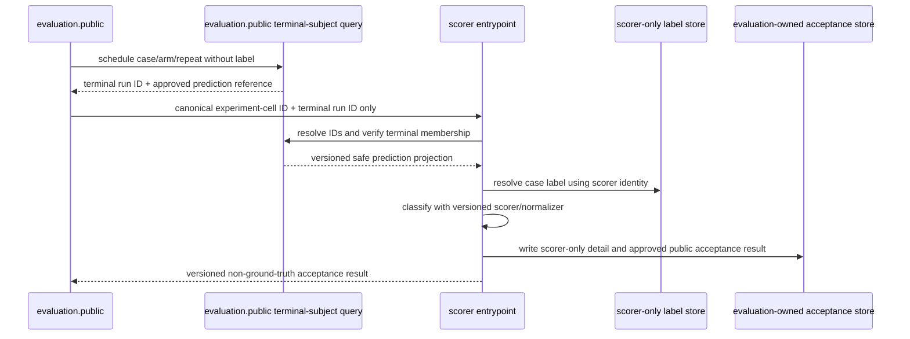

# Scoring, Resumption, Inference, and Reporting

Normative: yes  
Version: `scoring-reporting-v2`  
Owner: TV5; collaborators: TV4, TV6  
Requirements: EVAL-04–EVAL-06, DATA-01–DATA-03

## Scorer-only post-terminal join



The scorer runs only after an immutable terminal run. It cannot append run events, call a provider/tool, or return labels/adjudication to `judge`, worker, evaluator, daemon or desktop. The public acceptance result contains pass/fail/mixed aggregate-safe fields and IDs, never ground-truth content.

## Approved-score crossing contract

`ApprovedScoreV1` is the only scorer-to-evaluation crossing and is accepted through `evaluation.public.AcceptApprovedScore`. It contains contract/schema digest, score record ID, experiment cell ID, run ID, scorer and label-normalizer versions, completion/prediction class, gate-ready aggregate-safe values and timestamp. It contains no ground-truth label, adjudication, official report, raw scorer rationale, source/host path or provider/tool handle. The evaluator validates identity/version/idempotency but cannot resolve or reconstruct the label.

`examples/scoring-record.json` is scorer-only; `examples/approved-score.json` is the corresponding label-free crossing shape. Neither is a real score or test result.

## Identity and resumption

```text
experiment_id := digest(experiment_profile_digest, manifest_digest, provider_profile_digest)
experiment_cell_id := digest(experiment_id, case_id, arm, repeat_index)
pair_id := digest(experiment_id, case_id, repeat_index)
```

A uniqueness rule binds one accepted run to each cell identity. Reuse requires exact profile/manifest/provider/source/prompt/flag/schema/scorer digests. A matching name with different bytes is drift. An ambiguous primary provider attempt is preserved, not silently replayed. A retry-enabled run belongs to a distinct profile/experiment identity.

## Cell classification and denominators

Predicted `valid` is positive. For completed schema-valid verdicts: valid/valid is TP, invalid/valid FP, invalid/invalid TN and valid/invalid FN. A ground-truth-valid cell without a completed schema-valid prediction is also FN under the frozen rule and remains separately classified by terminal/completion/schema status. A failed ground-truth-invalid cell is not TN.

Every declared cell remains in completion denominators. Reports distinguish declared, scheduled, provider-attempted, completed-valid, failed, cancelled and budget-exhausted cells. Missingness is never dropped to improve quality metrics.

## Repeats and inferential unit

Repeat rows are retained to show stochastic agreement/dispersion within a case. They are not independent observations. Paired arm deltas are computed within `(case_id, repeat_index)`, summarized within case, and uncertainty is clustered/resampled at contest level so all cases/repeats/arms from a selected contest travel together.

The primary report states counts for contests, source families, cases, repeats and cells. It reports a contest-cluster confidence interval with method/version/seed/resample count. A source-family-clustered sensitivity interval is added when enough families exist; otherwise it is marked underpowered rather than fabricated. Naive cell-level intervals may appear only as explicitly non-inferential diagnostics.

## Metrics and subgroups

- Precision, recall, completion and schema-failure with defined/undefined indicators.
- Matched harness-minus-direct deltas and contest-cluster confidence intervals.
- Token accounting: native usage plus full logical input/output including repeated/cached context.
- Cost using immutable price version/currency; provider, tool, queue and end-to-end latency separately.
- Repeat validity/severity agreement and within-case dispersion.
- Overall plus `pre_cutoff`, `post_cutoff`, `unknown`, contest and source-family views.

Post-cutoff is a predeclared contamination subgroup, not the sole primary analysis. Unknown cutoff never enters post-cutoff. Small clusters and interval instability are disclosed.

## Predeclared RQ1 gates

The Accepted experiment profile must freeze:

1. minimum harness precision gain over direct;
2. maximum permitted harness recall loss;
3. minimum harness completion rate;
4. exact confidence/point-estimate decision rule and undefined-metric handling.

The test-access audit cites the profile digest created before frozen-test access. `positive` requires all gates. Recall-gate or completion-gate failure always yields `mixed`, even when precision passes. Lack of required precision gain with safety gates intact is `negative` or `inconclusive` according to the frozen rule. No post-hoc threshold can relabel the same experiment.

## Export fields

Per-cell research export: schema/version, experiment/profile/manifest/provider digests, pair/cell/case/contest/source-family/split/cutoff bucket, arm/repeat, run/state/reason, safe prediction, completion/schema class, native/logical usage, retry snapshot, cost/pricing, separated latency, scorer/normalizer versions and trajectory reference.

Aggregate export: grouping keys; unit counts; declared/completed/failure counts; TP/FP/TN/FN; precision/recall/completion/schema failure; paired deltas; cluster method/seed/count/interval; logical/native tokens; cost/latency summaries; repeat agreement; cutoff and family breakdown; each gate value/result and final RQ1 classification.

Agent-facing run/event/desktop exports omit labels, score detail and scorer-only schema. Research evaluation exports are access-controlled and never consumed as future Judge input.
