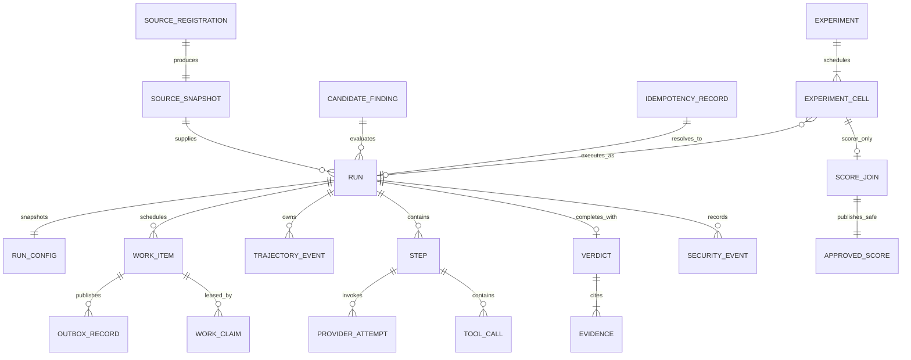

# PostgreSQL Entity and Ownership Blueprint

Normative: yes  
Version: `persistence-erd-v2`  
Owner: TV6; collaborators: TV1, TV4, TV5  
Requirements: DATA-01–DATA-04

## Entity relationships

## Key fields

| Entity | Required identity/concurrency fields | Sensitive/exposure rule |
|---|---|---|
| `source_registration` | registration ID, policy version, safe outcome, snapshot ID, timestamps | no raw selected path/hash |
| `source_snapshot` | snapshot ID, revision, inventory/tree/content digests, managed content reference | safe projection exposes ID/revision/digests only |
| `run` | run ID, state, state version, terminal reason/timestamps | no label/raw path/credential |
| `run_config` | run ID, canonical config digest and immutable resolved values | profile/prompt/flag/budget/source/experiment versions/digests |
| `work_item` | work ID, run ID, kind, state, version, available time | PostgreSQL authority; queue payload ID only |
| `outbox_record` | outbox ID, aggregate/work ID, event kind, payload digest, publish state/version | safe stable IDs only |
| `work_claim` | claim ID/token digest, work ID, worker ID, claim version, lease expiry, heartbeat/release/outcome | token never API/export |
| `trajectory_event` | event ID, run ID, unique sequence, schema/type, safe payload/digest | append-only safe projection |
| `provider_attempt` | attempt ID, step/logical-call/attempt indexes, profile/model, request/response digests, usage/timing/cost/outcome | no credential/raw native object |
| `tool_call` | call ID/index, tool/version, safe args/result digests, timing/outcome | relative authorized source paths only |
| `verdict/evidence` | one verdict/run; ordered relative-path evidence | no score/label |
| `experiment/cell` | accepted profile/manifest/provider digests; unique case/arm/repeat | controller never reads label |
| scorer-only `ground_truth_label`, `adjudication`, `score_join` | case/label provenance and post-terminal score | scorer role/schema only |
| `approved_score` | cell/result IDs, scorer contract version, aggregate-safe gate/classification fields | evaluation-owned public acceptance contract; no label/adjudication |

## Capability table/migration ownership

| Capability | Tables/migration namespace | Other capabilities use |
|---|---|---|
| `source_access` | `source_registration`, `source_snapshot`, managed-content metadata | `source_access.public` only |
| `run_control` | `candidate_finding`, `run`, `run_config`, `idempotency_record`, `work_item`, `outbox_record`, `work_claim`, `trajectory_event`, `security_event`, safe content refs | `run_control.public` only |
| `model_gateway` | `provider_profile_ref`, `provider_attempt` | `model_gateway.public` only |
| `agent_runtime` | `step`, context allocation, `tool_call` projection/reference | `agent_runtime.public` only |
| `judge` | `verdict`, `evidence` | `judge.public` only |
| `evaluation` | `experiment`, `experiment_cell`, `approved_score`, export records | `evaluation.public` only |
| `scoring` | scorer-schema `ground_truth_label`, `adjudication`, `score_join` | scorer entrypoint only; output via `evaluation.public` |

Foreign keys/references do not authorize cross-module SQL. Module migration metadata is composed by the migration registry; each table has exactly one owner.

## Required constraints and indexes

- unique source inventory/tree identity under policy version; no raw-path column;
- unique idempotency key digest with immutable canonical request digest;
- unique `(run_id, sequence)`, `(run_id, step_index)`, `(step_id, attempt_index)`, `(step_id, call_index)`;
- monotonic run/work/claim/outbox versions and terminal-state checks;
- at most one active non-expired claim/work item plus unique claim token digest;
- unique verdict/run and `(verdict_id, ordinal)` evidence;
- unique experiment cell `(experiment_id, case_id, arm, repeat_index)` and score join/cell;
- indexes for eligible work/lease expiry, unpublished outbox, run state/update, event run/sequence, attempt/tool failure, contest/source-family/split/cutoff and experiment status.

## Isolation invariant

Daemon/worker/evaluator/desktop roles cannot read scorer schema/tables. Scorer cannot mutate run/config/event/attempt/tool/verdict. Only the scorer composition writes `score_join`; only a versioned `evaluation.public` adapter accepts the non-ground-truth `approved_score`. No scorer-only field/schema enters daemon OpenAPI or desktop generation.

PostgreSQL is authoritative. SQLite, Redis, renderer cache, filesystem rendezvous data and process memory are not state authorities.

