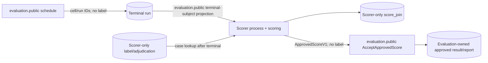

# Ground-Truth and Scorer Flow Audit

Normative: yes  
Version: `ground-truth-flow-audit-v2`  
Owner: TV4; collaborators: TV5, TV1, TV6  
Requirements: EVAL-06, TOOL-01, DATA-01–DATA-04

Design-proof scope: this audit proves the blueprint contains no permitted edge from ground truth/scorer detail to Judge or desktop paths. Runtime import, composition, database-grant and data-fixture proof remains mandatory in a future implementation change.

## Sole authorized flow

There is no reverse `evaluation -> scoring` import and no run-event/API crossing. `ApprovedScoreV1` is the only output edge.

## Forbidden-edge review

| Component/closure | Blueprint inputs/imports | Credential/grant | Result |
|---|---|---|---|
| desktop/shell/generated client | desktop-public OpenAPI allowlist | no DB/provider/scorer credential | PASS |
| daemon/source registration/run API | `run_control.public`, `source_access.public`, safe projections | no scorer schema usage/select | PASS |
| worker/Judge/agent runtime/provider/tools | candidate, opaque snapshot, config, committed safe history | no scorer/label credential or import | PASS |
| run/config/work/outbox/events/ordinary logs | schema allowlists with no label/scorer/raw path | run role only | PASS |
| evaluator | manifests, profile, case/arm/repeat IDs, terminal refs, `ApprovedScoreV1` | no label adapter/schema/credential; cannot import `scoring` | PASS |
| scorer | canonical IDs, terminal-subject projection via `evaluation.public`, private label lookup | scorer-only role/schema; no direct run mutation/provider/tool grants | PASS |
| research exporter | separately approved evaluation/scorer projection | no path back to run construction | PASS |

## Schema/generation audit

`contracts/registry.yaml` assigns ground-truth schemas `scorer_only`. Desktop generation deny-lists that exposure and allowlists exact public schemas. The local OpenAPI has no ground-truth/score route or reachable scorer-only `$ref`. Run trajectory vocabulary has no scoring event; scorer completion is an evaluation-owned record. Any generated scorer type in daemon/worker/evaluator/desktop output invalidates the audit.

## Composition and database audit obligations

Future acceptance must show:

1. only scorer entrypoint imports/composes `harness.modules.scoring` and its label adapter;
2. `evaluation` has no reverse import and cannot construct scorer repositories/queries;
3. daemon/worker/evaluator database identities receive no scorer schema/table/function grants;
4. scorer receives minimal terminal safe-read plus scorer-only reads/writes, but no run/event mutation or provider/tool execution;
5. repository-wide fixtures/logs/requests/trajectories/desktop generated code contain no injected labels/adjudication;
6. scorer-only schema cannot enter local OpenAPI/desktop generation transitively.

## Failure rule

Any source module, migration, route, schema, event, log, desktop component, provider/tool payload, export or grant that opens a label/adjudication/scorer-detail edge into Judge/runtime paths blocks acceptance and requires this audit to be redone.

Blueprint audit result: `PASS — one-way post-terminal scorer boundary only; runtime proof pending`.
