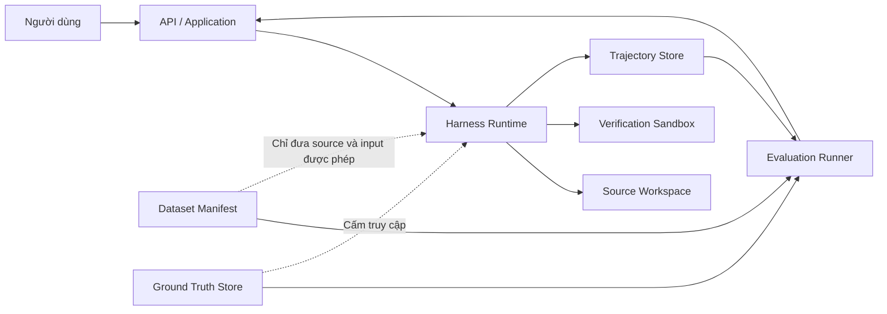
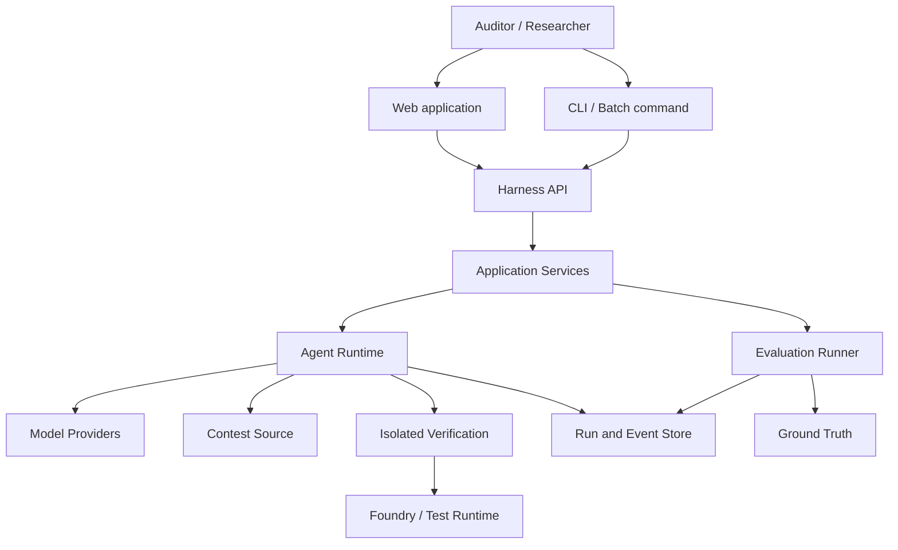
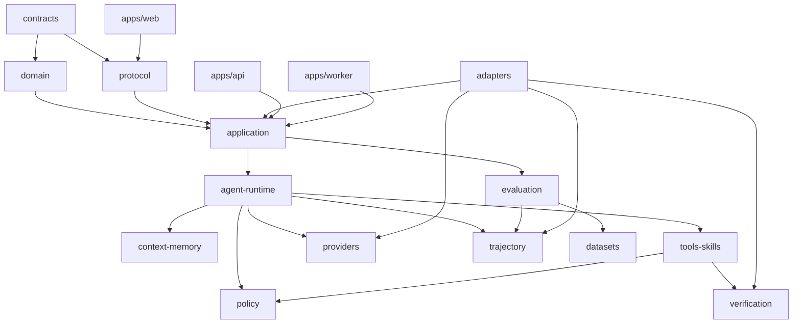
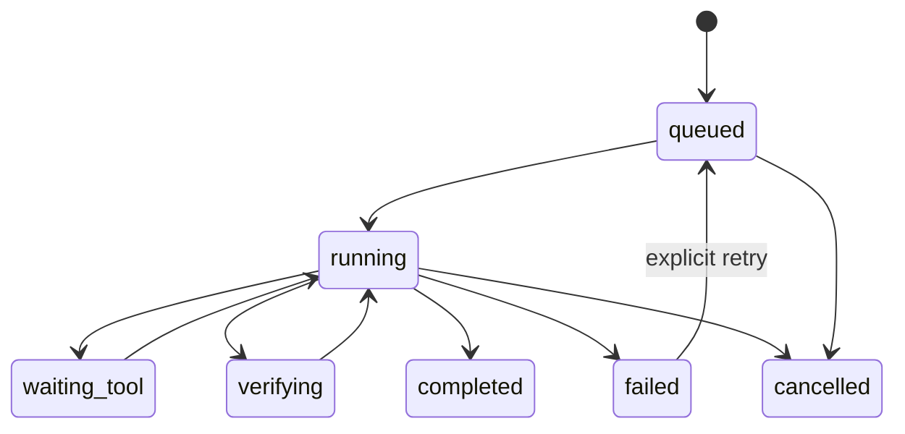
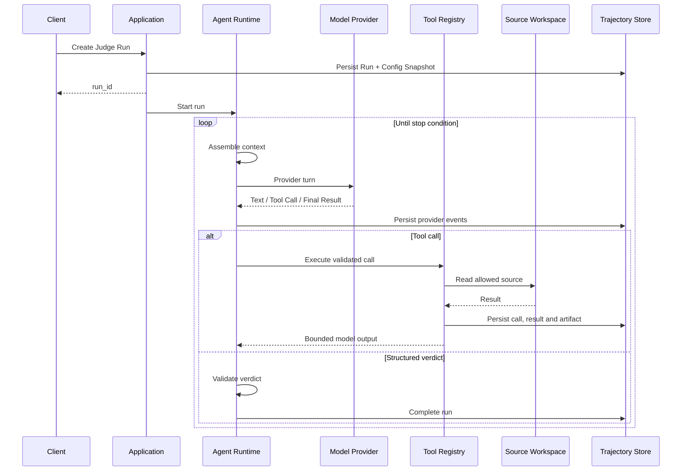
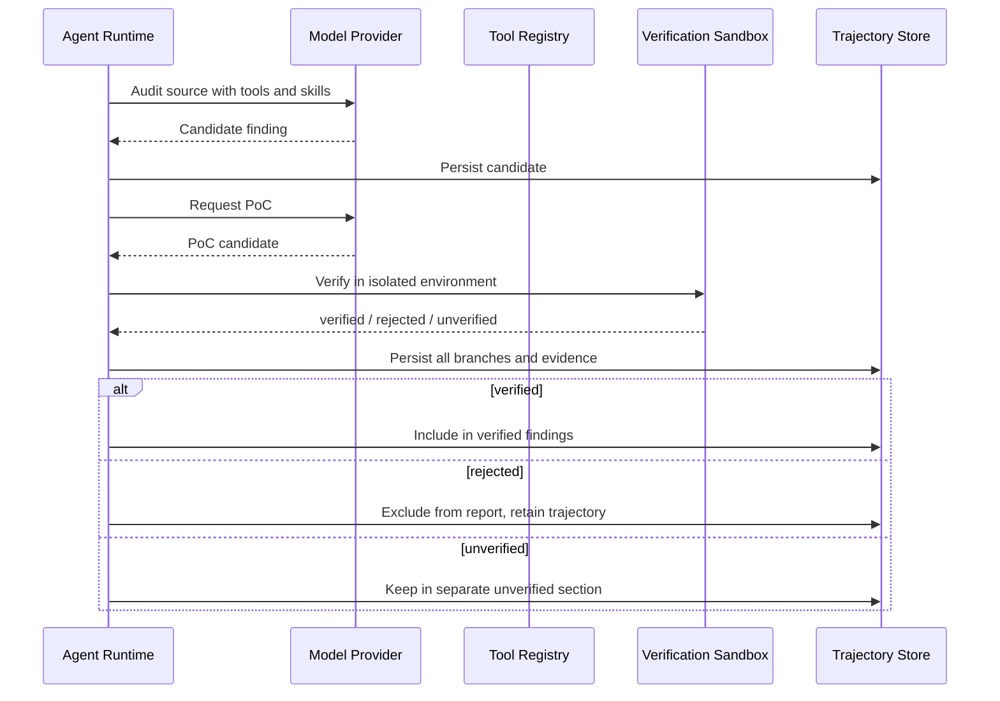

# Harness Architecture Blueprint

> **Trạng thái:** Blueprint v0.3
> **Phạm vi:** Kiến trúc chuẩn để bắt đầu triển khai
> **Nguồn tham chiếu:** tài liệu đồ án trong `harness/` và cách tổ chức của OpenCode trong `opencode/`
> **Nguyên tắc:** học quyết định thiết kế, không sao chép implementation

---

## 1. Mục đích của blueprint

Blueprint này là nguồn thiết kế chung cho toàn nhóm. Nó trả lời năm câu hỏi:

1. Hệ thống gồm những khối nào và mỗi khối chịu trách nhiệm gì?
2. Các khối được phép phụ thuộc vào nhau theo hướng nào?
3. Dữ liệu đi qua hệ thống ra sao trong Judge mode, Audit mode và Evaluation?
4. Những hợp đồng nào phải chốt trước khi các thành viên triển khai song song?
5. Những quyết định nào chưa đủ dữ kiện để chốt và cần nhóm trả lời?

Blueprint không mô tả chi tiết từng class hoặc framework. Các chi tiết đó thuộc implementation và có thể thay
đổi, miễn là không phá vỡ ranh giới và hợp đồng được định nghĩa tại đây.

### 1.1. Thứ tự ưu tiên khi tài liệu mâu thuẫn

Nếu xuất hiện mâu thuẫn, dùng thứ tự sau:

1. [`idea.md`](../idea.md): luận điểm và phạm vi nghiên cứu.
2. Blueprint này: ranh giới kiến trúc và hợp đồng hệ thống.
3. [`04-working-rules.md`](04-working-rules.md): quy tắc bắt buộc về ablation, ground truth và data split.
4. [`02-roles.md`](02-roles.md): quyền sở hữu module.
5. Decision record trong `docs/decisions/`: quyết định kỹ thuật cụ thể.
6. Source code và test: hành vi triển khai hiện tại.

Mọi thay đổi làm ảnh hưởng tới câu hỏi nghiên cứu, chỉ số đánh giá hoặc ranh giới ground truth phải cập nhật
blueprint và có decision record.

---

## 2. Bài toán và phạm vi hệ thống

Harness là lớp điều phối bao quanh model. Harness không thay đổi trọng số model. Nó cung cấp:

- agent loop để model suy luận qua nhiều bước;
- tool để đọc và phân tích repository;
- context và memory để duy trì thông tin cần thiết;
- skill để đưa quy trình audit chuyên biệt vào run;
- verification để sinh và chạy PoC;
- trajectory để quan sát và đánh giá toàn bộ quá trình;
- evaluation để so sánh baseline, ablation và nhiều provider.

Hệ thống có hai chế độ:

| Chế độ       | Đầu vào                                    | Đầu ra chính                                         | Mục tiêu                                |
| --------------- | --------------------------------------------- | ------------------------------------------------------- | ----------------------------------------- |
| **Judge** | Source của contest và một finding có sẵn | Valid/invalid, severity, lý do, bằng chứng           | Xây và kiểm chứng nền tảng trước  |
| **Audit** | Toàn bộ source repository                   | Danh sách finding đã xác minh hoặc chưa xác minh | Tự tìm lỗ hổng trên phạm vi dự án |

### 2.1. Ngoài phạm vi

- Huấn luyện hoặc fine-tune model.
- Fork hoặc sửa OpenCode thành sản phẩm của nhóm.
- Xây provider adapter riêng cho từng hãng nếu đã có thư viện ổn định.
- Cho agent truy cập ground truth.
- Dùng kết quả benchmark ngoài làm số liệu baseline trực tiếp.
- Microservice hoặc distributed execution trước khi modular monolith chứng minh là không đủ.
- RAG, knowledge graph hoặc vector database nếu chưa có decision record chứng minh chúng phục vụ RQ1-RQ3.

---

## 3. Các quyết định kiến trúc đã chốt

### AD-01 — Modular monolith

Hệ thống được tổ chức thành monorepo với các module có ranh giới rõ, nhưng triển khai ban đầu như một modular
monolith.

Lý do:

- nhóm sáu người vẫn có thể làm song song qua package boundary;
- dễ chạy trên máy cá nhân và máy bảo vệ;
- trace, transaction và cấu hình đơn giản hơn microservice;
- khi một module cần tách process, hợp đồng đã tồn tại nên không phải thiết kế lại domain.

### AD-02 — Ports and Adapters

Domain và application use case chỉ biết các interface, không phụ thuộc trực tiếp vào SDK model, database,
filesystem, container runtime hoặc web framework.

Các tích hợp bên ngoài được đặt sau port:

- `ModelProvider`;
- `ToolExecutor`;
- `RunRepository`;
- `EventStore`;
- `Workspace`;
- `VerificationSandbox`;
- `Clock`;
- `IdGenerator`.

Điều này cho phép test bằng fake adapter và thay provider, database hoặc sandbox mà không sửa agent core.

### AD-03 — Runtime và Evaluation là hai security boundary khác nhau

Runtime chỉ nhận source workspace và input công khai. Ground truth chỉ tồn tại trong Evaluation.



Không được coi system prompt là cơ chế bảo vệ. Việc chặn phải được thực hiện tại workspace mount, path
policy và tool execution.

### AD-04 — Contract và schema đứng trước implementation

Các giá trị có cùng ý nghĩa ở core, API, database và UI phải bắt nguồn từ một schema chung. Không định nghĩa
lại `Run`, `Finding`, `ToolCall` hoặc `RunEvent` riêng ở từng module.

Đây là phiên bản giản lược của hướng phụ thuộc trong OpenCode:

```text
contracts/schema
      ↓
domain/core       protocol/API
      ↓               ↓
application/use-cases
      ↓
adapters/server/storage/provider/tools
      ↓
apps/api, apps/worker, apps/web
```

`contracts` không được import database driver, model SDK, filesystem hoặc framework server.

### AD-05 — Trajectory là dữ liệu bền vững hạng nhất

Không chỉ lưu verdict cuối. Mọi bước quan trọng phải tạo `RunEvent` bền vững:

- run được tạo, bắt đầu, dừng hoặc thất bại;
- provider turn bắt đầu và kết thúc;
- tool call được yêu cầu, bắt đầu, hoàn thành hoặc lỗi;
- context bị compact hoặc truncate;
- permission bị từ chối;
- verification bắt đầu và có kết quả;
- finding được đề xuất, xác minh, loại hoặc để `unverified`;
- budget thay đổi và stop condition được kích hoạt.

Event được dùng cho trace view, replay, debugging và trajectory evaluation. Event log không bắt buộc trở
thành full event-sourcing; trạng thái hiện tại vẫn có thể lưu ở bảng riêng để truy vấn nhanh.

### AD-06 — Mọi thành phần ảnh hưởng kết quả đều có flag

Flag phải nằm trong `RunConfigSnapshot`, được lưu cùng run và không thay đổi giữa chừng:

- tools;
- skills;
- context compaction;
- session note;
- long-term memory;
- verification;
- retry strategy;
- prompt variant;
- no-progress detection.

Không đọc trực tiếp config toàn cục trong module domain. Application tạo snapshot khi bắt đầu run và truyền
snapshot đó xuống runtime.

### AD-07 — Structured result, typed error

Verdict và finding phải theo schema. Error phải phân biệt ít nhất:

- lỗi input hoặc schema;
- lỗi logic có thể đưa lại cho model để tự sửa;
- permission denied;
- budget exceeded;
- provider/transient infrastructure error;
- sandbox/build/test error;
- lỗi nội bộ không thể tiếp tục.

Không parse verdict từ văn xuôi tự do và không biến mọi lỗi thành một chuỗi `Error`.

### AD-08 — Prompt được compose, version hóa và hash

Prompt không phải một chuỗi lớn được sửa trực tiếp. Nó được compose từ các thành phần có trách nhiệm riêng:

1. harness policy bất biến trong một prompt version;
2. instruction theo mode Judge hoặc Audit;
3. workspace metadata;
4. enabled skill summary;
5. budget và stop-condition reminder;
6. output contract.

Tool definition được cung cấp qua cơ chế tool calling của provider, không lặp lại toàn bộ trong system prompt.
Skill body chỉ được nạp khi cần. Mỗi thành phần có `id`, `version` và content hash; `RunConfigSnapshot` lưu hash
từng phần cùng aggregate prompt hash.

Provider-specific prompt chỉ được phép điều chỉnh cách biểu diễn để tương thích provider. Nó không được âm thầm
thay đổi policy, tool quyền hạn hoặc output contract. Mọi thay đổi prompt tạo ra một experiment variant mới nếu
dùng trong benchmark.

### AD-09 — Error recovery theo loại lỗi, không theo một bảng retry cố định

Mỗi lỗi có owner và recovery policy rõ ràng:

- provider transient error có thể retry trong giới hạn attempt, wall-clock và cost budget;
- retry phải ưu tiên `Retry-After`/provider metadata, nếu không có mới dùng exponential backoff có jitter;
- stream bị ngắt sau khi đã có partial output phải lưu provider attempt riêng, không tự động chạy lại tool call
  đã phát sinh nếu chưa chứng minh được idempotency;
- tool input/schema error và lỗi thao tác có thể sửa được được chuyển thành model-readable result;
- permission denied không retry và không cung cấp gợi ý giúp vượt policy;
- sandbox build/test error có thể cho agent sửa PoC trong verification retry budget riêng;
- budget exceeded, cancellation và invariant violation kết thúc run.

Retry, repair và compaction đều phải phát event, tính usage/cost và nằm trong config snapshot. Không dùng circuit
breaker toàn cục trước khi có nhiều worker hoặc có bằng chứng provider failure gây cascade.

### AD-10 — Cost được theo dõi bằng pricing snapshot

`CostTracker` nhận usage chuẩn hóa sau mỗi provider attempt và cộng cả

- provider turn chính;
- retry;
- tool-call repair;
- structured-output repair;
- compaction;
- model-based verification hoặc matching, nếu có.

Run chỉ có một hard `total_budget`. CostTracker gắn category để phân tích `reasoning`, `compaction`, `retry`,
`repair` và `verification`, nhưng không chia thành các ví cứng có thể làm run dừng khi tổng budget vẫn còn.

Pricing catalog được nhập từ trang giá chính thức, lưu `source_url`, `currency`, đơn vị token, `effective_at`
và content hash. Catalog được snapshot vào experiment/run để giá thay đổi sau này không sửa ngược số liệu cũ;
runtime không scrape giá trong lúc chạy.

Trước provider turn:

```text
recovery_reserve =
  max(total_budget * 10%, estimated_p90_recovery_cost)

allow_next_turn khi:
  remaining_budget >= estimated_next_turn_cost + recovery_reserve
```

`estimated_next_turn_cost` dùng input token đã biết và output-token reserve. `estimated_p90_recovery_cost` lấy
từ pilot cho compaction hoặc provider retry. Nếu không đủ, runtime phát `budget_warning`, yêu cầu graceful final
result nếu còn khả thi hoặc dừng trước khi phát sinh thêm chi phí. Sau turn, actual usage là nguồn authoritative.

Nếu provider không trả usage đáng tin cậy, run phải đánh dấu `cost_estimated` thay vì trình bày chi phí ước
lượng như số liệu thực.

---

## 4. Những gì tham khảo từ OpenCode

Blueprint đã khảo sát các khu vực sau:

- [`packages/opencode/src/session/`](../../opencode/packages/opencode/src/session/): agent loop, message,
  compaction, retry và run state;
- [`packages/opencode/src/tool/tool.ts`](../../opencode/packages/opencode/src/tool/tool.ts): hợp đồng tool;
- [`packages/opencode/src/tool/registry.ts`](../../opencode/packages/opencode/src/tool/registry.ts): registry,
  tool visibility và dynamic description;
- [`packages/opencode/src/permission/`](../../opencode/packages/opencode/src/permission/): kiểm tra quyền tại
  thời điểm thực thi;
- [`packages/schema/`](../../opencode/packages/schema/) và
  [`packages/protocol/`](../../opencode/packages/protocol/): tách schema khỏi transport;
- [`CONTEXT.md`](../../opencode/CONTEXT.md): durable session history, safe provider-turn boundary và event
  replay.

### 4.1. Adopt, adapt và reject

| Quyết định trong OpenCode                                         | Áp dụng cho harness                                    |
| -------------------------------------------------------------------- | -------------------------------------------------------- |
| Tool có ID, description, input schema và execute contract          | **Adopt**                                          |
| Tool registry chịu trách nhiệm validation và giới hạn output   | **Adopt**                                          |
| Tool error được viết để model có thể sửa input              | **Adopt**                                          |
| Schema/public contract không phụ thuộc runtime                    | **Adopt**                                          |
| Session và tool call có trạng thái bền vững                    | **Adopt**                                          |
| Event stream có sequence để reconnect và replay                  | **Adapt** cho trace view                           |
| Context chỉ thay đổi tại ranh giới an toàn giữa provider turn | **Adapt**                                          |
| Permission được đánh giá ở lúc thực thi tool                | **Adopt**, nhưng mặc định deny cho audit       |
| Monorepo với nhiều package nhỏ                                    | **Adapt**, chỉ tạo package theo ownership thật  |
| Effect-based runtime và toàn bộ dependency graph của OpenCode    | **Reject** nếu nhóm chưa có kinh nghiệm       |
| Plugin, MCP, LSP, desktop, TUI và multi-agent đầy đủ            | **Reject** khỏi phiên bản đầu                 |
| Cho người dùng duyệt tương tác mọi shell command             | **Adapt** thành policy tự động, reproducible   |
| Workspace có quyền đọc rộng như coding assistant               | **Reject**; runtime chỉ thấy source được cấp |

### 4.2. Technology facts đã kiểm chứng

- Zod hiện có [`z.toJSONSchema()`](https://zod.dev/json-schema) native; không mặc định thêm converter package.
- AI SDK hiện hỗ trợ [tool calling](https://ai-sdk.dev/docs/ai-sdk-core/tools-and-tool-calling), structured
  output và [provider registry](https://ai-sdk.dev/docs/reference/ai-sdk-core/provider-registry), nhưng vẫn phải
  đặt sau `ModelProvider` port.
- Docker hỗ trợ [`--network none`](https://docs.docker.com/engine/network/drivers/none/) và
  [CPU/memory limits](https://docs.docker.com/engine/containers/resource_constraints/). `--stop-timeout` là
  thời gian chờ khi dừng container, không phải giới hạn tổng thời gian chạy; wall-clock timeout thuộc host supervisor.
- Bun có [Windows build chính thức](https://bun.sh/docs/installation). Việc không chọn Bun là quyết định giảm
  biến số runtime, không phải kết luận Bun không chạy trên Windows.

---

## 5. System context



### 5.1. External actors

| Actor                | Quyền                                                     |
| -------------------- | ---------------------------------------------------------- |
| Auditor              | Tạo Judge/Audit run, xem trace, tải kết quả            |
| Researcher           | Tạo experiment, chạy baseline/ablation, đọc metric     |
| Administrator        | Cấu hình provider credential và giới hạn tài nguyên |
| Model provider       | Nhận provider request đã chuẩn hóa, trả model output |
| Verification runtime | Chỉ nhận source snapshot và test cần chạy             |

---

## 6. Container và process

Modular monolith có thể chạy bằng ba process dùng chung package:

| Process        | Trách nhiệm                                        | Có được đọc ground truth? |
| -------------- | ---------------------------------------------------- | ------------------------------- |
| `api`        | HTTP API, auth cục bộ, truy vấn run, stream event | Không                          |
| `worker`     | Chạy agent runtime và verification job             | Không                          |
| `evaluation` | Chuẩn bị case, gọi runtime, chấm kết quả       | Có                             |

`web` là client tĩnh hoặc process frontend riêng, nhưng không chứa domain logic.

API và worker có thể chạy trong cùng process ở local mode. Việc tách process chỉ là deployment choice, không
làm thay đổi module hoặc hợp đồng.

Trong local mode, worker là background runner trong cùng event loop và claim job qua cùng `RunQueue` port;
không gọi thẳng route handler. Khi tách process, thay adapter wake-up/claim nhưng giữ nguyên application use
case. Mỗi run có workspace riêng; không cho hai run ghi vào cùng source checkout.

---

## 7. Module architecture



### 7.1. `contracts`

Sở hữu các schema dùng chung:

- identifier;
- run mode và run status;
- run config;
- provider usage;
- message và provider turn;
- tool definition, tool call và tool result;
- finding, verdict và severity;
- verification request/result;
- run event;
- experiment và metric.

Module này chỉ chứa plain data schema, validation và type. Không chứa use case.

### 7.2. `domain`

Sở hữu invariant:

- transition hợp lệ của `RunStatus`;
- budget không được âm hoặc vượt giới hạn;
- một tool call chỉ được settle một lần;
- finding `verified` phải có verification evidence;
- `invalid` khác `unverified`;
- test case không được thay đổi split sau khi manifest đã khóa;
- run evaluation phải giữ nguyên config snapshot.

### 7.3. `application`

Điều phối use case:

- `CreateRun`;
- `StartRun`;
- `CancelRun`;
- `ResumeRun`;
- `GetRun`;
- `StreamRunEvents`;
- `RunJudge`;
- `RunAudit`;
- `VerifyFinding`;
- `CreateExperiment`;
- `ExecuteExperiment`;
- `ScoreExperiment`.

Application không tự gọi SDK hoặc database. Nó làm việc qua port.

### 7.4. `agent-runtime`

Sở hữu agent loop:

1. Nạp run và config snapshot.
2. Kiểm tra stop condition.
3. Lắp context cho provider turn.
4. Gọi model qua `ModelProvider`.
5. Lưu response và usage.
6. Nếu có tool call, chuyển sang tool registry.
7. Đưa tool result trở lại history.
8. Nếu có structured final result, validate và kết thúc.
9. Nếu chưa kết thúc, bắt đầu turn tiếp theo.

Stop condition tối thiểu:

- `max_steps`;
- `max_input_tokens`;
- `max_output_tokens`;
- `max_cost`;
- `wall_clock_timeout`;
- `cancelled`;
- `no_progress`;
- `completed`.

Agent core không import implementation của tool cụ thể. Nó chỉ biết `ToolRegistry`.

### 7.5. `providers`

Sở hữu abstraction chung:

```ts
interface ModelProvider {
  stream(request: ProviderRequest, signal: AbortSignal): AsyncIterable<ModelEvent>
}
```

`ModelEvent` tối thiểu là discriminated union của:

- `response_started`;
- `text_delta`;
- `reasoning_delta`, nếu provider cung cấp;
- `tool_input_started`;
- `tool_input_delta`;
- `tool_call`;
- `usage`;
- `finish`;
- `error`.

Provider adapter phải giữ `provider_attempt_id`, response metadata và finish reason để phân biệt retry với
provider turn logic. Event chưa chuẩn hóa hoặc provider-specific metadata không được đi thẳng vào agent core.

Provider request phải độc lập hãng:

- model reference;
- system context;
- chronological messages;
- visible tool definitions;
- structured output schema;
- token và generation controls;
- provider-specific opaque options, nếu thật sự cần.

Adapter chịu trách nhiệm chuyển đổi sang wire format. Runtime chỉ đọc event chuẩn hóa.

### 7.6. `context-memory`

Sở hữu:

- context budget;
- system context composition;
- prompt template và version;
- session note trong một run;
- compaction;
- truncation;
- long-term memory;
- memory reset policy.

Prompt architecture dùng các source ổn định:

1. harness policy;
2. mode instruction;
3. workspace metadata;
4. enabled skill summary;
5. run budget;
6. memory được phép nạp;
7. output contract.

Context source chỉ được cập nhật tại safe boundary trước provider turn. Không chèn context bất đồng bộ vào
giữa một response đang stream.

Tool output đầy đủ được lưu làm artifact. Model chỉ nhận bounded projection có đánh dấu rõ việc truncate và
tham chiếu tới artifact nếu policy cho phép đọc lại.

Compaction phải bảo toàn các invariant sau:

- policy, mode instruction và output contract không bị tóm tắt;
- active finding, unresolved task và session note còn hiệu lực;
- tool call/result vẫn ghép cặp hợp lệ;
- phần bị loại có artifact reference hoặc explicit loss marker;
- compaction usage và cost được ghi như một provider attempt;
- compaction failure không được âm thầm tiếp tục với context thiếu.

Compaction policy v1:

- trigger khi estimated context đạt 80% usable capacity sau khi trừ output-token reserve;
- dùng cùng model đang chạy để không đưa model thứ hai vào cross-provider comparison;
- giữ recent history theo token budget, mặc định 25% usable context, tối thiểu 2.000 và tối đa 8.000 token;
- một compaction attempt cho mỗi trigger;
- nếu summary vẫn overflow, prune model-visible output của tool cũ theo kích thước nhưng giữ metadata và artifact
  reference;
- nếu vẫn overflow, kết thúc với `context_overflow`, không âm thầm bỏ policy hoặc active finding.

Các giá trị trên nằm trong config snapshot và có thể đổi bằng decision record sau pilot. Compaction cost luôn
thuộc total run budget và được gắn category `compaction`.

Memory protocol v1 phân biệt:

- `session_note`: trạng thái trong một run, được bật trong `harness_full_clean` kể cả official test;
- dynamic long-term memory: scope theo contest, chỉ đọc/ghi trên train/validation;
- official test: không đọc hoặc ghi dynamic long-term memory giữa các run;
- frozen train-memory snapshot: chỉ dùng trong secondary experiment đã đăng ký và khóa trước khi xem test result.

Vì vậy `session_note` không được gọi là long-term memory. Số liệu chính thức dùng `harness_full_clean`; giá trị
của long-term memory được báo cáo riêng, không trộn validation result vào official test result.

### 7.7. `tools-skills`

Tool contract đề xuất:

```ts
interface ToolDefinition<Input, Metadata = Record<string, unknown>> {
  id: string
  version: string
  description: string
  inputSchema: Schema<Input>
  capability: ToolCapability
  execute(input: Input, context: ToolContext): Promise<ToolResult<Metadata>>
}

interface ToolContext {
  runId: string
  turnId: string
  toolCallId: string
  workspace: Workspace
  policy: ExecutionPolicy
  signal: AbortSignal
  emit(event: RunEvent): Promise<void>
}

interface ToolResult<Metadata> {
  title: string
  modelOutput: string
  artifactRefs: string[]
  metadata: Metadata
}
```

Registry chịu trách nhiệm:

- đăng ký và phát hiện tool;
- từ chối ID trùng;
- lọc tool theo mode, flag và policy;
- validate input;
- tạo model-facing validation error;
- thực thi permission check;
- giới hạn model-visible output;
- lưu artifact đầy đủ;
- phát event và metric;
- đảm bảo tool call settle đúng một lần.

Skill không phải executable code. Skill là tài liệu có version, metadata và điều kiện áp dụng:

```yaml
id: reentrancy
version: 1.0.0
applies_to:
  - solidity
required_tools:
  - read_file
  - grep
  - find_references
exclusion_rules:
  - state is updated before every external interaction
```

Skill body được nạp theo yêu cầu, không đưa toàn bộ catalog vào context ngay từ đầu.

Tool version tăng khi thay đổi input schema, model-visible description, permission/capability, output semantics
hoặc hành vi có thể làm thay đổi trajectory/kết quả. Refactor nội bộ không đổi contract không bắt buộc tăng
version. Run phải lưu `tool_id`, `tool_version` và description hash.

Concurrency policy v1:

- chỉ tool `read_only` đồng thời có `parallel_safe: true` mới được chạy song song;
- tối đa bốn read-only tool đang chạy trong một run;
- write, execute và verify chạy tuần tự;
- event `tool_call_completed` được phát ngay khi tool thực sự hoàn thành, kèm timestamp và `original_index`;
- tool results đưa trở lại model được sắp theo `original_index`, không theo completion time;
- registry dùng bounded semaphore, không dùng `Promise.all` không giới hạn.

Nhờ đó trajectory phản ánh thời gian thực, còn context gửi model vẫn deterministic.

### 7.8. `policy`

Policy là lớp bắt buộc nằm giữa tool request và side effect:

- workspace root allowlist;
- canonical path check sau khi resolve symlink;
- deny ground-truth path và filename pattern;
- read-only mặc định;
- shell command allowlist;
- environment variable allowlist;
- network deny mặc định;
- secret redaction;
- CPU, RAM, disk, process và timeout limit;
- audit log cho cả allow và deny.

Policy decision phải deterministic từ config snapshot. Evaluation run không được chờ người dùng bấm
approve vì sẽ làm mất reproducibility.

Verification không được bật mạng chỉ để tải dependency trong lúc chấm. Dependency phải được chuẩn bị ở bước
ingestion/build-preparation, khóa bằng lockfile/content hash và đưa vào source snapshot, cache hoặc image đã
pin digest. Nếu dependency chưa có, kết quả là `unverified` với lý do môi trường, không tự động mở mạng.

### 7.9. `verification`

Verification là port riêng, không phải shell tool tổng quát:

```ts
interface VerificationSandbox {
  verify(request: VerificationRequest, signal: AbortSignal): Promise<VerificationResult>
}
```

Luồng:

1. Nhận source snapshot, framework metadata và PoC candidate.
2. Tạo sandbox không mạng.
3. Giới hạn tài nguyên và thời gian.
4. Build project.
5. Chạy test mục tiêu.
6. Thu stdout, stderr, exit code và artifact.
7. Hủy sandbox.
8. Trả một trong ba kết quả:
   - `verified`;
   - `rejected`;
   - `unverified`.

`unverified` dùng khi không thể kết luận do build, môi trường hoặc thiếu bằng chứng. Không gộp nó vào
`rejected`.

Docker/OCI container là lựa chọn ưu tiên cho spike, không phải giả định đã chứng minh trên mọi máy Windows.
Image phải pin version hoặc digest, không dùng `latest`. Sandbox dùng `--network none`, read-only source mount,
writable temp volume và resource/process limit. Wall-clock timeout do host supervisor thực thi rồi stop/kill
container; không dựa vào một cờ `docker run --timeout` không tồn tại.

Trước khi chốt Docker adapter, phải kiểm tra Docker Desktop/WSL2 trên máy phát triển và máy demo, đồng thời đo
tỷ lệ build trên corpus mẫu.

### 7.10. `trajectory`

Sở hữu:

- run state repository;
- append-only event log;
- event sequence;
- artifact metadata;
- provider usage;
- trace projection;
- event replay.

Một event có envelope tối thiểu:

```ts
interface RunEvent<TPayload> {
  id: string
  runId: string
  sequence: number
  type: string
  occurredAt: string
  schemaVersion: number
  payload: TPayload
}
```

`sequence` tăng đơn điệu trong phạm vi một run. Client reconnect bằng `after_sequence`.

### 7.11. `datasets`

Sở hữu metadata, không chứa runtime logic:

- contest manifest;
- source reference và source integrity hash;
- ground-truth reference;
- publication date;
- framework/build metadata;
- split;
- labeling version;
- provenance.

Runtime manifest và evaluation manifest phải là hai projection khác nhau. Runtime projection tuyệt đối không
chứa đường dẫn hoặc nội dung ground truth.

### 7.12. `evaluation`

Evaluation runner:

1. Đọc locked dataset manifest.
2. Tạo experiment matrix.
3. Tạo run với config snapshot cụ thể.
4. Chờ run hoàn thành.
5. Đọc output và trajectory.
6. Match finding với ground truth.
7. Tính precision, recall, cost và reproducibility.
8. Lưu metric cùng toàn bộ provenance.

Các experiment bắt buộc:

- direct model baseline;
- harness;
- từng ablation variant;
- static analyzer baseline;
- general-purpose agent baseline;
- cross-provider matrix.

Evaluation không được gọi thẳng hàm nội bộ để bỏ qua policy. Nó phải dùng cùng application use case như API
hoặc một embedded client có semantics tương đương.

### 7.13. `protocol` và `apps`

Protocol sở hữu:

- HTTP path;
- request/response schema;
- public error;
- pagination;
- event stream contract.

API chỉ chuyển protocol request sang application command/query. Không đặt agent loop trong route handler.

Web chỉ dùng protocol/client package. Web không được import domain runtime hoặc database.

---

## 8. Domain model

### 8.1. Aggregate chính

| Aggregate             | Vai trò                                                             |
| --------------------- | -------------------------------------------------------------------- |
| `Run`               | Một lần Judge hoặc Audit từ input tới kết quả                 |
| `RunConfigSnapshot` | Toàn bộ cấu hình bất biến của run                             |
| `Trajectory`        | Chuỗi event và artifact của run                                   |
| `Finding`           | Một giả thuyết lỗ hổng hoặc kết luận Judge                   |
| `Verification`      | Kết quả kiểm chứng một finding                                  |
| `Experiment`        | Tập run được tổ chức để trả lời một câu hỏi đánh giá |
| `DatasetManifest`   | Danh sách contest và split đã khóa                              |

### 8.2. Identifier

Mọi identifier được sinh bởi hệ thống, không dùng index trong mảng:

- `run_id`;
- `turn_id`;
- `message_id`;
- `tool_call_id`;
- `finding_id`;
- `verification_id`;
- `experiment_id`;
- `artifact_id`;
- `event_id`.

### 8.3. Run state



Không dùng một trạng thái `done` chung. `completed`, `failed` và `cancelled` có ý nghĩa khác nhau khi tính
metric.

### 8.4. Tool-call state

```text
pending → running → completed
                  ↘ error
                  ↘ denied
                  ↘ cancelled
```

Tool call đã ở trạng thái cuối không được cập nhật lần hai.

### 8.5. Finding và verdict

Finding tối thiểu:

```yaml
id: string
title: string
description: string
severity: critical | high | medium | low | informational | unknown
locations:
  - path: string
    start_line: number
    end_line: number
impact: string
preconditions: string[]
evidence_refs: string[]
verification_status: verified | rejected | unverified | not_attempted
confidence: number
```

Judge verdict:

```yaml
classification: valid | invalid | uncertain
severity: critical | high | medium | low | informational | unknown
reasoning_summary: string
evidence_refs: string[]
```

`uncertain` phải được giữ riêng trong raw result. Evaluation policy quyết định cách tính nó, không ép thành
`invalid` ở runtime.

---

## 9. Luồng Judge mode



Judge input phải chứa finding cần chấm nhưng không chứa official verdict.

---

## 10. Luồng Audit mode và verification



Verification không được tự suy ra `verified` chỉ từ exit code. Adapter phải biết test nào được chạy, test có
thực sự chứng minh exploit condition hay không và source có build đúng target hay không.

---

## 11. Evaluation architecture

### 11.1. Experiment matrix

Một experiment được mô tả bằng:

```yaml
dataset_manifest: contests-v1.lock.json
mode: judge
providers:
  - provider_a/model_x
  - provider_b/model_y
variants:
  - direct
  - harness_full_clean
  - frozen_train_memory
  - without_skills
  - without_verification
repetitions: 3
budget:
  max_steps: 30
  max_cost: 2.00
matching_policy_version: 1
```

`harness_full_clean` bật session note nhưng tắt dynamic long-term memory. `frozen_train_memory` là secondary
variant; snapshot của nó phải được khóa trước khi xem test result. Giá trị budget trong ví dụ chỉ minh họa
schema.

Mọi run phải lưu:

- model và provider;
- model parameters;
- prompt/skill/tool-description hash;
- source commit hoặc content hash;
- dataset manifest hash;
- config snapshot;
- code commit;
- runtime image;
- start/end time;
- token, cost và latency;
- output và trajectory.

### 11.2. Reproducibility

Reproducibility không có nghĩa LLM phải trả văn bản giống tuyệt đối. Cần định nghĩa nhiều mức:

1. **Execution reproducibility:** cùng config và source có thể chạy lại.
2. **Schema reproducibility:** run luôn tạo output hợp lệ.
3. **Decision stability:** verdict hoặc matched finding ổn định qua nhiều lần.
4. **Metric stability:** precision/recall không dao động vượt ngưỡng đã chốt.

Reproducibility protocol:

1. Pilot chạy 3-5 lần trên một mẫu nhỏ đại diện cho provider, mode và độ dài context.
2. Nếu standard deviation của metric chính không vượt 5 percentage points, campaign chính dùng ba lần lặp.
3. Nếu vượt ngưỡng, campaign chính dùng năm lần và điều tra case-level instability.
4. Dùng temperature thấp nhất provider hỗ trợ và lưu seed nếu provider có seed.
5. Báo cáo mean, standard deviation, decision stability, invalid-output rate và 95% bootstrap confidence interval
   theo contest.
6. Harness delta dùng paired comparison trên cùng case/model/repetition khi có thể.

Pilot result và số lần lặp cuối được khóa trong experiment manifest trước campaign chính.

### 11.3. Contamination control

- Lưu ngày công bố contest.
- Lưu knowledge cutoff khai báo của model nếu có.
- Tách metric theo nhóm trước/sau cutoff.
- Không tuyên bố contest sau cutoff là tuyệt đối chưa từng xuất hiện trong training data.
- Báo cáo contamination như một limitation, không che giấu.

### 11.4. Campaign monitoring và fail policy

Experiment phải có projection theo dõi:

- tổng run theo `queued/running/completed/failed/cancelled`;
- actual và estimated cost so với campaign budget;
- provider error/rate-limit theo thời gian;
- run không phát durable event quá `stuck_threshold`;
- compile và verification success rate;
- số case còn lại và estimated completion.

Campaign không tự động tiếp tục vô hạn. Nó pause khi vượt một trong các ngưỡng đã snapshot:

- hard cost budget;
- consecutive infrastructure failure;
- provider unavailable;
- tỷ lệ failed run vượt fail policy;
- dataset/source integrity error.

`pause` khác `cancel`: pause giữ queue để người vận hành kiểm tra và resume; cancel kết thúc các run chưa bắt
đầu. Mọi threshold được pilot và version hóa, không hard-code một con số cho mọi provider.

### 11.5. Finding matching

Judge mode chấm trực tiếp finding được cấp bằng classification schema, không dùng location matching.

Audit mode dùng one-to-one matching giữa predicted và ground-truth findings:

1. tạo candidate pair từ file/function/location có liên quan;
2. chấm feature gồm vulnerability class, root cause, affected location và impact;
3. giải assignment một-một để một prediction không match nhiều ground-truth finding;
4. đưa pair mơ hồ sang double human review;
5. khóa policy version, calibration set và adjudication record trước benchmark.

Location overlap chỉ là một feature, không phải bằng chứng đủ. Official score không dùng model đang được đánh
giá để tự chấm output của chính nó. LLM chỉ có thể hỗ trợ sắp hàng review; human adjudication là kết luận cuối
cho pair mơ hồ.

---

## 12. Data và storage

### 12.1. Bảng logic tối thiểu

| Bảng                 | Nội dung                                             |
| --------------------- | ----------------------------------------------------- |
| `runs`              | mode, status, input, config snapshot, result          |
| `run_events`        | append-only event có sequence                        |
| `provider_turns`    | request metadata, usage, latency, finish reason       |
| `tool_calls`        | tool, input, status, duration, output projection      |
| `artifacts`         | full tool output, PoC, logs, report                   |
| `findings`          | normalized finding                                    |
| `verifications`     | request, result, evidence                             |
| `experiments`       | experiment definition và trạng thái                |
| `experiment_runs`   | mapping experiment, case, variant, repetition và run |
| `metrics`           | metric value cùng policy version                     |
| `dataset_manifests` | manifest hash, split và provenance                   |

Index tối thiểu:

- unique `(run_id, sequence)` trên `run_events`;
- `(run_id, status)` trên `tool_calls`;
- `(experiment_id, status)` trên `experiment_runs`;
- `(contest_id, split)` trên dataset projection;
- content hash unique hoặc deduplicated trên `artifacts`.

SQLite phải bật foreign key và WAL nếu được chọn. Run claim của worker phải là atomic transaction, không phải
đọc `queued` rồi update bằng hai thao tác tách rời.

### 12.2. Artifact

Không nhét toàn bộ stdout, source snapshot hoặc log dài vào event row. Event chứa metadata và
`artifact_ref`; artifact store giữ payload lớn.

Artifact phải có:

- content hash;
- media type;
- size;
- created time;
- producing run/tool/verification;
- retention policy;
- redaction status.

### 12.3. Dataset layout

```text
datasets/
├─ manifests/
│  ├─ contests-v1.lock.json
│  └─ runtime-projection-v1.json
├─ sources/
│  └─ <contest-id>/
│     └─ source/
└─ ground-truth/
   └─ <contest-id>/
      └─ findings.json
```

Worker chỉ được mount `sources/<contest-id>/source`. Evaluation process mới được mount `ground-truth`.

### 12.4. Schema evolution và migration

- Database migration là forward-only và được lưu trong source control.
- `RunEvent.schemaVersion` chỉ tăng khi payload semantics hoặc shape thay đổi.
- Event cũ không bị rewrite để giống event mới; projection reader có upcaster cho các version còn hỗ trợ.
- Artifact và config snapshot bất biến; migration chỉ thay metadata/index khi có thể.
- Trước migration phải tạo backup và chạy migration test trên một bản sao database demo.
- Blueprint không cam kết backward compatibility vô hạn trong giai đoạn phát triển, nhưng mọi run đã dùng
  trong báo cáo phải đọc và replay được bằng release candidate.

---

## 13. API và event delivery

API là bất đồng bộ:

```text
POST   /runs/judge
POST   /runs/audit
GET    /runs/{run_id}
POST   /runs/{run_id}/cancel
POST   /runs/{run_id}/retry
GET    /runs/{run_id}/events?after_sequence={n}
GET    /runs/{run_id}/artifacts

POST   /experiments
POST   /experiments/{experiment_id}/start
GET    /experiments/{experiment_id}
GET    /experiments/{experiment_id}/metrics
```

`POST /runs/*` trả `run_id` ngay sau khi run và config snapshot đã được lưu bền vững.

Khuyến nghị event delivery:

- SSE để cập nhật trace theo thời gian thực;
- mỗi event có `sequence`;
- client reconnect bằng `after_sequence`;
- `GET /runs/{id}` luôn là authoritative snapshot;
- mất live event không làm mất dữ liệu vì durable events có thể replay.

Không để HTTP request chờ toàn bộ agent run.

### 13.1. Offline replay

Offline demo dùng chính durable data contract, không dựng một UI giả:

1. chọn một tập run đã kiểm tra và redact;
2. đóng gói SQLite database, artifact và manifest hash;
3. replay service đọc event theo sequence và phát lại với tốc độ cấu hình được;
4. web trace view dùng cùng endpoint/client như live mode;
5. UI hiển thị rõ `Replay` để không trình bày dữ liệu ghi sẵn như run đang gọi provider thật.

Replay không cần mock provider vì không chạy agent loop. Một fixture fake-provider riêng vẫn được giữ cho
end-to-end test và demo walking skeleton không cần mạng.

### 13.2. Local security

Local-only không đồng nghĩa bỏ mọi kiểm soát. API mặc định:

- bind loopback, không bind `0.0.0.0`;
- kiểm tra `Origin` cho browser request;
- không cho web tùy ý gửi path ngoài workspace đã chọn;
- dùng random local session token nếu browser/API chạy khác process hoặc có endpoint tạo side effect nguy hiểm.

Không xây user account/RBAC cho local mode. Multi-user/public deployment là một security design khác và không
được bật chỉ bằng đổi host binding.

---

## 14. Cấu hình

```text
config/
├─ defaults.yaml
├─ flags.yaml
├─ runtime.yaml
├─ memory.yaml
├─ policies/
│  ├─ judge.yaml
│  ├─ audit.yaml
│  └─ evaluation.yaml
├─ providers.yaml
├─ pricing/
│  └─ catalog.yaml
└─ experiments/
   └─ judge-baseline.yaml
```

Thứ tự merge:

```text
defaults
  → mode policy
  → experiment variant
  → explicit run override
  → immutable RunConfigSnapshot
```

Credential không nằm trong config hoặc snapshot. Snapshot chỉ lưu credential reference đã che thông tin
nhạy cảm.

`runtime.yaml` chứa retry, compaction, tool/run/provider/sandbox concurrency và timeout defaults. `memory.yaml`
chứa scope/reset policy. Experiment có thể override các giá trị được phép, nhưng resolved value phải nằm trong
immutable snapshot cùng pricing catalog hash.

Config phải validate ngay lúc tạo run, không đợi đến giữa agent loop mới phát hiện sai.

---

## 15. Cấu trúc repository đề xuất

```text
project/
├─ harness/
│  ├─ apps/
│  │  ├─ api/
│  │  ├─ worker/
│  │  ├─ evaluation-runner/
│  │  └─ web/
│  ├─ packages/
│  │  ├─ contracts/
│  │  ├─ domain/
│  │  ├─ protocol/
│  │  ├─ application/
│  │  ├─ agent-runtime/
│  │  ├─ providers/
│  │  ├─ context-memory/
│  │  ├─ tools-skills/
│  │  ├─ policy/
│  │  ├─ verification/
│  │  ├─ trajectory/
│  │  └─ adapters/
│  ├─ evaluation/
│  │  ├─ analysis/
│  │  └─ notebooks/
│  ├─ datasets/
│  ├─ config/
│  ├─ tests/
│  │  ├─ contract/
│  │  ├─ integration/
│  │  ├─ adversarial/
│  │  ├─ fixtures/
│  │  └─ e2e/
│  ├─ docs/
│  └─ package.json
└─ opencode/
   └─ reference only
```

`apps/evaluation-runner` là executable dùng cùng protocol/application client như API, không gọi private runtime
function. `evaluation/analysis` và `evaluation/notebooks` là research workspace đọc CSV/JSON đã export; chúng
không nằm trong runtime dependency graph và có thể dùng Python mà không tạo thêm một Python service.

Không bắt buộc tạo ngay mọi package. Chỉ tạo package khi:

- có ownership riêng;
- có dependency boundary cần kiểm soát;
- hoặc cần test/đóng gói độc lập.

Nếu package chỉ có một file và không bảo vệ ranh giới nào, giữ nó trong package cha.

---

## 16. Dependency rules

Các rule phải được kiểm tra bằng lint hoặc dependency test:

1. `contracts` không import module nội bộ khác.
2. `domain` chỉ import `contracts`.
3. `protocol` chỉ import `contracts`.
4. `application` import `domain`, `contracts` và port.
5. Adapter được import application contract, nhưng application không import adapter.
6. `web` chỉ import generated client hoặc `protocol`, không import runtime.
7. `evaluation` không import database table hoặc gọi agent core trực tiếp.
8. Tool cụ thể không được import agent loop.
9. Ground-truth loader không được nằm trong dependency graph của worker.
10. Verification adapter không được nhận credential của model provider.

---

## 17. Testing strategy

### 17.1. Contract test

- schema encode/decode;
- provider adapter tạo event chuẩn;
- tool adapter tuân theo Tool contract;
- storage adapter giữ đúng event sequence;
- API request/response khớp protocol.

### 17.2. Unit test

- run-state transition;
- budget và stop condition;
- config merge và snapshot;
- tool input validation;
- finding normalization;
- scoring policy.

### 17.3. Integration test

- fake provider phát tool call rồi verdict;
- registry gọi tool và lưu trajectory;
- context compaction không làm mất system policy;
- worker restart vẫn đọc được run đã lưu;
- verification sandbox build và chạy fixture.

### 17.4. Adversarial test

- path traversal;
- symlink escape;
- absolute path ngoài workspace;
- đọc filename chứa ground truth;
- command injection;
- secret exfiltration qua tool output;
- network access từ sandbox;
- process, fork bomb, CPU, RAM và disk exhaustion;
- prompt injection nằm trong source code.

### 17.5. End-to-end test

Fixture nhỏ, deterministic:

1. Judge một finding hợp lệ.
2. Judge một finding không hợp lệ.
3. Audit một repository có lỗ hổng đã biết.
4. Verification thành công.
5. Verification thất bại.
6. Verification không thể kết luận.
7. Client disconnect rồi replay event.
8. Chạy cùng test case với một ablation flag bị tắt.

Test thật với provider phải tách khỏi test mặc định vì có chi phí và độ bất định.

---

## 18. Observability và auditability

Log vận hành và trajectory là hai loại khác nhau:

- **Operational log:** phục vụ developer, có stack trace và infrastructure detail.
- **Run event:** dữ liệu nghiên cứu bền vững, có schema và version.

Metric hệ thống:

- run count theo status;
- provider latency và error rate;
- token/cost mỗi run;
- tool call count, error rate và denied rate;
- context compaction count;
- sandbox build/test success rate;
- verification verified/rejected/unverified rate.

Không ghi API key, raw credential hoặc secret vào cả hai loại log.

---

## 19. Ownership

| Module                                      | Owner chính    | Phối hợp bắt buộc         |
| ------------------------------------------- | --------------- | ----------------------------- |
| `agent-runtime`, application run use case | TV1             | TV2, TV3, TV4, TV5            |
| `context-memory`                          | TV2             | TV1, TV5                      |
| `tools-skills`                            | TV3             | TV1, TV4, TV5                 |
| `policy`, `verification`                | TV4             | TV1, TV3, TV5                 |
| `datasets`, `evaluation`, scoring       | TV5             | TV1, TV4, TV6                 |
| `protocol`, API, web, trace view          | TV6             | TV1, TV5                      |
| `contracts`                               | Đồng sở hữu | Thay đổi phải review chéo |

Thay đổi trong `contracts` cần ít nhất:

- owner module tạo thay đổi;
- một consumer của contract;
- TV5 nếu trường dữ liệu ảnh hưởng evaluation.

---

## 20. Trình tự triển khai theo dependency

Trình tự này dựa trên dependency, không gắn với ngày:

### Slice 1 — Walking skeleton

- contract tối thiểu cho Run, RunEvent và ToolCall;
- fake provider;
- composable prompt v0 và prompt hash;
- typed error taxonomy và model-readable tool error;
- agent loop một tool call;
- `read_file` chỉ đọc workspace;
- in-memory adapter;
- structured Judge verdict;
- end-to-end test.

### Slice 2 — Durable trajectory

- persistent run/event store;
- database-backed queue với atomic claim/lease;
- migration v0;
- event sequence và replay;
- API tạo run và trace query;
- web trace view tối thiểu.

### Slice 3 — Real provider và context

- một provider adapter thật;
- provider spike trên ít nhất hai provider;
- token/cost usage;
- pricing snapshot và CostTracker;
- context budget;
- compaction pilot;
- truncation artifact;
- retry và cancel.

### Slice 4 — Tool và skill platform

- registry;
- read/glob/grep/list;
- skill discovery;
- tool visibility và flags;
- tool contract test.

### Slice 5 — Judge evaluation

- dataset runtime projection;
- locked contest split;
- baseline direct model;
- harness variant;
- precision, recall, cost và repeated runs.
- campaign monitoring và pause policy.

### Slice 6 — Security và verification

- policy engine;
- adversarial suite;
- isolated sandbox;
- pinned verification image và offline dependency preparation;
- PoC flow;
- verified/rejected/unverified.

### Slice 7 — Audit mode

- repository plan và bounded worklist cho single agent;
- finding candidates;
- multi-finding workflow;
- thứ tự verification và context handoff giữa các vùng code;
- call-flow tool;
- report generation.

### Slice 8 — Cross-provider và ablation

- experiment matrix;
- provider fairness;
- ablation variants;
- trajectory scoring;
- reproducibility report.

### Slice 9 — Offline release

- đóng gói database, artifact và manifest đã redact;
- replay service dùng durable event sequence;
- cùng trace UI với live mode;
- nhãn Replay rõ ràng;
- kiểm tra trên đúng máy demo.

Mỗi slice phải chạy end-to-end. Không xây hết module rồi mới tích hợp.

---

## 21. Definition of Architecture Ready

Blueprint v0.3 đã đủ quyết định để scaffold module boundary, config và test fixture cho cả chín Slice. Điều này
không có nghĩa implementation của Slice sau được làm trước dependency của nó hoặc được tạo package rỗng không có
ownership.

Trạng thái architecture readiness:

- [X] Chốt primary language và workspace tool.
- [X] Chốt schema library và JSON Schema conversion.
- [ ] Chốt schema v0 cho `Run`, `RunEvent`, `ToolCall`, `Finding`, `VerificationResult`.
- [X] Chốt dependency rules.
- [X] Chốt source/ground-truth mount boundary.
- [X] Chốt prompt composition v0 và prompt hashing.
- [X] Chốt error taxonomy và retry defaults.
- [ ] Có một fake-provider scenario cho walking skeleton.
- [ ] Chỉ định owner/reviewer cho shared contracts.
- [ ] Chạy provider, database-driver và sandbox acceptance spike trước implementation tương ứng.

Nhóm có thể tạo workspace và source skeleton ngay. Schema v0 và fake-provider scenario là hai artifact code đầu
tiên; acceptance spike là gate trước khi merge concrete adapter, không chặn tạo port/contract.

---

## 22. Decision Questions

Blueprint v0.3 chốt toàn bộ Decision Question ở trạng thái **Decided**. Spike và pilot bên dưới là acceptance
test cho quyết định, không phải câu hỏi kiến trúc còn mở. Nếu acceptance test thất bại, nhóm tạo decision record
mới, nêu bằng chứng và thay đổi quyết định có kiểm soát.

### DQ-01 — Primary language và runtime

**Trạng thái:** Decided
**Blocker:** Slice 1

**Quyết định:** TypeScript trên Node.js LTS cho core, API và tool runtime. Python chỉ dùng cho analysis/notebook qua
CSV/JSON export, không tạo Python service thứ hai.

Acceptance test:

- ít nhất bốn thành viên có thể debug;
- walking skeleton chạy trên Windows và Linux;
- cả TV1, TV3 và TV6 có thể sửa contract/tool/API;
- không đưa Effect vào chỉ vì OpenCode dùng Effect.

### DQ-02 — Workspace/package manager

**Trạng thái:** Decided
**Blocker:** Slice 1

**Quyết định:** Node.js LTS + pnpm workspace.

Lý do chọn pnpm là workspace/filter và dependency isolation phù hợp modular monolith. Không dùng lập luận
“Bun không hỗ trợ Windows”: Bun hiện có bản Windows chính thức. Bun chưa được chọn vì blueprint không cần phụ
thuộc Bun-specific API và Node.js LTS giảm thêm một biến số khi dùng native dependency/offline packaging.

### DQ-03 — Schema library

**Trạng thái:** Decided
**Blocker:** Slice 1

**Quyết định:** Zod phiên bản đã pin trong lockfile. Dùng native `z.toJSONSchema()`; không thêm
`zod-to-json-schema` nếu không có compatibility case đã được test. Contract test phải kiểm tra schema dùng cho
runtime validation và JSON Schema gửi provider có semantics tương đương.

### DQ-04 — Provider integration

**Trạng thái:** Decided
**Blocker:** Slice 3

**Quyết định:** dùng AI SDK sau `ModelProvider` port. Harness tự quản lý durable agent loop bằng core
`generateText`/`streamText`; không dùng `ToolLoopAgent` làm orchestration owner. Adapter phải hạ event về
`ModelEvent` của harness.

**Acceptance spike:** cùng một structured-output schema, một tool call, usage capture, cancellation và error
case chạy qua ít nhất hai provider. Nếu AI SDK thất bại tiêu chí, thay adapter bằng LiteLLM/OpenAI-compatible
gateway qua decision record; không thay agent core.

### DQ-05 — Database

**Trạng thái:** Decided
**Blocker:** Slice 2

**Quyết định:** SQLite với WAL và foreign key, Drizzle ORM/migration, `better-sqlite3` driver và index đã nêu
ở Mục 12.

**Acceptance test:** prebuilt/native package phải cài và chạy trên Node.js LTS ở máy Windows phát triển và máy
demo offline. Nếu không đạt, đổi SQLite driver qua adapter; không đổi schema/domain và không duy trì đồng thời
SQLite/PostgreSQL adapter.

### DQ-06 — Queue và worker recovery

**Trạng thái:** Decided
**Blocker:** Slice 2

**Quyết định:** database-backed queue, một in-process worker trong local mode, không Redis.

Worker claim bằng atomic transaction và lưu `lease_owner`, `lease_expires_at`, `attempt`. Worker heartbeat gia
hạn lease. Phiên bản đầu đánh dấu run hết lease là `failed/process_crashed`; retry luôn tạo attempt mới, không
tiếp tục giữa một provider turn. Resume sau crash là một thiết kế riêng, không được tuyên bố chỉ vì history đã
lưu bền vững.

### DQ-07 — Sandbox runtime

**Trạng thái:** Decided
**Blocker:** Slice 6, nhưng cần spike sớm

**Quyết định:** Docker Desktop/WSL2 trên Windows và OCI container trên Linux. Image phải pin digest,
dependency có sẵn offline, network none, source read-only, temp writable và host-enforced timeout.

**Acceptance spike:** xác nhận resource limits thực sự có hiệu lực trên backend dùng trong demo và đo tỷ lệ
build trên khoảng 20 contest repository. Nếu máy demo không đáp ứng WSL2/Docker, demo dùng replay verification
đã ghi rõ; không được tuyên bố sandbox live khi thực tế chỉ replay.

### DQ-08 — Tool-call concurrency

**Trạng thái:** Decided
**Blocker:** trước real provider

**Quyết định:** chỉ chạy song song tool `read_only` được đánh dấu `parallel_safe` và không dùng chung mutable
resource, tối đa bốn tool/run. Tool write, execute và verify chạy tuần tự.

Event log phát completion theo thời gian thực kèm `original_index`; context trả kết quả cho model theo thứ tự
tool call gốc. Registry dùng bounded semaphore, không dùng `Promise.all` không giới hạn.

### DQ-09 — Long-term memory

**Trạng thái:** Decided
**Blocker:** trước ablation memory

**Quyết định:**

- session note là state trong một run và được bật trong official `harness_full_clean`;
- dynamic long-term memory có scope theo contest, chỉ đọc/ghi trên train/validation;
- official test không đọc hoặc ghi dynamic memory giữa các run;
- official result lấy từ test set với `harness_full_clean`;
- frozen train-memory snapshot chỉ là secondary test variant, phải khóa trước khi xem test result;
- long-term-memory ablation được báo cáo riêng, không dùng validation làm số liệu chính thức.

### DQ-10 — Event transport

**Trạng thái:** Decided
**Blocker:** Slice 2

**Quyết định:** SSE cộng durable replay theo `after_sequence`; snapshot endpoint là authoritative fallback.

### DQ-11 — Finding matching policy

**Trạng thái:** Decided
**Blocker:** trước Audit benchmark

**Quyết định:** Judge mode dùng direct classification. Audit mode dùng one-to-one matching theo Mục 11.5,
kết hợp vulnerability class, root cause, location và impact. Pair mơ hồ có double human review.

Official score không dùng model đang được đánh giá để tự chấm. Policy, calibration set và adjudication record
được version hóa và khóa trước benchmark.

### DQ-12 — Reproducibility threshold

**Trạng thái:** Decided
**Blocker:** trước benchmark chính thức

**Quyết định:** pilot chạy 3-5 lần trên mẫu nhỏ đại diện. Nếu standard deviation của metric chính không vượt
5 percentage points, campaign chính dùng ba lần; nếu vượt thì dùng năm lần và điều tra case-level instability.

Dùng temperature thấp nhất provider hỗ trợ, lưu seed nếu có. Báo cáo mean, standard deviation, decision
stability, invalid-output rate và 95% bootstrap confidence interval theo contest. Pilot result và repetition
count được khóa trong experiment manifest trước campaign.

### DQ-13 — Authentication và deployment

**Trạng thái:** Decided
**Blocker:** không chặn core

**Quyết định:** phiên bản đồ án local-only, không user account/RBAC. Vẫn bắt buộc loopback binding, Origin
validation, workspace policy và local session token ở các endpoint có side effect. Public/multi-user deployment
ngoài phạm vi và cần threat model mới.

### DQ-14 — Audit mode report policy

**Trạng thái:** Decided
**Blocker:** Slice 7

**Quyết định:** report có `Verified Findings` và `Unverified Findings` tách biệt. Rejected findings không hiện
trong report người dùng nhưng được giữ đầy đủ trong trajectory/evaluation.

### DQ-15 — Prompt architecture

**Trạng thái:** Decided
**Blocker:** Slice 1

Áp dụng AD-08. Tool definitions đi qua provider tool contract, không ghép toàn bộ vào system prompt. Provider
prompt adaptation phải giữ semantic equivalence và có contract/golden test.

### DQ-16 — Error recovery parameters

**Trạng thái:** Decided
**Blocker:** Slice 1

**Quyết định:**

- provider 408/429/retryable 5xx: tối đa ba attempt tổng cộng;
- ưu tiên `Retry-After`; nếu thiếu thì exponential backoff 2s, 4s, 8s với full jitter, cap 30s;
- mọi retry vẫn chịu wall-clock và total cost budget;
- stream bị cắt chỉ retry tối đa một lần khi chưa có non-idempotent side effect; attempt cũ vẫn được lưu;
- schema/tool-call repair: tối đa hai lần model sửa;
- PoC build/test repair: tối đa hai lần;
- permission denied, cancellation, budget exceeded và invariant violation: không retry.

Campaign pause sau năm infrastructure failure liên tiếp của cùng provider; đây là provider health policy, không
phải model logic.

### DQ-17 — Compaction strategy

**Trạng thái:** Decided
**Blocker:** Slice 3

**Quyết định:** áp dụng compaction policy v1 tại Mục 7.6: trigger 80% usable context, cùng model của run, giữ
25% recent-token budget trong khoảng 2.000-8.000 token, một compaction attempt, sau đó prune tool output cũ và
dừng `context_overflow` nếu vẫn không đủ.

Compaction luôn tính vào total budget, gắn category `compaction`, phát event và có flag ablation.

### DQ-18 — Sub-agent architecture

**Trạng thái:** Decided
**Blocker:** không chặn Slice 7

**Quyết định:** không triển khai sub-agent trong v1. Audit mode dùng một agent với repository plan và bounded
worklist.

Chỉ mở lại bằng decision record nếu trajectory chứng minh single-agent không đạt coverage trong budget. Khi đó
sub-agent phải là child run có `parent_run_id`, context/budget/result schema riêng và không mở rộng workspace
permission của parent.

### DQ-19 — Worker concurrency

**Trạng thái:** Decided
**Blocker:** trước evaluation campaign

**Quyết định mặc định:**

- local interactive mode: một active run;
- evaluation mode: tối đa ba active run;
- tối đa hai provider turn đồng thời cho mỗi provider;
- một verification sandbox đồng thời;
- tối đa bốn parallel-safe read tool trong một run.

Mỗi run có workspace riêng. Shared semaphore/rate limiter thuộc worker adapter. Các giới hạn nằm trong config,
có thể giảm theo rate limit/tài nguyên nhưng không được tăng không giới hạn.

### DQ-20 — Migration policy

**Trạng thái:** Decided
**Blocker:** Slice 2

Áp dụng Mục 12.4: forward-only migration, event version/upcaster, backup test và giữ khả năng replay mọi run
dùng trong báo cáo.

### DQ-21 — Offline demo

**Trạng thái:** Decided
**Blocker:** trước hoàn thiện ứng dụng

Áp dụng Mục 13.1: pre-populated durable data, replay event theo sequence, cùng trace UI với live mode và nhãn
`Replay` rõ ràng. Không giả lập một live provider call bằng dữ liệu ghi sẵn.

### DQ-22 — Pricing source và cost guard margin

**Trạng thái:** Decided
**Blocker:** trước benchmark có budget tiền

**Quyết định:** pricing catalog YAML được nhập từ trang giá chính thức, lưu source URL, currency, token unit,
`effective_at` và content hash. Catalog được snapshot; không scrape lúc chạy và không sửa ngược run cũ.

Recovery reserve dùng:

```text
max(total_budget * 10%, estimated_p90_recovery_cost)
```

Runtime chỉ bắt đầu turn khi remaining budget đủ cho estimated next turn cộng recovery reserve. Model không có
pricing xác định không được đưa vào benchmark cost chính thức.

---

## 23. Những điều không được làm khi triển khai

- Không để route handler chứa agent loop.
- Không để tool tự truy cập filesystem ngoài `Workspace` port.
- Không truyền raw database client vào domain.
- Không lưu duy nhất verdict cuối và bỏ trajectory.
- Không cho evaluation import và gọi private runtime function.
- Không đưa ground-truth path vào prompt rồi kỳ vọng model không đọc.
- Không gộp `rejected` với `unverified`.
- Không thay config giữa một run.
- Không thêm tool mà không có schema, policy, event và contract test.
- Không tạo package chỉ để mô phỏng cấu trúc OpenCode.
- Không copy code từ OpenCode vào harness.

---

## 24. Kiểm tra một thay đổi kiến trúc

Trước khi merge thay đổi lớn, trả lời:

1. Thay đổi phục vụ RQ nào?
2. Module nào sở hữu hành vi?
3. Có làm đảo hướng dependency không?
4. Có thêm hoặc thay đổi public contract không?
5. Có ảnh hưởng tới config snapshot hoặc ablation không?
6. Có thay đổi dữ liệu trajectory cần TV5 sử dụng không?
7. Có mở rộng quyền truy cập source, shell, network hoặc ground truth không?
8. Có làm run cũ không replay hoặc không so sánh được không?
9. Có cần migration hoặc schema version không?
10. Có decision record và bằng chứng test chưa?

Nếu không trả lời rõ các câu trên, thay đổi chưa sẵn sàng triển khai.
