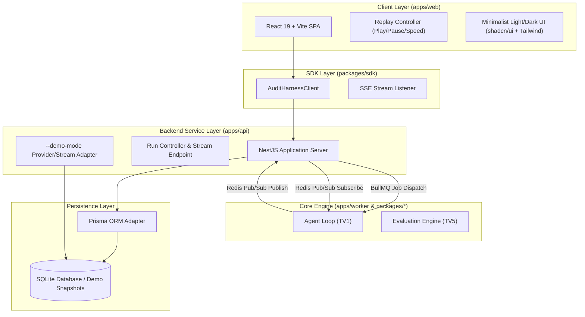

# Technical Specification — TV6: Application & Demo Track
## Document Identifier: SPEC-TV6-00-OVERVIEW
**Project:** Audit Harness (Smart Contract LLM Verification & Evaluation Platform)  
**Standard Compliance:** ISO/IEC/IEEE 29148:2018 / IEEE 830-1998  
**Status:** Approved Architectural Specification  
**Track:** TV6 — Application & Demo  

---

## 1. Executive Summary & Purpose

Tài liệu này quy định chi tiết phạm vi kỹ thuật, phân định ranh giới trách nhiệm và vai trò nguyên tử của từng thành phần phần mềm thuộc **Track TV6 (Application & Demo)** trong dự án **Audit Harness**.

Mục tiêu chính của TV6 là xây dựng một hệ thống ứng dụng hai chế độ (Live Execution & Offline Replay), bao gồm giao diện người dùng (Frontend SPA), backend dịch vụ API (NestJS API Service), thư viện SDK giao tiếp (`packages/sdk`), và cơ chế lưu trữ/phát lại dữ liệu đánh giá (Trajectory Store & Replay Engine).

---

## 2. Ranh giới & Trách nhiệm của các Thành phần Phần mềm (Atomic Software Component Roles)

Hệ thống TV6 được cấu thành từ 5 thành phần phần mềm nguyên tử trong kiến trúc Monorepo. Mỗi thành phần sở hữu vai trò độc lập, tuân thủ nguyên tắc Single Responsibility Principle (SRP) và Hexagonal Architecture.

### 2.1 Component 1: `apps/web` (Frontend Single Page Application)
- **Công nghệ**: React 19, Vite, TypeScript, Tailwind CSS, shadcn/ui, Lucide Icons, Monospace JSON Viewer.
- **Vai trò nguyên tử**:
  1. **Presentation Layer**: Đảm nhận toàn bộ việc hiển thị dữ liệu Audit Run, Trace View, Tool Call Logs, và Verdict Reports. Không chứa bất kỳ business logic kiểm định hay prompt logic nào.
  2. **State Management**: Quản lý UI state (Light/Dark theme, Active Step, Search Filter, Auto-scroll toggle, Replay Speed).
  3. **Event Stream Consumption**: Sử dụng `@audit-harness/sdk` để mở kết nối Server-Sent Events (SSE) `/api/runs/:id/stream`, render phản hồi từng dòng log/step theo thời gian thực mà không làm giật lag UI (xử lý render throttling/virtualized list khi log vượt 10,000 lines).
  4. **Replay Control Panel**: Cung cấp bộ điều khiển phát lại video/log giả lập (Play, Pause, Speed 1x/2x/5x, Step Forward, Step Back, Jump to Step) trong chế độ Offline Demo.

### 2.2 Component 2: `apps/api` (Backend API Service)
- **Công nghệ**: NestJS, TypeScript, RxJS (cho SSE Streams), Prisma ORM, BullMQ + Redis (Job Queue).
- **Vai trò nguyên tử**:
  1. **HTTP/REST Controller Layer**: Nhận yêu cầu tạo run mới (`POST /api/v1/runs`), truy vấn chi tiết (`GET /api/v1/runs/:id`), danh sách lượt chạy (`GET /api/v1/runs`), hủy run (`POST /api/v1/runs/:id/cancel`), và xuất báo cáo CSV/JSON (`GET /api/v1/runs/:id/export`).
  2. **IPC / Job Dispatch**: Dispatch job sang `apps/worker` thông qua **BullMQ (Redis)** ở môi trường production, hoặc In-process Event Emitter để chạy slim-local không cần Redis.
  3. **SSE Streaming Gateway**: Cung cấp endpoint SSE `GET /api/v1/runs/:id/stream` hỗ trợ phục hồi kết nối qua `?fromStep=X` / `Last-Event-ID`. Subscribe Redis Pub/Sub channel `harness:events:{runId}` để nhận event từ Worker và pipe vào RxJS Subject → Client.
  4. **Dual-Mode Orchestration**:
     - **Live Mode**: Dispatch job BullMQ, Worker thực thi Agent Loop và emit event qua Redis.
     - **Demo Mode (`--demo-mode`)**: Endpoint REST `GET /api/v1/demo/runs/:id/timeline` trả về toàn bộ events JSON. Frontend (Client-Driven Replay) tự quản lý nhịp độ phát lại.
  5. **Validation & DTO Gate**: Sử dụng Zod Schemas để kiểm tra tính hợp lệ của request. Phân biệt rõ trường user-provided và system-generated trong `RunConfigSnapshot`.
  6. **SQLite WAL Mode**: Bắt buộc khởi tạo `PRAGMA journal_mode = WAL` và `PRAGMA busy_timeout = 5000` khi khởi động để cho phép Worker ghi log đồng thời với API đọc dữ liệu mà không gây `SQLITE_BUSY`.

### 2.3 Component 3: `packages/sdk` (TypeScript Audit Harness Client SDK)
- **Công nghệ**: TypeScript Strict, Fetch API, `@microsoft/fetch-event-source`.
- **Vai trò nguyên tử**:
  1. **Abstracted API Client**: Đóng gói toàn bộ các API call HTTP và luồng SSE vào một class `AuditHarnessClient`, bao gồm các phương thức: `createRun()`, `getRun()`, `listRuns()`, **`cancelRun()`**, và `subscribeRunStream()`.
  2. **Type Safety Sharing**: Tải và xuất bản các DTOs/Contracts từ `packages/contracts` để `apps/web` và `apps/api` đồng bộ kiểu dữ liệu 100%, chống trôi contract (contract drift).
  3. **Connection Lifecycle & Reconnection**: Sử dụng `@microsoft/fetch-event-source` thay vì `EventSource` goc: hỗ trợ gửi custom headers (Authorization, x-request-id), tự động exponential backoff retry, và hỗ trợ `Last-Event-ID` để phục hồi từ bước đầu tiên gở bỏ.

### 2.4 Component 4: `packages/contracts` & Prisma Schema (Data Storage Layer)
- **Công nghệ**: SQLite, Prisma ORM, TypeScript Zod Schemas.
- **Vai trò nguyên tử**:
  1. **Persistence Schema**: Định nghĩa cấu trúc bảng dữ liệu nguyên tử cho `Run`, `RunConfigSnapshot`, `ToolCall`, `ModelEvent`, và `Verdict`.
  2. **Immutability Invariant**: Đảm bảo dữ liệu Trajectory đã ghi vào DB không bị thay đổi (append-only event log).

---

## 3. Quy tắc Bảo trì & Phát triển 12 Tháng (12-Month Maintainability Contract)

Để phục vụ dự án nhiều người phát triển kéo dài 12 tháng, TV6 tuân thủ các quy tắc thiết kế phần mềm bền vững:

1. **Strict Hexagonal Boundary**: `apps/web` chỉ tương tác với `apps/api` thông qua `@audit-harness/sdk`. Không bao giờ import trực tiếp module từ `apps/worker` hay `packages/domain` vào Frontend.
2. **Zero Outer-Dependency Offline Demo**: Chế độ Offline Demo (`--demo-mode`) bắt buộc tự trị 100%, chỉ phụ thuộc vào tệp JSON snapshot tải lúc mount, sau đó `ReplayController` Frontend hoàn toàn tự kiểm soát Pause/Play/Speed offline không cần mạng.
3. **No Breaking Schema Changes**: Mọi thay đổi về bảng DB hoặc API Response DTO phải có migration script của Prisma và phiên bản schema (`v0`, `v1`).
4. **Contract-First Development**: Mọi API endpoint mới phải được viết Contract Zod / Type Definition tại `packages/contracts` trước khi triển khai code tại `apps/api` hay `apps/web`.
5. **@SkipResponseTransform bắt buộc cho SSE & Export**: Mọi endpoint SSE (`@Sse()`) và endpoint xuất tệp (export CSV/JSON) **BẮT BUỘC** được gắn `@SkipResponseTransform()` để bypass `ResponseTransformInterceptor`, tránh phá vỡ luồng HTTP Keep-Alive và Content-Disposition header.

---

## 4. Bảng Ma trận Phụ thuộc & Giao tiếp Inter-Track

| Track Phụ thuộc | Đầu vào TV6 nhận | Đầu ra TV6 cung cấp |
| :--- | :--- | :--- |
| **TV1 (Agent Loop)** | Event `StepStarted`, `StepCompleted`, `VerdictGenerated` | Giao diện hiển thị trạng thái Agent Loop real-time |
| **TV3 (Tools & Skills)** | Payload `ToolCall` (`tool_name`, `arguments`, `result`, `is_error`) | Component `ToolCallViewer` render theo từng dạng tool |
| **TV5 (Data & Eval)** | Yêu cầu bộ lọc so sánh Multi-run (Baseline vs Harness) | Màn hình so sánh Delta & Tính năng Export CSV/JSON |
