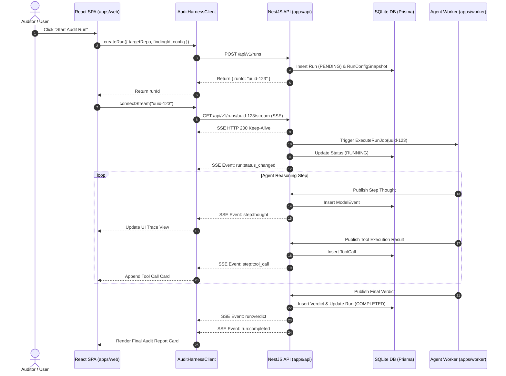
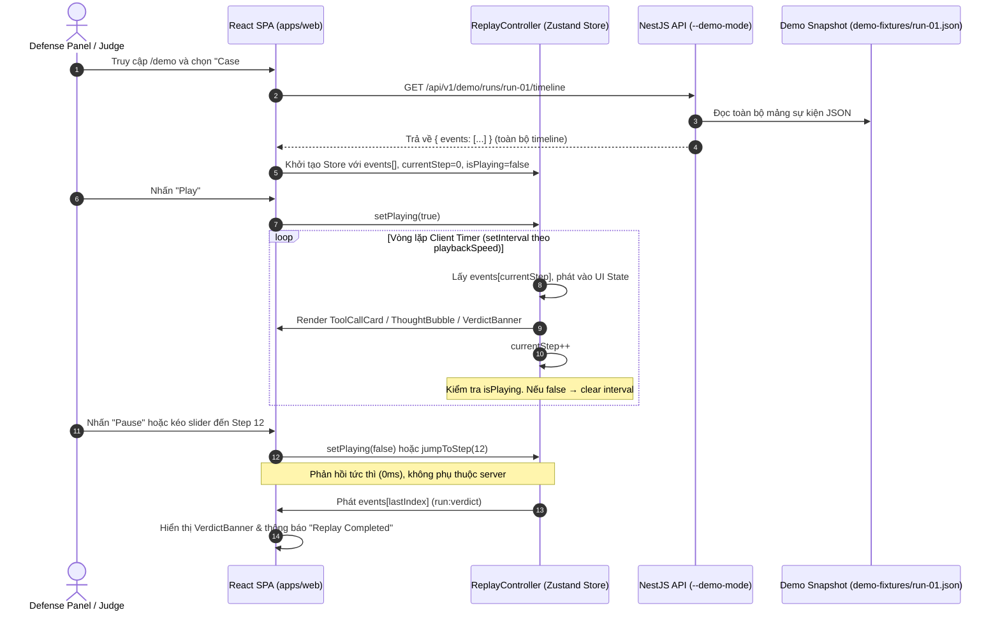

# Technical Specification — TV6: Architecture & Data Flow
## Document Identifier: SPEC-TV6-01-ARCH-DATAFLOW
**Standard Compliance:** ISO/IEC/IEEE 29148:2018 / RFC 8895 (Server-Sent Events)  
**Status:** Approved Architectural Specification  
**Track:** TV6 — Application & Demo  

---

## 1. System Architecture Diagram & Data Pipeline

Tài liệu này mô tả chi tiết kiến trúc luồng dữ liệu end-to-end từ giao diện React SPA (`apps/web`), qua Backend NestJS API (`apps/api`), kết nối tới Database Prisma/SQLite và Agent Runtime (`apps/worker`).

```
+-----------------------------------------------------------------------------------+
|                                  CLIENT LAYER                                     |
|  +-----------------------------------------------------------------------------+  |
|  |                             apps/web (React 19 + Vite)                      |  |
|  |  +-------------------+  +------------------------+  +--------------------+  |  |
|  |  | TraceView Component|  | ReplayController Comp  |  | MultiRunComp View  |  |  |
|  |  +---------+---------+  +-----------+------------+  +---------+----------+  |  |
|  +------------|------------------------|-------------------------|-------------+  |
+---------------|------------------------|-------------------------|----------------+
                |                        |                         |
                | (SSE Stream)           | (HTTP REST)             | (HTTP REST)
                v                        v                         v
+-----------------------------------------------------------------------------------+
|                                  SDK LAYER                                        |
|  +-----------------------------------------------------------------------------+  |
|  |                packages/sdk (AuditHarnessClient & SSE Listener)             |  |
|  +-------------------------------------+---------------------------------------+  |
+----------------------------------------|------------------------------------------+
                                         |
                                         v
+-----------------------------------------------------------------------------------+
|                                SERVICE LAYER                                      |
|  +-----------------------------------------------------------------------------+  |
|  |                            apps/api (NestJS Server)                         |  |
|  |  +---------------------+  +--------------------+  +----------------------+  |  |
|  |  | RunStreamController |  | RunManagementCtrl  |  | DemoService (REST)   |  |  |
|  |  +----------+----------+  +---------+----------+  +----------+-----------+  |  |
|  +-------------|-----------------------|------------------------|--------------+  |
+----------------|-----------------------|------------------------|-----------------+
                 |                       |                        |
                 v                       v                        v
+-----------------------------------------------------------------------------------+
|                             PERSISTENCE & RUNTIME                                 |
|  +------------------------------------+  +-------------------------------------+  |
|  |      Prisma ORM & SQLite DB        |  |    apps/worker (Agent Loop Core)    |  |
|  |  (Runs, ToolCalls, Events, Verdict) |  |   (TV1 / TV3 / TV4 Execution Engine)  |  |
|  +------------------------------------+  +-------------------------------------+  |
+-----------------------------------------------------------------------------------+
```

---

## 2. Cơ chế Giao tiếp Nội bộ: IPC / Message Queue (`apps/api` ↔ `apps/worker`)

Đây là lớp giao tiếp nội bộ quan trọng nhất của hệ thống, điều phối luồng tác vụ từ API Gateway sang Agent Runtime và phản hồi ngược lại để stream ra cho client.

### 2.1 Dispatch Job: `apps/api` → `apps/worker` (BullMQ via Redis)

Khi client gọi `POST /api/v1/runs`, `apps/api` **KHÔNG** thực thi Agent Loop trực tiếp. Thay vào đó, API **dispatch** một job sang hàng đợi BullMQ:

```typescript
// file: apps/api/src/modules/run/run.service.ts
import { InjectQueue } from '@nestjs/bullmq';
import { Queue } from 'bullmq';

@Injectable()
export class RunService {
  constructor(
    @InjectQueue('audit-runs') private readonly auditQueue: Queue,
    private readonly prisma: PrismaService,
  ) {}

  async createAndDispatchRun(dto: CreateRunDto): Promise<Run> {
    // 1. Ghi Run vào DB với status PENDING
    const run = await this.prisma.run.create({ data: { ...dto, status: 'PENDING' } });

    // 2. Dispatch job sang Worker qua BullMQ (Redis)
    await this.auditQueue.add(
      'execute-run',
      { runId: run.id },
      {
        jobId: run.id, // Idempotent: mỗi run chỉ có 1 job
        attempts: 1,  // Không tự retry để tránh lặp suy luận vô hạn
        removeOnComplete: true,
        removeOnFail: false, // Giữ lại job lỗi để debug
      }
    );

    return run;
  }

  async cancelRun(runId: string): Promise<Run> {
    // Kiểm tra trạng thái job trước khi hành động
    const job = await this.auditQueue.getJob(runId);
    if (job) {
      const state = await job.getState();
      if (state === 'waiting' || state === 'delayed') {
        // Job chưa chạy → xoà hoàn toàn khỏi queue
        await job.remove();
      }
      // Nếu state === 'active': không thể kill Worker từ API qua BullMQ.
      // Worker tự dừng khi phát hiện status = 'CANCELLED' trong DB polling
      // (kiểm tra đầu mỗi vòng lặp Agent Loop).
    }

    // Cập nhật DB trước — Worker sẽ dừng ở lần polling kế tiếp
    return this.prisma.run.update({
      where: { id: runId },
      data: { status: 'CANCELLED', completedAt: new Date() },
    });
  }
}
```

> **Cấu hình Môi trường Local Slim (Không có Redis)**:
> - **Module Switching**: Set env `USE_REDIS=false`. `RunModule` dùng `ConditionalModule` của NestJS tải `LocalEventEmitterAdapter` thay vì `BullMQAdapter`.
> - **Process**: `apps/api` và `apps/worker` chạy trong cùng 1 Node.js process (monolith). `WorkerModule` được import trực tiếp vào `AppModule` ở slim mode.
> - **Event Flow**: `RunService` emit `'run.execute'` qua `EventEmitter2` → `AgentLoop` handler trong cùng process lắng nghe và thực thi. `RedisEventSubscriber` được thay bằng `EventEmitter2` subscription trực tiếp vào `StreamService`.
> - **Giới hạn**: Không hỗ trợ scale ngang. Chỉ dùng cho local dev / CI testing.

### 2.2 Emit Sự kiện Log/Tool-call: `apps/worker` → `apps/api` (Redis Pub/Sub)

Sau khi Worker hoàn thành mỗi bước suy luận, nó cần **push sự kiện** sang `apps/api` để API pipe vào SSE stream cho client. Cơ chế:

```
+------------------------------+          Redis Pub/Sub          +------------------------------+
|        apps/worker           |  ──────────────────────────►   |         apps/api             |
|                              |  Channel: harness:events:{runId}|                              |
|  AgentLoop.onStepCompleted() |                                 |  RedisEventSubscriber        |
|  → redis.publish(channel,    |                                 |  → StreamService.publish()   |
|      JSON.stringify(event))  |                                 |  → RxJS Subject → SSE Client |
+------------------------------+                                 +------------------------------+
```

**Luồng phát sự kiện chi tiết**:
1. `apps/worker`: Sau mỗi bước Agent Loop, gọi `redis.publish('harness:events:{runId}', eventPayload)`.
2. `apps/api`: `RedisEventSubscriber` lắng nghe channel Redis → nhận event → gọi `streamService.publishEvent(event)`.
3. `StreamService`: RxJS `Subject` emit event → `getStreamForRun(runId)` filter → SSE HTTP/1.1 Keep-Alive → client.

---

## 3. Database Schema Specification (Prisma + SQLite Atomic Model)

Cơ sở dữ liệu SQLite được quản lý bởi Prisma ORM. Mọi sự kiện của lượt chạy Agent được lưu trữ dưới dạng **Append-Only Event Store** để đảm bảo tính toàn vẹn dữ liệu (Immutability).

### 3.1 Cấu hình Bắt buộc: SQLite WAL Mode (Chống lỗi `SQLITE_BUSY`)

Do `apps/worker` ghi log ở cường độ cao (nhiều INSERT đồng thời) trong khi `apps/api` đồng thời thực hiện SELECT để trả lời REST request, **bắt buộc** phải bật WAL Mode khi khởi tạo Prisma Client:

```typescript
// file: apps/api/src/modules/prisma/prisma.service.ts
import { Injectable, OnModuleInit, OnModuleDestroy } from '@nestjs/common';
import { PrismaClient } from '@prisma/client';

@Injectable()
export class PrismaService extends PrismaClient implements OnModuleInit, OnModuleDestroy {
  async onModuleInit(): Promise<void> {
    await this.$connect();
    // BẮT BUỘC: Bật WAL mode để writer (Worker) và reader (API) không block lẫn nhau
    await this.$executeRawUnsafe('PRAGMA journal_mode = WAL;');
    // BẮT BUỘC: Nếu DB bận, chờ tối đa 5000ms thay vì throw SQLITE_BUSY ngay lập tức
    await this.$executeRawUnsafe('PRAGMA busy_timeout = 5000;');
  }

  async onModuleDestroy(): Promise<void> {
    await this.$disconnect();
  }
}
```

> **Lý do kỹ thuật**: SQLite mặc định dùng chế độ **DELETE journal** — chỉ cho phép 1 writer và 0 reader cùng lúc. Với **WAL (Write-Ahead Logging)**, writer và reader hoạt động đồng thời độc lập (Multi-Version Concurrency Control), loại bỏ hoàn toàn lỗi `SQLITE_BUSY: database is locked`.

> [!IMPORTANT]
> **Yêu cầu `apps/worker`**: `PRAGMA journal_mode = WAL` là **database-level flag** (ghi vào SQLite file, persist qua các connection). Chỉ cần bật một lần. Tuy nhiên `PRAGMA busy_timeout = 5000` là **connection-level** — `apps/worker` phải có `PrismaService` của riêng nó và cũng phải thực thi `PRAGMA busy_timeout = 5000` trong `onModuleInit()` để tránh lỗi `SQLITE_BUSY` khi ghi log ở tần suất cao.

### 3.2 Prisma Schema (Append-Only Event Store)

```prisma
// file: prisma/schema.prisma

datasource db {
  provider = "sqlite"
  url      = env("DATABASE_URL")
}

generator client {
  provider = "prisma-client-js"
}

enum RunStatus {
  PENDING
  RUNNING
  COMPLETED
  FAILED
  CANCELLED
}

enum VerdictStatus {
  VALID
  INVALID
  UNVERIFIED
}

model Run {
  id              String             @id @default(uuid())
  title           String
  targetRepository String
  findingId       String
  status          RunStatus          @default(PENDING)
  startedAt       DateTime           @default(now())
  completedAt     DateTime?
  totalDurationMs Int                @default(0)
  totalTokensUsed Int                @default(0)
  totalCostUsd    Float              @default(0.0)
  
  // Relations
  configSnapshot  RunConfigSnapshot?
  toolCalls       ToolCall[]
  modelEvents     ModelEvent[]
  verdict         Verdict?

  createdAt       DateTime           @default(now())
  updatedAt       DateTime           @updatedAt
}

model RunConfigSnapshot {
  id               String   @id @default(uuid())
  runId            String   @unique
  run              Run      @relation(fields: [runId], references: [id], onDelete: Cascade)
  modelProvider    String   // e.g. "anthropic", "openai", "fake"
  modelName        String   // e.g. "claude-3-5-sonnet", "gpt-4o"
  temperature      Float    @default(0.0)
  maxSteps         Int      @default(50)
  tokenBudget      Int      @default(100000)
  enableMemory     Boolean  @default(true)
  enableCompaction Boolean  @default(true)
  enableVerification Boolean @default(true)
  promptVersion    String
  configHash       String
}

model ToolCall {
  id           String   @id @default(uuid())
  runId        String
  run          Run      @relation(fields: [runId], references: [id], onDelete: Cascade)
  stepIndex    Int
  toolName     String
  argumentsJson String  // JSON stringified input arguments
  resultJson   String  // JSON stringified execution output
  isError      Boolean  @default(false)
  durationMs   Int      @default(0)
  tokensUsed   Int      @default(0)
  timestamp    DateTime @default(now())

  @@index([runId, stepIndex])
}

model ModelEvent {
  id           String   @id @default(uuid())
  runId        String
  run          Run      @relation(fields: [runId], references: [id], onDelete: Cascade)
  stepIndex    Int
  eventType    String   // "THOUGHT", "TOOL_REQUEST", "SYSTEM_PROMPT", "ERROR"
  content      String   // Raw markdown thought or system notification
  tokensUsed   Int      @default(0)
  timestamp    DateTime @default(now())

  @@index([runId, stepIndex])
}

model Verdict {
  id              String        @id @default(uuid())
  runId           String        @unique
  run             Run           @relation(fields: [runId], references: [id], onDelete: Cascade)
  status          VerdictStatus
  severity        String        // "CRITICAL", "HIGH", "MEDIUM", "LOW", "INFORMATIONAL"
  confidenceScore Float         // 0.0 to 1.0
  explanation     String        // Markdown explanation generated by LLM
  pocSourceCode   String?       // Verification PoC Solidity Test file content
  pocResult       String?       // "PASS", "FAIL", "N/A"
  timestamp       DateTime      @default(now())
}
```

---

## 4. Server-Sent Events (SSE) Protocol Specification

Endpoint stream real-time: `GET /api/v1/runs/:id/stream`

### 4.1 Bảng Ánh xạ Tên Event (Event Name Mapping Table)

Bảng dưới đây quy định tương quan bắt buộc giữa giá trị `eventType` lưu trong SQLite (`ModelEvent.eventType`) và tên event SSE được phát ra cho client:

| `ModelEvent.eventType` (SQLite) | SSE Event Name | Mô tả |
| :--- | :--- | :--- |
| `"THOUGHT"` | `step:thought` | Agent đã hoàn thành 1 bước suy luận (Chain-of-Thought) |
| `"TOOL_REQUEST"` | `step:tool_call` | Agent yêu cầu thực thi 1 công cụ và nhận kết quả |
| `"SYSTEM_PROMPT"` | `run:status_changed` | Hệ thống thay đổi trạng thái Run (PENDING → RUNNING → COMPLETED) |
| `"ERROR"` | `run:status_changed` | Lỗi nghiêm trọng, đồng thời cập nhật `status: "FAILED"` vào DB |
| *(N/A — generated by Worker)* | `run:verdict` | Phán quyết cuối cùng đã được ghi vào bảng `Verdict` |
| *(N/A — terminal event)* | `run:completed` | Run kết thúc hoàn toàn, client nên đóng kết nối SSE |

> **Quy tắc ánh xạ**: `apps/worker` chỉ ghi `ModelEvent` với các `eventType` cột trái. `apps/api` (qua `RedisEventSubscriber`) chịu trách nhiệm **dịch** sang tên event SSE cột phải trước khi phát ra cho client qua `StreamService`.

### 4.2 Event Format Standards
Dữ liệu gửi qua SSE tuân theo MIME type `text/event-stream`. Mỗi sự kiện gồm 3 dòng: `id`, `event`, và `data` (JSON-encoded payload).

#### 1. Event: `run:status_changed`
```text
id: 101
event: run:status_changed
data: {"runId":"uuid-123","status":"RUNNING","timestamp":"2026-07-31T23:00:00.000Z"}
```

#### 2. Event: `step:thought`
```text
id: 102
event: step:thought
data: {"runId":"uuid-123","stepIndex":3,"thought":"Analyzing Reentrancy vulnerability in Deposit.sol line 45...","tokensUsed":120}
```

#### 3. Event: `step:tool_call`
```text
id: 103
event: step:tool_call
data: {"runId":"uuid-123","stepIndex":3,"toolName":"read_file","arguments":{"path":"contracts/Deposit.sol","startLine":40,"endLine":60},"result":"function deposit() public payable { ... }","isError":false,"durationMs":45,"tokensUsed":350}
```

#### 4. Event: `run:verdict`
```text
id: 104
event: run:verdict
data: {"runId":"uuid-123","verdict":{"status":"VALID","severity":"HIGH","confidenceScore":0.95,"explanation":"Reentrancy confirmed by PoC test execution.","pocResult":"PASS"}}
```

#### 5. Event: `run:completed`
```text
id: 105
event: run:completed
data: {"runId":"uuid-123","totalDurationMs":125000,"totalTokensUsed":45200,"totalCostUsd":0.135}
```

#### 6. Event: `heartbeat` (Keep-Alive — Tránh Proxy Timeout)
```text
id: 0
event: heartbeat
data: {"timestamp":"2026-07-31T23:00:15.000Z"}
```

> **Tần suất**: Mỗi **15 giây** nếu không có event thực nào. Ngăn proxy/load balancer/browser timeout đóng kết nối SSE do idle. Client bỏ qua event này (không cần handler). Backend thực hiện bằng `setInterval` trong `StreamController`.

---

## 5. Sequence Diagrams

### 5.1 Sequence Diagram 1: Live Execution Stream Flow



### 5.2 Sequence Diagram 2: Offline Demo — Client-Driven Replay Flow (`--demo-mode`)

> **Kiến trúc Mới — Client-Driven Replay**: Backend chỉ cung cấp toàn bộ timeline JSON qua 1 REST call. `ReplayController` trên Frontend **hoàn toàn tự kiểm soát** nhịp độ phát sự kiện, không phụ thuộc server timer. Điều này đảm bảo Pause/Jump phản hồi tức thì (0ms latency) và hoạt động offline 100%.


