# SmartPoC as the Autonomous Core Agent for Judge Mode: Comparative Analysis & Implementation Plan

---

## 1. Summary

In smart contract auditing and automated triage, **Audit Mode** and **Judge Mode** share a unified ultimate objective: **conclusively confirming or rejecting a suspected bug report with executable proof**.

However, they operate under fundamentally inverted assumptions:

- **Audit Mode** is a generative discovery pipeline: it scans code, generates candidate findings, and requires an iterative repair loop because models writing exploits from scratch make frequent errors.
- **Judge Mode** is a strict adjudication platform: it evaluates an external submission. The burden of proof lies entirely on the submitter. **Zero repair loops are needed.** The agent stitches the submitter's PoC into the project's `BaseTest` template and runs it in a single shot. If it fails, it is rejected immediately.

```mermaid
flowchart TB
 subgraph AuditMode["Audit Mode (Generative Discovery & Synthesis)"]
        A2["LLM Auditor / Static Scanner"]
        A1["Entire Codebase / Repository"]
        A3["BCE AST Slicing"]
        A4["LLM Synthesizes PoC from Scratch"]
        A5["GRE"]
        A6["Synthetic DV State Injection"]
        A7["Precision Filtered Findings"]
  end
 subgraph JudgeMode["Judge Mode (Zero-Bias Single-Shot Adjudication)"]
        J2["Report Ingestion Gate"]
        J1["Contest Report Markdown\n+ Source Snapshot"]
        J3["IMMEDIATE REJECT\nReason: MISSING_POC"]
        J4["Sanitize & Anti-Cheat Filter"]
        J5["IMMEDIATE REJECT\nReason: NON_FAITHFUL_OVERRIDE"]
        J6["Template Stitcher into BaseTest.t.sol"]
        J7["Single-Shot Docker Sandbox Execution\nforge test --match-test"]
        J8["IMMEDIATE REJECT\nReason: EXECUTION_FAILED"]
        J9{"Has Submitter Assertions?"}
        J10["Tier 1: Semantic Submitter Oracle Check\nVerify Asserts Executed in Trace"]
        J11["Tier 2: SmartPoC DV Fallback\nInject State Probes & Check Delta S"]
        J12["Normative Judge Verdict\nvalid/invalid + PASS/FAIL + Traces"]
  end
    A1 --> A2
    A2 -- Machine JSON Warning\nNo PoC, No Oracle --> A3
    A3 --> A4
    A4 --> A5
    A5 --> A6
    A6 --> A7
    J1 --> J2
    J2 -- No PoC Code Block --> J3
    J2 -- PoC Found --> J4
    J4 -- Override / ffi Detected --> J5
    J4 -- Clean PoC --> J6
    J6 --> J7
    J7 -- "Exit Code != 0 / Revert / Error" --> J8
    J7 -- "Exit Code == 0" --> J9
    J9 -- Yes: Has Asserts --> J10
    J9 -- No: Lacks Asserts --> J11
    J10 --> J12
    J11 --> J12
```

By removing repair loops, Judge Mode eliminates judge bias, slashes token costs, and ensures strict adherence to competitive audit platform rules.

---

## 2. In-Depth Comparative Analysis: Audit Mode vs. Judge Mode

| Dimension | Audit Mode (Verification Layer) | Judge Mode (SmartPoC as Whole Agent) |
| :-- | :-- | :-- |
| **Primary Mission** | **Vulnerability Discovery & Noise Reduction:** Scan code, brainstorm bugs, and eliminate hallucinations before human review. | **Adjudication & Verification:** Assess an existing finding submitted by a security researcher (e.g., Code4rena/Sherlock) and determine if it is real, exploitable, and in-scope. |
| **Input Artifact** | **Machine-Generated Structured Findings:** High-format JSON (e.g., `implicated_functions`, `contract`, `vulnerability_type`, abstract invariants). | **Human-Authored Contest Submissions:** Semi-structured Markdown containing natural language narratives, attack paths, affected code permalinks, and **mandatory embedded PoC snippet**. |
| **PoC Availability** | **None (0%):** Static analyzers and scanner models generate descriptions, never runnable Foundry tests. | **Mandatory (100%):** Submissions without an executable PoC snippet are **immediately rejected** via the Fast-Reject Ingestion Gate. |
| **Core Technical Hurdle** | **Context Slicing & Cold-Start Generation:** Constructing exploit preconditions from scratch without drowning in repo context. | **Anti-Cheating, Template Stitching & Semantic Oracles:** Detecting tampered/mocked bytecode, cleanly stitching into `BaseTest`, and proving state deltas represent true exploits. |
| **Role of BCE** _(Bug-Context Extraction)_ | Same | Same |
| **Execution Loop** | **Iterative Repair Loop:** Necessary because model-authored code contains frequent syntax errors. | **No Repair Loops:** Single execution in Docker sandbox. Fails immediately on compiler error, test revert, or failed assert.  |
| **Role of DV** _(Differential Verification)_ | **Synthetic Oracle:** Automatically infers trigger functions and observable variables to detect abnormal state shifts. | **Two-Tier Oracle Adjudication:** • _Tier 1:_ Semantically validates submitter's native assertions in trace.• _Tier 2:_ Synthesizes pre/post state queries as fallback if assertions are missing. |
| **Output Contract** | Filtered candidate list (`CONFIRMED_VULNERABLE` / `REJECTED_FALSE_POSITIVE`). | Official[`JudgeVerdict`](file:///C:/Code/DATN/harness/blueprint/contracts/judge-verdict.schema.json) with `validity`, `severity`, `evidence` digests, and `verification_status: PASS |

---

## 3. Architectural Blueprint: The SmartPoC Judge Agent

The proposed SmartPoC Judge Agent is structured into 5 cohesive stages:

### Detailed Component Roles

#### 1. Report Ingestion Gate (`modules/judge/application/report_ingestion.py`)

- **Fast-Reject PoC Extractor:** Scans submitted markdown for executable code blocks (Solidity/Foundry tests). If no PoC code block exists, immediately emits an `invalid` verdict with reason `MISSING_POC` without wasting LLM or Docker resources.
- **BCE:** Operates **strictly on repository source code**: resolves cited contracts and functions into actual repository AST objects and slices call-graph dependencies.
- **Full PoC Preservation:** The submitter's PoC code is **passed in full** without slicing, preserving all test functions, submitter helper contracts, custom attacker contracts, interface declarations, and setup logic.

#### 2. Pre-Execution Sanitizer & Template Stitcher (`modules/verification/application/sanitizer.py`)

- **Anti-Cheating AST Filter:** Rejects test scripts attempting to override target contract methods, mock internal variables, or invoke `vm.ffi`.
- **Foundry Template Stitching:** Uses the target repo's existing test scaffold (`test/BaseTest.t.sol` or `test/TestSetup.t.sol`) where all compiler pragmas, imports, remappings, and contract instantiations are already configured. The agent simply extracts the test function body (`function test...`) and helper contracts, injecting them directly into the template. No pragma or remapping normalization needed.

#### 3. Single-Shot Sandbox Execution (`modules/verification/adapters/docker_sandbox.py`)

- **Single-Shot Run:** Mounts the stitched test file into an ephemeral Docker container (`--network none`) and runs `forge test --match-test <name> -vvvv`.
- **Immediate Rejection on Non-Zero Exit Code:** If compilation fails or the test reverts, the pipeline terminates immediately with an `invalid` verdict (`EXECUTION_FAILED`).

#### 4. Two-Tier Action-State Differential Verification (`modules/verification/application/dv.py`)

- **Tier 1 (Native Submitter Oracle Evaluation):** When the submitter's PoC contains assertions (`assertEq`, `assertGt`, `vm.expectRevert`), the agent extracts their semantic hypothesis, inspects the Foundry execution trace (`-vvvv`) to confirm the assertions executed, and verifies that the assert proves unauthorized impact rather than benign mechanics.
- **Tier 2 (Synthetic DV Injection Fallback):** When the PoC lacks assertions (e.g. executes steps without asserting, or only relies on `console.log`), SmartPoC DV activates as a fallback: it infers target state variables from the report, instruments pre/post state queries (`emit log_named_uint`), executes, and evaluates $\Delta S$.
- **Severity Calibration:** Evaluates verified impact: High for permanent capital loss/insolvency; Medium for temporary denial of service or state lock.

#### 5. Verdict & Evidence Synthesis (`modules/judge/application/verdict_synthesizer.py`)

- Formulates normative [`judge-verdict-v1`](file:///C:/Code/DATN/harness/blueprint/contracts/judge-verdict.schema.json).
- Returns `validity: "valid"` with `verification_status: "PASS"` on genuine exploits, or `validity: "invalid"` with `verification_status: "FAIL"` on unrepairable, failing, or non-impactful submissions.
